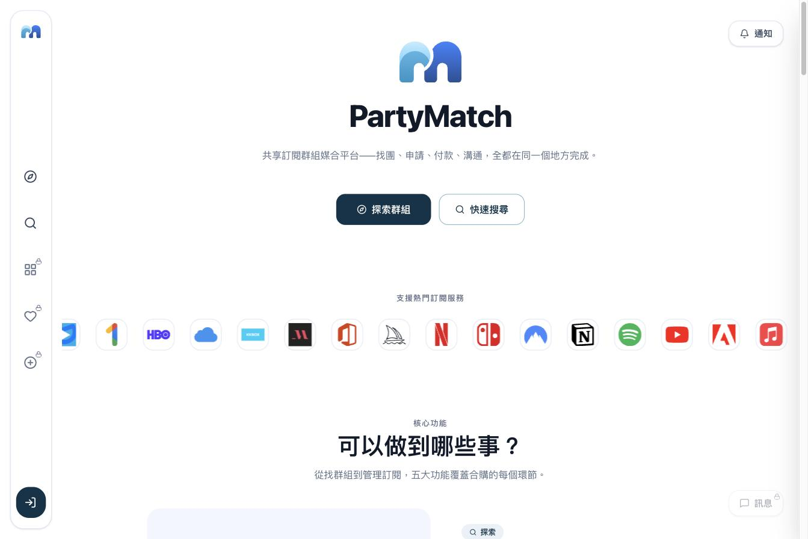
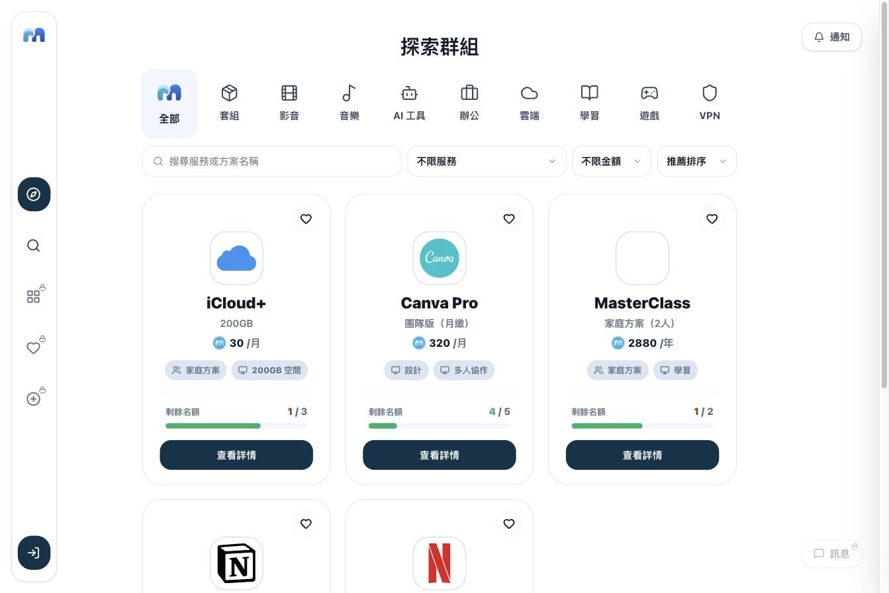
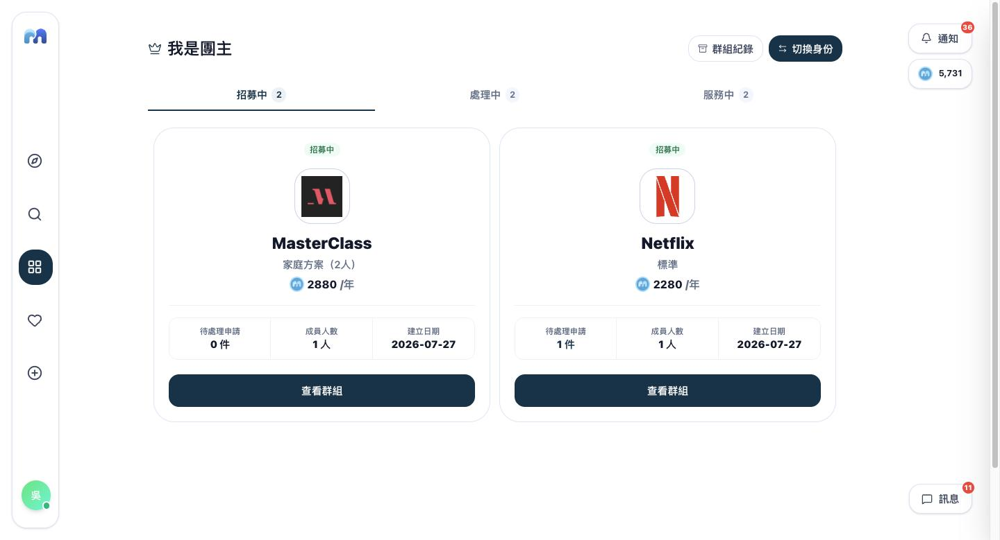
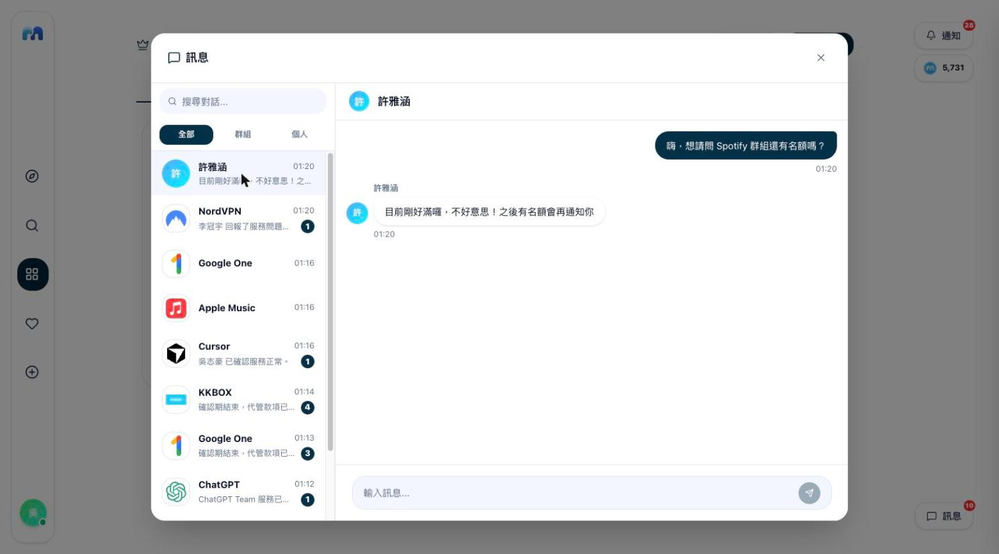

# PartyMatch

## 專案介紹

PartyMatch 是一個共享訂閱媒合平台，讓使用者可以探索或建立 Netflix、Spotify、YouTube Premium、Disney+ 等共享訂閱群組，從找夥伴、申請審核、付款代管到續訂都在同一個平台完成。

完整的產品定位、解決的問題與功能說明見下方[技術文件](#技術文件)。

### 核心功能

- **狀態機驅動的群組生命週期**：招募中 → 額滿 → 填寫資訊 → 啟用 → 服務中 → 續訂／結束
- **PM幣代管系統**：申請即扣款代管，團主啟用服務後才撥款
- **信用分數系統**：依成員與團主的行為即時增減分數，可作為群組申請門檻
- **28 種訂閱服務、6 種真實共享機制**：依服務動態顯示要填寫的帳號資訊欄位
- **申訴與裁定機制**：糾紛可自行協調，協調不成由管理員裁定
- **訊息與通知系統**：聊天室、私訊、系統通知整合的訊息中心
- **管理員後台**：獨立 Dashboard，管理平台數據與申訴裁定
- **敏感資料保護**：敏感欄位動態遮罩、機密資料加密儲存、附件私有化

各項功能詳細說明見[產品總覽](docs/product/product-overview.md)。

---

## 線上 Demo

- 前端：https://partymatch.ykk910309.workers.dev
- 後端 API：https://partymatch-api.onrender.com/api

---

## 畫面展示

| 首頁 | 探索群組 | 群組管理 | 訊息中心 |
|------|----------|----------|----------|
|  |  |  |  |

---

## 技術內容

| 類別 | 技術 |
|------|------|
| Frontend | React 19、Vite、React Router v7、Zustand |
| UI | Tailwind CSS v4、shadcn/ui、Radix UI、lucide-react |
| Backend | Node.js、Express |
| 資料庫 | MySQL + Prisma ORM |
| 快取 | Redis |
| 認證 | JWT（雙 token） |
| 檔案儲存 | Cloudflare R2 |
| Architecture | Feature-based、Store + API 雙層分離、事件驅動跨元件通訊 |

技術選型理由與各項實作細節（深色模式、認證機制、圖片上傳、匯率查詢等）見[架構總覽](docs/architecture/architecture.md)。

---

## 技術文件

完整技術文件在 [`docs/`](docs/README.md)，依 Product／Architecture／Flows 分類。

1. **先懂產品在做什麼** → [產品總覽](docs/product/product-overview.md)
2. **再懂整體是怎麼組出來的** → [架構總覽](docs/architecture/architecture.md)
3. **想知道某個功能實際怎麼運作** → [使用者流程總覽](docs/flows/user-flows.md)

---

## 注意事項

儲值、付款、代管撥款等流程皆為模擬邏輯，未串接正式金流。正式環境所需的 API key、JWT secret、資料庫連線資訊與第三方服務設定皆未包含於此 repository。

目前刻意未實作的部分：Google 登入、忘記密碼寄信、帳號中心的「通知偏好」「安全驗證」皆尚未串接後端，畫面上不會露出這些入口（而非顯示 disabled 按鈕或開發中佔位），避免半成品入口影響展示觀感。

---

## 聯絡我

- GitHub: [@s1092055](https://github.com/s1092055)
- Email: ykk910309@gmail.com
