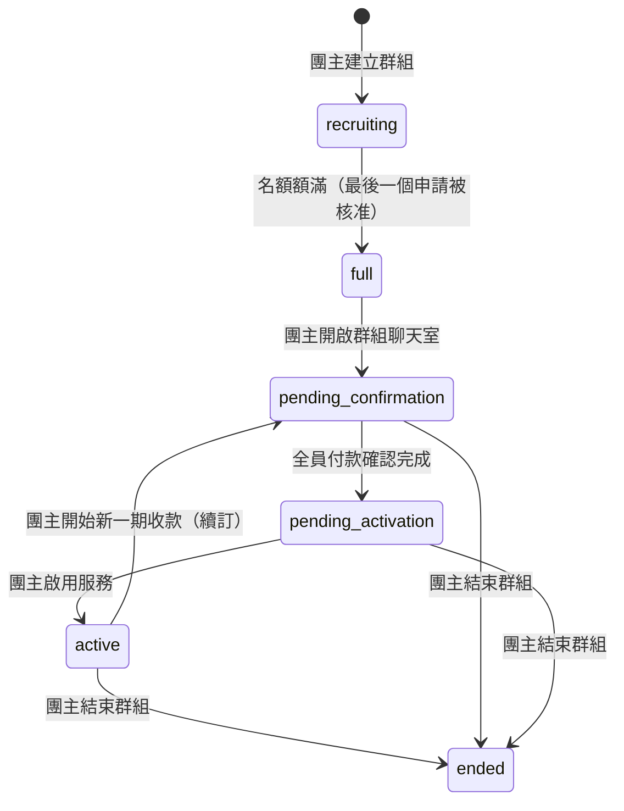
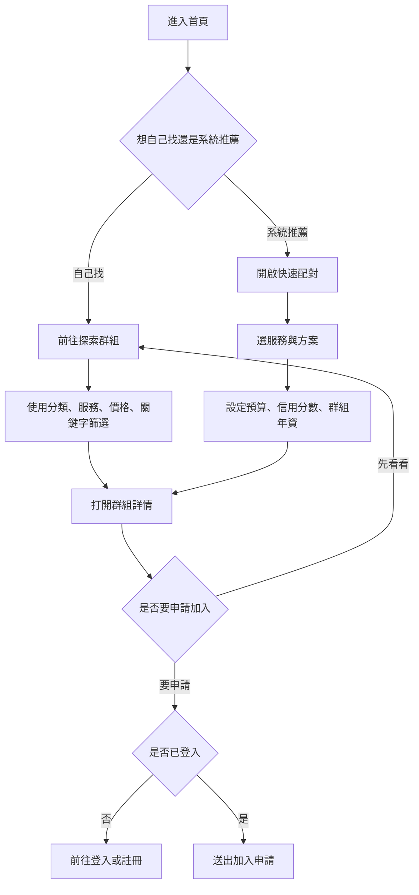
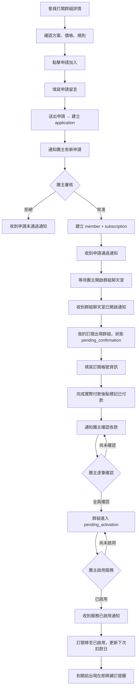
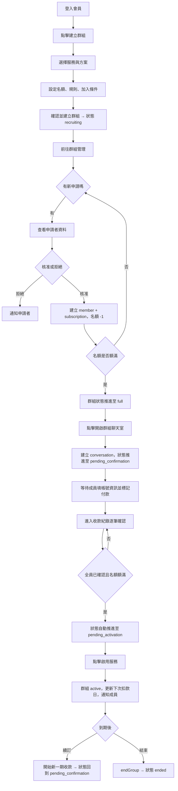
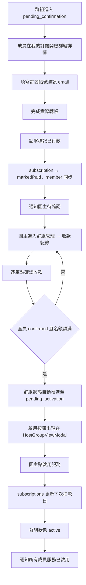
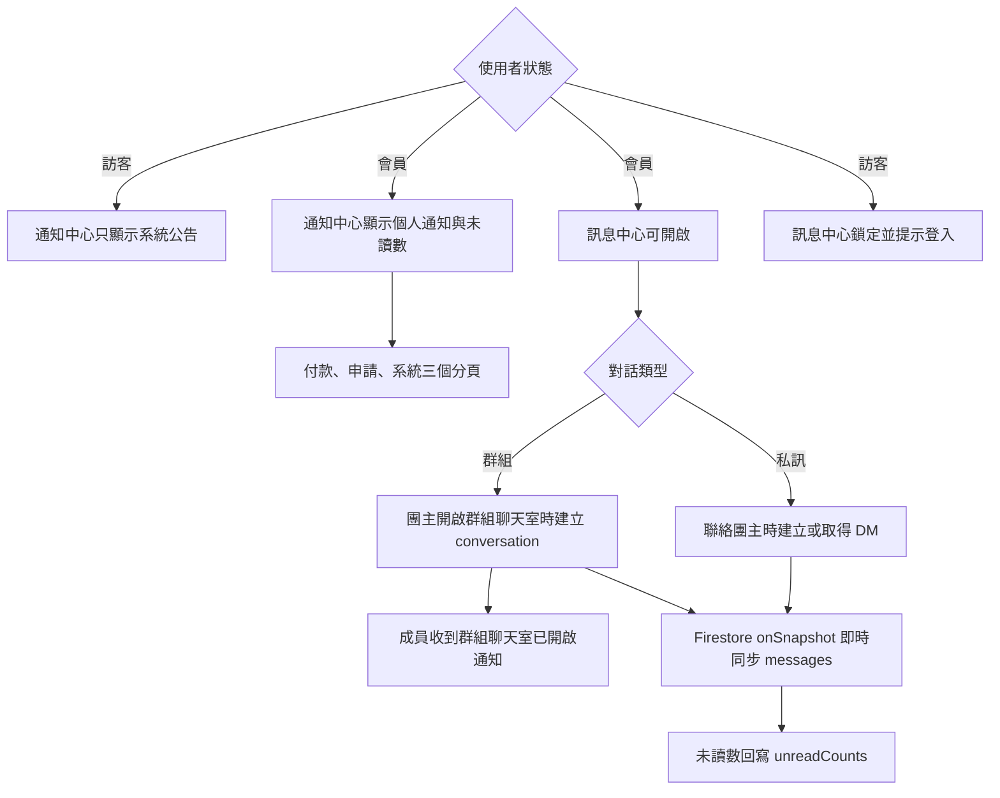

# PartyMatch

PartyMatch 是一個共享訂閱群組媒合平台，目標是讓使用者能安全地找到 Netflix、Spotify、YouTube Premium、ChatGPT Plus 等訂閱服務的合購群組，並在同一個平台完成申請、審核、付款追蹤、通知與訊息溝通。

內建 **SubTrack** 訂閱管理模組，負責加入後的付款狀態、帳單提醒、付款紀錄與團主確認流程。

> 目前是 MVP 展示版。核心資料已串接 Firebase Auth + Firestore，包含群組、成員、申請、訂閱、付款紀錄、通知、收藏、訊息與使用者資料。
>
> Demo 帳號：`demo@partymatch.tw` / `demo1234`

---

## 快速開始

```bash
npm install
npm run dev
```

預設開發網址：

```txt
http://localhost:5173
```

常用指令：

| 指令 | 用途 |
|------|------|
| `npm run dev` | 啟動 Vite 開發伺服器 |
| `npm run build` | 建置 production bundle |
| `npm run lint` | 執行 ESLint |
| `npm run seed:demo` | 建立 demo 帳號與 Firestore demo 資料 |
| `npm run clear:demo` | 清空 `demo_*` collection 中的 demo 資料 |
| `npm run seed:services` | 匯入服務清單資料 |

---

## 環境變數

請在專案根目錄建立 `.env`，並填入 Firebase 專案設定。不要把實際金鑰 commit 到 Git。

```bash
VITE_FIREBASE_API_KEY=
VITE_FIREBASE_AUTH_DOMAIN=
VITE_FIREBASE_PROJECT_ID=
VITE_FIREBASE_STORAGE_BUCKET=
VITE_FIREBASE_MESSAGING_SENDER_ID=
VITE_FIREBASE_APP_ID=

DEMO_USER_EMAIL=demo@partymatch.tw
DEMO_USER_PASSWORD=demo1234
VITE_DEMO_MODE=true
```

Demo seed 會讀取 `.env`，建立或重用 demo 帳號，並寫入 groups、members、applications、subscriptions、notifications、favorites 等資料。

---

## 技術棧

| 類別 | 使用技術 |
|------|----------|
| Frontend | React 19、Vite、React Router v7 |
| UI | Tailwind CSS v4、lucide-react |
| Backend / Data | Firebase Auth、Firebase Firestore |
| Realtime | Firestore `onSnapshot` 用於訊息中心即時同步；以 `experimentalForceLongPolling` 解決 Safari WebChannel 靜默斷線問題 |
| State Layer | `src/shared/stores/*` 封裝業務邏輯 |
| Data Access | `src/shared/api/*` 封裝 Firestore CRUD |
| Demo Data | `scripts/seedDemo.mjs`、`scripts/clearDemo.mjs` |

---

## 功能總覽

### 使用者功能

| 功能 | 入口 | 登入需求 | 目前內容 |
|------|------|----------|----------|
| 首頁 Landing | `/` | 不需登入 | 功能介紹、使用流程、團主指南、FAQ、28 種服務跑馬燈、Hero CTA（探索群組 / 快速配對） |
| 探索群組 | `/explore` | 不需登入 | 分類篩選、服務篩選、價格排序、群組卡片、詳情 Modal |
| 快速配對 | 側欄 / 首頁 CTA | 不需登入 | 選服務、選方案、設定預算與條件，自動推薦符合群組 |
| 群組詳情 | 群組卡片 / 搜尋結果 | 不需登入可看；申請需登入 | 方案、名額、規則、帳號需求、群組狀態 Badge、團主資訊、推薦群組（排除自己的群組）、申請加入 |
| 申請加入 | 群組詳情 Modal | 需登入 | 建立申請紀錄、通知團主、保留送出成功畫面 |
| 我的訂閱 | `/my-subscriptions` | 需登入 | 訂閱清單、待處理 / 已啟用 / 即將續訂分類、標記付款、申請紀錄、查看群組、退出群組（招募中 / 額滿狀態才可執行） |
| 我的收藏 | `/favorites` | 需登入 | 收藏群組、分類篩選、取消收藏 |
| 帳號中心 | `/account` | 需登入 | 個人資料寫回 Firebase users、付款方式/通知偏好本機持久化 |
| 通知中心 | 右上角通知按鈕 | 訪客可看系統公告；會員看個人通知 | 付款、申請、系統通知；會員可標記已讀 |
| 訊息中心 | 右上角訊息按鈕 / 聯絡團主 | 需登入 | 群組對話、私人 DM、未讀數、退出/刪除對話、即時訊息 |

### 團主功能

| 功能 | 入口 | 目前內容 |
|------|------|----------|
| 建立群組 | 側欄「建立群組」/ `/create-group` | 4 步驟表單：選服務、選方案、群組設定（名額、帳號需求、加入規則、**收款方式**）、確認預覽送出 |
| 群組管理 | `/manage-groups` | 群組卡片、狀態篩選（全部／招募中／處理中／啟用中／已結束）、待處理申請、本期收款、付款狀態；`markedPaid` 成員觸發收款管理 badge |
| 審核申請 | GroupViewModal → 申請管理子 Modal | 核准後建立 member + subscription，名額同步更新；拒絕後通知申請者；支援 dropdown 篩選（全部／審核中／已核准／已移除／已拒絕） |
| 移除成員 | GroupViewModal → 成員名單子 Modal | 限 `recruiting`/`full` 狀態；移除後建立 `removed` 申請紀錄、刪除 subscription、同步信用分數、發送含 `meta.groupId` 通知；被移除成員可重新申請 |
| 成員付款確認 | GroupViewModal → 收款管理子 Modal | 成員標記付款後，團主逐筆確認（需 subscription 存在才可確認）；確認後清除殘留問題欄位；全員確認後推進狀態；可回報付款問題（原因存入 `paymentIssueType`/`paymentIssueNote`）；成員重新補件後狀態回到 `markedPaid` |
| 啟用服務 | GroupViewModal header banner + CTA 按鈕；點擊「所有付款已確認」通知直達 | 名額/付款完成後顯示全寬 banner 提示；CTA 按鈕帶 ping 動畫（綠色）；確認為 **Modal** 形式，需填寫**收款帳號**後才可啟用；收款帳號與收款方式顯示於收款管理 Modal 頂部 |
| 續訂或結束 | RenewalModal / store 函式 | 開始新一期收款後自動重設成員與訂閱付款狀態並發送通知；結束服務後群組進入已結束狀態 |
| 歷史紀錄 | GroupHistoryModal | 已有歷史檢視元件，卡片入口尚待補強 |

### 共用 UI / 互動

| 元件 / 模組 | 用途 |
|-------------|------|
| `AppNav` | 桌機側欄、手機 Header、右側通知/訊息按鈕、未讀 badge、未登入鎖頭提示 |
| `MobileSearch` | 手機/側欄搜尋入口，可搜尋服務與群組 |
| `ModalShell` | 快速配對、建立群組、訊息中心共用 Modal 外殼 |
| `GroupModalShell` | 探索、管理、訂閱三處群組詳情 Modal 共用的兩欄佈局殼；新增 `headerBanner` prop（modal header 下方全寬提示條）；`showCenteredBadge`（收款中等狀態 badge）亦整合至 headerBanner 位置顯示 |
| `GroupDetailModal` | 探索頁群組詳情（`pm:open-group` 事件驅動）；使用 `GroupModalShell`，含收藏、申請加入、聯絡團主、推薦群組輪播 |
| `GroupViewModal` | 薄殼：依登入者角色決定渲染 `HostGroupView`（`features/manage`）或 `MemberGroupView`（`features/subscriptions`） |
| `FilterTabsBar` | 管理群組、我的訂閱等頁面的可重用分頁篩選列 |
| `ToastContainer` / `toast.js` | 全域提示訊息（含 `aria-live="polite"` 無障礙支援） |
| `ServiceLogo` | 依 serviceId 顯示本地或服務資料中的 Logo |

---

## 群組狀態機

群組從建立到結束共經歷七個狀態，每個狀態有對應的操作角色與觸發條件。



| 狀態 | 說明 | 下一步操作者 |
|------|------|------------|
| `recruiting` | 公開招募中，接受申請；成員可退出群組 | 團主審核申請 |
| `full` | 名額額滿，等待團主開啟群組對話；成員仍可退出（會釋出名額，狀態退回 `recruiting`） | 團主點「開啟群組聊天室」 |
| `pending_confirmation` | 收款階段：成員填寫帳號資訊、標記付款；團主逐筆確認 | 全員確認後自動推進 |
| `pending_activation` | 收款完成，等待團主啟用服務 | 團主點「啟用服務」 |
| `active` | 服務運作中；到期時團主可開始新一期收款 | 團主續訂或結束 |
| `ended` | 群組已結束（唯讀，成員無法退出） | — |

---

## 操作流程圖

以下流程圖可直接當作使用說明。GitHub 會自動渲染 Mermaid 圖表；若編輯器沒有顯示圖，可以直接閱讀下方文字步驟。

### 1. 訪客探索與快速配對



操作說明：

1. 先從首頁或側欄進入「探索群組」。
2. 如果不知道怎麼挑，可以用「快速配對」輸入需求，讓系統列出推薦群組。
3. 點群組卡片可開啟詳情，查看方案、價格、規則與名額。
4. 送出申請需要登入；未登入的受保護入口會顯示鎖頭並提示「請先登入會員」。

### 2. 會員申請加入群組



操作說明：

1. 在群組詳情送出申請，系統建立申請資料並通知團主。
2. 團主核准後，系統建立成員與訂閱資料，並傳送申請通過通知。
3. 名額額滿後，團主點「開啟群組聊天室」讓群組進入 `pending_confirmation`；成員會收到通知。
4. 成員需先**填寫訂閱帳號資訊**，才能看到「標記已付款」按鈕。
5. 標記後通知團主確認；全員確認後群組自動推進至 `pending_activation`。
6. 團主啟用服務後，訂閱移到「已啟用」分類，接近到期日時出現在「即將續訂」提醒。

### 3. 團主建立與管理群組



操作說明：

1. 從側欄點「建立群組」開始 4 步驟表單；建立成功狀態為 `recruiting`。
2. 在「群組管理」點卡片「查看群組」開啟 **HostGroupViewModal**，從底部列進入「申請管理」或「收款紀錄」子 Modal。
3. 所有名額核准完畢後，GroupViewModal 會出現「**開啟群組聊天室**」按鈕（狀態 `full`），點擊後群組進入 `pending_confirmation`。
4. 收款紀錄全員確認後，群組自動推進至 `pending_activation`；啟用按鈕出現在摘要卡（桌機）或底部列（手機）。
5. 啟用後服務進入 `active`；到期後可選擇「開始新一期收款」（重置所有成員付款狀態並回到 `pending_confirmation`）或「結束群組」。

### 4. 付款確認與啟用服務



操作說明：

1. 成員需先在群組詳情填寫**訂閱帳號資訊**（電子郵件），才會看到「標記已付款」按鈕。
2. 標記後系統通知團主；團主在「收款紀錄」子 Modal 逐筆確認。
3. 全員確認且名額額滿 → 群組自動推進 `pending_activation`；啟用按鈕出現。
4. 啟用後訂閱更新下次扣款日，成員收通知。

### 5. 訊息與通知



操作說明：

1. 訪客可以打開通知中心，但只會看到系統公告；個人通知需登入。
2. 通知依類型分為付款、申請、系統三頁，可標記已讀。
3. 群組聊天室在團主點「開啟群組聊天室」時建立；成員會收到通知。
4. 訊息透過 Firestore `onSnapshot` 即時同步；成員加入或退出時寫入系統訊息。

---

## 權限與導覽規則

| 狀態 | 可用功能 | 受限制功能 |
|------|----------|------------|
| 訪客 | 首頁、探索群組、快速配對、群組詳情、通知中心系統公告 | 我的訂閱、我的收藏、帳號中心、群組管理、建立群組、訊息中心 |
| 已登入會員 | 所有會員功能、申請加入、收藏、訂閱管理、訊息中心 | 團主操作需先建立或擁有群組 |
| 團主 | 群組管理、審核申請、確認付款、啟用服務；續訂/結束為雛形 | 僅能管理自己建立的群組 |

未登入時，受限制入口會顯示鎖頭與「請先登入會員」提示；部分入口點擊後會帶 `redirectTo` 前往登入，登入完成後回到原本想去的頁面。

---

## 路由

### 公開頁面

| 路徑 | 頁面 | 說明 |
|------|------|------|
| `/` | 首頁 | Landing Page，訪客與會員皆可瀏覽 |
| `/explore` | 探索群組 | Marketplace 群組列表 |
| `/explore?q=keyword` | 探索搜尋 | 依關鍵字篩選群組 |
| `/groups/:groupId` | 群組詳情重導 | 轉到探索頁並開啟群組詳情 Modal |
| `/login` | 登入 | PublicOnlyRoute |
| `/register` | 註冊 | PublicOnlyRoute |
| `/forgot-password` | 忘記密碼 | PublicOnlyRoute |
| `/disclaimer` | 免責聲明 | 法務頁 |
| `/terms` | 服務條款 | 法務頁 |
| `/privacy` | 隱私政策 | 法務頁 |

### 需登入頁面

| 路徑 | 頁面 | 說明 |
|------|------|------|
| `/quick-match` | 快速配對重導 | 觸發 `pm:open-match` 後回到探索頁 |
| `/create-group` | 建立群組重導 | 觸發 `pm:open-create` 後回到群組管理 |
| `/manage-groups` | 群組管理 | 團主管理頁 |
| `/my-subscriptions` | 我的訂閱 | 成員端 SubTrack |
| `/favorites` | 我的收藏 | 收藏清單 |
| `/account` | 帳號中心 | 個人資料與偏好設定 |

---

## 專案結構

```txt
src/
├── app/
│   ├── App.jsx                 # 初始化 stores 並掛載 RouterProvider
│   ├── firebase.js             # Firebase app / db / auth
│   ├── redirects.jsx           # Modal 型路由重導
│   └── router.jsx              # React Router 設定
├── assets/                     # Logo 與本地服務 icon
├── features/
│   ├── account/                # 帳號中心
│   ├── auth/                   # 登入、註冊、忘記密碼
│   ├── create/                 # 建立群組 Modal
│   ├── explore/                # 探索群組
│   ├── favorites/              # 我的收藏
│   ├── group/                  # 群組詳情與申請加入
│   ├── home/                   # 首頁與首頁文案資料
│   ├── legal/                  # 法務頁
│   ├── manage/                 # 團主管理
│   │   └── components/
│   │       └── HostGroupView.jsx   # 團主視角群組 Modal（申請管理、收款紀錄、成員名單）
│   ├── match/                  # 快速配對
│   ├── messages/               # 訊息中心
│   │   ├── MessagesModal.jsx   # 狀態管理與 orchestration
│   │   ├── utils.js            # formatTime 共用工具
│   │   └── components/         # ConfirmDialog、ConversationAvatar、ConversationList、ChatWindow
│   └── subscriptions/          # 我的訂閱
│       └── components/
│           ├── MemberGroupView.jsx    # 成員視角群組 Modal（付款紀錄、成員名單、退出群組）
│           └── PaymentStatusBadge.jsx # 付款狀態 badge
├── shared/
│   ├── api/                    # Firestore 資料存取
│   ├── constants/              # nav、paymentStatus 等常數
│   ├── data/                   # services.mock.js
│   ├── layout/                 # AppLayout、AppNav、FloatingMessages、MobileSearch
│   ├── route/                  # ProtectedRoute、PublicOnlyRoute
│   ├── stores/                 # 前端業務邏輯與資料快取
│   ├── ui/                     # 共用 UI 元件（含 GroupModalShell、GroupViewModal、GroupOverviewContent 等）
│   └── utils/                  # 日期、搜尋、配對、狀態、toast 等工具
└── index.css                   # Tailwind v4 theme tokens 與 component primitives
```

---

## 主要檔案連動

| 主要檔案 | 連動對象 | props / event / function |
|----------|----------|--------------------------|
| `src/app/App.jsx` | `router.jsx`、所有 `init*Store()`、`ToastContainer` | App 啟動時初始化 Auth、services、groups、applications、subscriptions、members、favorites、notifications、payments |
| `src/app/router.jsx` | `AppLayout`、`ProtectedRoute`、`PublicOnlyRoute`、`redirects.jsx` | 定義公開頁、受保護頁、Modal 型 redirect route |
| `src/shared/layout/AppLayout.jsx` | `AppNav`、`MobileSearch`、`FloatingMessages`、`MessagesModal`、`CreateGroupModal`、`GroupDetailModal`、`QuickMatchModal` | 統一掛載跨頁共用導覽與全域 Modal |
| `src/shared/layout/AppNav.jsx` | `NAV_SECTIONS`、`authStore`、`notificationStore`、`conversationStore` | 未登入項目顯示鎖頭；用 `pm:open-*` 事件開搜尋、通知、訊息、建立群組、快速配對；監聽 `pm:notif-changed` / `pm:convs-changed` 更新未讀 badge |
| `src/features/home/HomePage.jsx` | `FeatureCards`、`ExtraFeatures`、`HowItWorks`、`HostGuide`、`FAQ` | 首頁元件從 `homeContent.js` 讀文案資料，CTA 以 navigate 或事件觸發功能 |
| `src/features/explore/ExplorePage.jsx` | `FilterBar`、`ExploreGroupCard`、`groupStore` | `filters` props 控制分類、服務、價格與排序；卡片點擊送出 `pm:open-group` |
| `src/shared/ui/GroupModalShell.jsx` | `GroupOverviewContent`、`Badge`、`ProgressBar`、`ServiceLogo`、`useScrollLock` | 三個群組詳情 Modal 共用的兩欄佈局殼；右欄摘要卡 inline（含 badge 支援群組狀態顯示）；props 注入 summaryFavoriteSlot / summaryExtraRows / summaryFooter / desktopReviewsSection / afterColumns / bottomBar / mobileFooter；管理 scroll lock、Escape 關閉、左右欄高度同步（ResizeObserver） |
| `src/features/group/GroupDetailModal.jsx` | `GroupModalShell`、`ApplyJoinModal`、`favoriteStore`、`applicationStore`、`memberStore` | 接收 `pm:open-group`；透過 GroupModalShell 渲染兩欄佈局；依使用者狀態顯示申請、收藏、付款或已加入 CTA；含推薦群組輪播 |
| `src/features/group/components/ApplyJoinModal.jsx` | `createApplication()` | props: `group`、`isOpen`、`onClose`、`onSuccess`；送出後建立申請並通知團主 |
| `src/features/create/CreateGroupModal.jsx` | `Step1Service`～`Step4Preview`、`LivePreviewPanel`、`createGroup()` | props: `form`、`onChange`；送出後建立 group，並觸發 `pm:group-created` |
| `src/features/match/QuickMatchModal.jsx` | `ServiceSelectionGrid`、`MatchSummaryPanel`、`matchGroups()`、`ExploreGroupCard` | `conditions` 狀態流過各步驟；結果頁以群組卡片呈現匹配結果 |
| `src/features/manage/ManagePage.jsx` | `HostedGroupCard`、`GroupViewModal`、`RenewalModal`、`GroupHistoryModal` | 管理頁集中處理審核、建立 member/subscription、確認付款、啟用群組；審核與收款確認已整合至 GroupViewModal 子 Modal，不再使用獨立 ApplicationsModal |
| `src/features/subscriptions/SubscriptionsPage.jsx` | `SubscriptionCard`、`GroupViewModal`、`subscriptionStore`、`memberStore` | 重新同步訂閱資料；以待處理、已啟用、即將續訂分類顯示；標記付款時同步 subscription 與 member 狀態並建立通知；`handleLeaveGroup` 負責移除 member、刪除 subscription、更新群組名額（full → recruiting 狀態回退）並通知本人與團主 |
| `src/features/messages/MessagesModal.jsx` | `conversationStore`、`messagesApi`、子元件 `ConversationList`、`ChatWindow`、`ConfirmDialog` | 接收 `pm:open-messages` / `pm:open-dm`；監聽 `pm:convs-changed` 同步對話列表；透過 `subscribeToMessages` 訂閱即時訊息；狀態管理與 UI 渲染分離 |
| `src/shared/layout/FloatingMessages.jsx` | `notificationStore` | 接收 `pm:open-notify`；訪客只取公開系統公告，會員合併個人通知與系統公告 |
| `src/shared/ui/GroupViewModal.jsx` | `HostGroupView`、`MemberGroupView`、`groupStore`、`memberStore`、`applicationStore`、`authStore` | 薄殼：讀取 group 與 currentUser，依 isHost 決定渲染 HostGroupView 或 MemberGroupView |
| `src/features/manage/components/HostGroupView.jsx` | `GroupModalShell`、`Modal`、`ConfirmDialog` | 團主視角；底部按鈕「成員名單 / 申請管理（招募中，含 dropdown 篩選）或 收款管理 / 群組訊息（啟用後）」；移除成員限定在 `recruiting`/`full` 狀態；header banner + ping 動畫 CTA 引導啟用群組；sub Modal 均採 `footer` prop 固定按鈕防視窗裁切 |
| `src/features/subscriptions/components/MemberGroupView.jsx` | `GroupModalShell`、`Modal`、`ConfirmDialog`、`CombinedServicePaymentModal` | 成員視角；付款失敗時 header 顯示「付款失敗，請重新完成補件」banner；填寫服務帳號與上傳付款憑證合併為**單步驟 Modal**；提交成功後以 ConfirmDialog 顯示成功提示；`recruiting`/`full` 狀態下顯示退出群組按鈕 |
| `src/shared/stores/*` | `src/shared/api/*`、`src/shared/utils/*` | stores 保存前端快取並封裝業務流程，api 檔只處理 Firestore CRUD/subscribe |

---

## 資料層設計

### Store 與 Firestore collection

| Store | Firestore collection | 主要職責 |
|-------|----------------------|----------|
| `authStore` | Firebase Auth + `users` | 登入、註冊、Google popup、密碼重設、個人資料、信用分數 |
| `serviceStore` | `services` + `services.mock.js` | 28 種服務清單、方案價格、Logo |
| `groupStore` | `groups` | 群組 CRUD、狀態推進、啟用/續訂/結束 |
| `applicationStore` | `applications` | 申請建立與審核狀態 |
| `memberStore` | `members` | 群組成員、付款狀態、移除成員 |
| `subscriptionStore` | `subscriptions` | 成員訂閱、標記付款、確認付款、啟用訂閱、`removeSubscription`（成員退出群組時刪除） |
| `paymentStore` | `paymentRecords` | 付款紀錄統計 |
| `notificationStore` | `notifications` | 個人通知、公開系統公告、未讀數 |
| `favoriteStore` | `favorites` | 收藏群組 |
| `conversationStore` | `conversations`（即時監聽） | 持有使用者的對話列表快取、計算未讀訊息數；登入時 `initConversations`、登出時 `teardownConversations` |
| `messagesApi` | `conversations` + subcollection `messages` | 即時對話、DM、群組訊息、未讀數 CRUD |

### 事件驅動互動

| 事件 | 觸發者 | 接收者 |
|------|--------|--------|
| `pm:open-search` | AppNav / MobileSearch | `MobileSearch` |
| `pm:open-match` | 首頁 CTA / AppNav / Redirect | `QuickMatchModal` |
| `pm:open-create` | 首頁 CTA / AppNav / Redirect | `CreateGroupModal` |
| `pm:open-group` | 群組卡片 / Redirect | `GroupDetailModal` |
| `pm:open-notify` | AppNav 通知按鈕 | `FloatingMessages` |
| `pm:open-messages` | AppNav / 訂閱卡 / 群組操作 | `MessagesModal` |
| `pm:open-dm` | 聯絡團主 | `MessagesModal` 建立或取得 DM |
| `pm:notif-changed` | `notificationStore` | `AppNav` 更新通知未讀 badge |
| `pm:convs-changed` | `conversationStore`（每次快照更新或 teardown） | `AppNav` 更新訊息未讀 badge、`MessagesModal` 重新讀取對話列表 |
| `pm:auth-changed` | `authStore` | `AppNav` 重新讀取使用者狀態 |
| `pm:members-changed` | `memberStore`（createMember / updateMember / removeMember） | `GroupDetailModal`、`SubscriptionsPage` 即時更新申請狀態與 CTA |
| `pm:applications-changed` | `applicationStore` | `GroupDetailModal`、`SubscriptionsPage` 更新申請 CTA |
| `pm:open-manage-group` | `FloatingMessages`（通知點擊）、跨頁面導覽 | `ManagePage` 開啟指定群組 modal；支援 `openActivateGroup`、`openActivate`、`openApplications`、`openBilling` 旗標自動展開對應子 modal |

---

## 狀態流程

### 群組狀態

完整狀態機請見上方「[群組狀態機](#群組狀態機)」章節。

| 狀態 | 說明 | 主要操作 |
|------|------|----------|
| `recruiting` | 招募中 | 審核申請、查看成員 |
| `full` | 名額已滿，等待開啟聊天室 | 點「開啟群組聊天室」 |
| `pending_confirmation` | 收款階段：成員填帳號、標記付款；團主逐筆確認 | 逐筆確認付款 |
| `pending_activation` | 款項全員確認，等待啟用 | 啟用服務 |
| `active` | 服務已啟用 | 可開始新一期收款（重設付款狀態）或結束服務 |
| `paused` / `cancelled` / `ended` | 已結束或暫停 | 歷史狀態，成員無法退出 |

### 付款狀態

| 狀態 | 成員端含義 | 團主端含義 |
|------|------------|------------|
| `pending` | 尚未標記付款 | 等待成員付款 |
| `markedPaid` | 已標記付款，等待團主確認 | 待確認收款；收款管理按鈕顯示 badge |
| `payment_failed` | 付款被回報問題，需重新上傳憑證 | 已回報問題，等待成員補件；成員補件後自動回到 `markedPaid` |
| `confirmed` | 團主已確認 | 已完成確認 |
| `paid` | 舊格式，視為已付款 | 舊格式，視為已確認 |
| `overdue` | 已逾期，需補繳 | 可提醒成員付款 |
| `waiting_activation` | 款項已確認，等待團主啟用 | 等待啟用服務 |

`src/shared/utils/subscriptionStatus.js` 會依訂閱付款狀態、群組狀態與日期計算實際顯示狀態。

---

## Demo 資料

```bash
npm run seed:demo
```

Demo 資料與正式資料**完全分開存放**：示範模式下讀寫 `demo_groups`、`demo_members`、`demo_applications`、`demo_subscriptions`、`demo_notifications`、`demo_favorites`、`demo_paymentRecords` 等獨立 collection，一般模式則讀寫 `groups`、`members`...等正式 collection，兩者是不同的 Firestore document，不會互相污染（見 `src/shared/api/demoCollection.js`）。`npm run clear:demo` 會直接清空這些 `demo_*` collection。

Demo seed 內容包含：

| 類別 | 覆蓋情境 |
|------|----------|
| 我的訂閱 | 待處理、已啟用、即將續訂；覆蓋 `pending`、`markedPaid`、`confirmed`、逾期判斷 |
| 申請紀錄 | 審核中、已拒絕 |
| 群組管理 | 招募中、已額滿、待確認付款、已啟用、已暫停、已結束 |
| 通知 | 付款、申請、系統通知 |
| 收藏 | 已收藏群組 |
| 訊息 | seed 不預填對話；建立群組、核准申請或開啟 DM 時由功能流程建立 |

`scripts/utils/getRate.mjs` 會嘗試抓 USD/TWD 匯率；網路不可用時會使用備用匯率。

---

## 已知限制

| 類別 | 限制 |
|------|------|
| MVP 流程 | 付款方式與安全驗證仍屬展示流程，尚未串接正式金流或 2FA |
| 資料一致性 | 若使用者只有訂閱記錄但沒有 member 記錄，標記付款時團主端成員狀態可能無法同步；此為資料層不完整導致，需在建立訂閱時同步確保 member 存在 |
| RWD | 部分小螢幕 Modal overflow 還可再優化 |
| 權限 | 前端已做 ProtectedRoute 與 UI 鎖定，正式產品仍需補 Firestore Security Rules |

---

## 待完成項目

以下為目前已知尚未完成或需補強的功能，依優先度排列：

### 高優先度（影響核心流程）

| 項目 | 說明 | 相關檔案 |
|------|------|----------|
| Firestore Security Rules | 前端已有 ProtectedRoute 與 UI 鎖定，但後端尚無 Firestore Rules，正式上線前需補上 | `firestore.rules`（待建立） |
| 資料一致性 guard | 部分情境下可能只有 subscription 無對應 member；需在核准申請時確保兩筆同時建立，或加入防呆查詢 | `applicationStore.js`、`ManagePage.jsx` |
| 信用評分完整機制 | 目前信用分數為靜態初始值，扣/加分邏輯（違約扣分、良好紀錄加分）尚未串通完整流程 | `authStore.js`、`memberStore.js` |

### 中優先度（功能雛形待完善）

| 項目 | 說明 | 相關檔案 |
|------|------|----------|
| RenewalModal 完整實作 | 「開始新一期收款」與「結束服務」功能目前為雛形，狀態推進與成員通知流程需完整測試 | `RenewalModal.jsx`、`groupStore.js` |
| GroupHistoryModal 入口補強 | 元件已存在，但群組卡片缺少明確的入口按鈕；需在 HostedGroupCard 或 HostGroupView 補上入口 | `GroupHistoryModal.jsx`、`HostedGroupCard.jsx`、`HostGroupView.jsx` |
| 逾期付款提醒流程 | `overdue` 狀態可識別但未自動觸發通知；需排程（Cloud Functions 或前端啟動時）掃描逾期訂閱並發送提醒 | `subscriptionStore.js`、`notificationStore.js` |
| 即將續訂通知 | 接近 `nextBillingDate` 時未自動提醒成員付款；需補排程邏輯 | `subscriptionStore.js` |

### 低優先度（體驗優化）

| 項目 | 說明 | 相關檔案 |
|------|------|----------|
| 正式金流串接 | 付款流程目前為展示用途（標記即可），尚未串接 ECPay / 綠界或其他金流 API | `subscriptionStore.js`、付款相關頁面 |
| 2FA / 身份驗證強化 | 目前僅 Firebase Email/Password + Google 登入，未實作第二驗證因素 | `authStore.js` |
| RWD 小螢幕優化 | sub Modal 已採 `flex-col max-h-[calc(100vh-2rem)]` + footer prop 固定按鈕；list modal 內容區 `h-[60vh] min-h-0` 可在視窗壓縮時收縮並垂直捲動；ping 動畫 CTA 仍有極窄螢幕視覺問題 | `Modal.jsx`、`HostGroupView.jsx`、`MemberGroupView.jsx` |
| 探索頁搜尋結果 URL 分享 | 目前篩選條件存於 sessionStorage，URL 無法直接分享當前篩選狀態 | `ExplorePage.jsx` |
| 快速配對結果分頁 | 配對結果目前一次顯示全部，資料量大時需加入分頁或虛擬捲動 | `QuickMatchModal.jsx` |

---

## 打包專案

```bash
zip -r partymatch.zip . \
  --exclude "*/node_modules/*" \
  --exclude "*/dist/*" \
  --exclude "*/.git/*" \
  --exclude "*/.DS_Store" \
  --exclude "*/.env"
```
