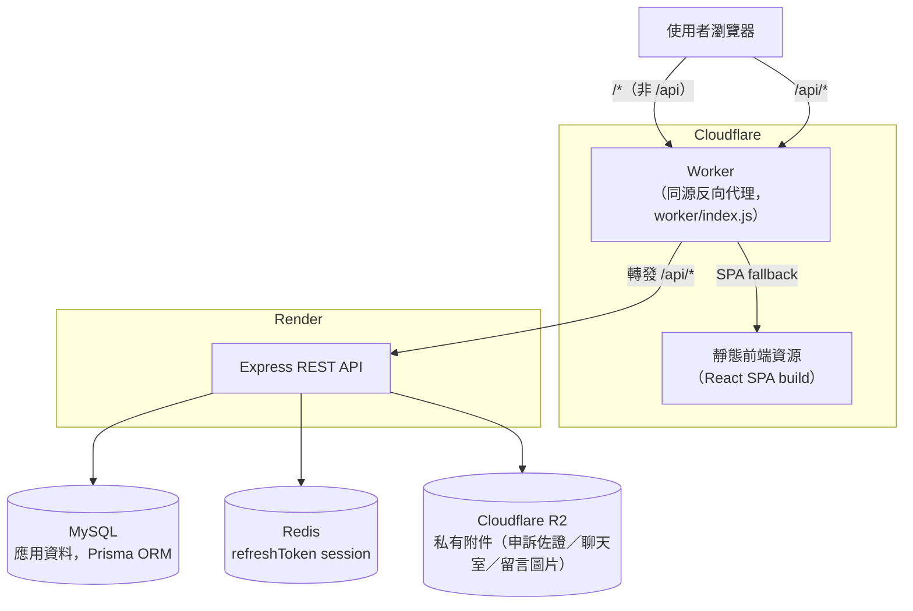

# 架構總覽

## 系統架構

正式環境前端與後端分屬兩個不同服務（Cloudflare／Render），中間用一個 Cloudflare Worker 把兩者變成同一個 origin：瀏覽器只跟這個 Worker 對話，`/api/*` 由 Worker 原樣轉發到 Render 上的 Express 服務，其餘路徑回傳前端靜態資源。這樣設計是為了讓 refreshToken 的 HttpOnly Cookie 可以用一般的 `SameSite=Lax`，不用處理跨網域 Cookie（`SameSite=None`）在 Safari ITP 等瀏覽器上容易被限制或封鎖的問題。



## 架構分層

```
React 19 + React Router v7
          │
    Feature Modules（UI 與頁面）
          │
    Store 層（記憶體快取 + 業務邏輯）
          │
    API 層（REST 封裝，axios）
          │
  Express 後端
          │
    MySQL（Prisma ORM）+ Redis（快取 / Session）
```

讀取走 Store（同步取用記憶體快取），寫入走 API（非同步打後端）。

## 技術棧與選型

| 層級 | 技術 | 為什麼選這個 |
|------|------|--------------|
| 前端框架 | React 19 + Vite | 開發體驗與建置速度優於 CRA |
| 路由 | React Router v7 | 純 SPA 不需要 Next.js 的 SSR/檔案路由 |
| 樣式 | Tailwind CSS v4 | 用 `@theme` 集中管理設計 token |
| 前端狀態 | Zustand | 樣板碼少，且適合跨頁面共享的伺服器快取資料 |
| 後端框架 | Node.js + Express | Middleware 模式與 REST 資源路由對應直觀 |
| ORM | Prisma | 型別安全的 schema-first 開發，transaction API 好用 |
| 資料庫 | MySQL 8 | 關聯式資料最符合群組/成員/申請的強關聯業務模型 |
| 快取 | Redis | 作為 refreshToken session store |
| 認證 | JWT（雙 token） | accessToken 短效 + refreshToken 長效，支援個別裝置登出 |
| 檔案儲存 | Cloudflare R2 | 申訴佐證、聊天室與留言附件的圖片上傳目的地 |

美金計價的訂閱方案改用即時匯率換算台幣顯示金額（非寫死換算），詳見[服務定價查證紀錄](../product/service-pricing-audit.md)。

## 文件導覽

| 文件 | 內容 |
|------|------|
| [前端架構](./frontend.md) | 資料夾結構原則、Store 層、路由設計概觀 |
| [後端架構](./backend.md) | Route 架構、Middleware、權限控管概觀 |
| [資料庫 Schema](./database.md) | 主要資料模型與群組狀態機 |
| [API 總覽](./api.md) | API 設計風格概覽 |
| [認證機制](./authentication.md) | JWT 雙 token、多裝置 session 概念 |
| [命名慣例](./naming-conventions.md) | 命名慣例哲學 |
