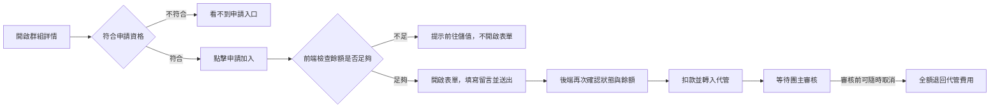

# 申請加入群組

## 使用者目標
在群組詳情頁對招募中的群組送出加入申請，等待團主審核。送出申請的當下就會把費用轉入平台代管，等待期間可以隨時取消拿回這筆錢。

## 流程圖

## 流程
1. 使用者需符合申請資格（非團主、非既有成員、沒有進行中的申請、群組未額滿、已登入）才會看到「申請加入」入口
2. 點擊「申請加入」時，前端先比對席位費用與目前餘額；不足會直接跳提示引導去儲值，填寫留言的表單不會打開
3. 餘額足夠才開啟表單，填寫選填的申請留言、勾選同意群組規則與付款條件後送出
4. 後端再次驗證群組狀態與申請人餘額（避免前端檢查後、送出前餘額被其他操作變動），有問題一樣給出明確提示
5. 通過驗證後立即從個人餘額扣款、轉入該群組的代管餘額，並建立申請紀錄
6. 申請人與團主各自收到對應通知
7. 審核前可以隨時取消申請，取消會全額退回代管費用，且可以重新申請

## 產品決策
- **代管扣款發生在申請當下，不是等團主接受**：讓使用者一送出申請就知道款項已經被代管扣留，也確保團主看到的每一筆申請都具備實際付款能力，而非缺乏依據的申請
- **申請成功要等後端確認才更新畫面**：避免遇到餘額不足這類錯誤時，畫面上的標籤先跳出來又消失的閃爍體驗

## 驗證重點
- 團主不能申請自己的群組；群組必須是招募中才能申請
- 同一使用者對同一群組不能有多筆進行中的申請
- 取消只能取消自己、且仍在審核中的申請
