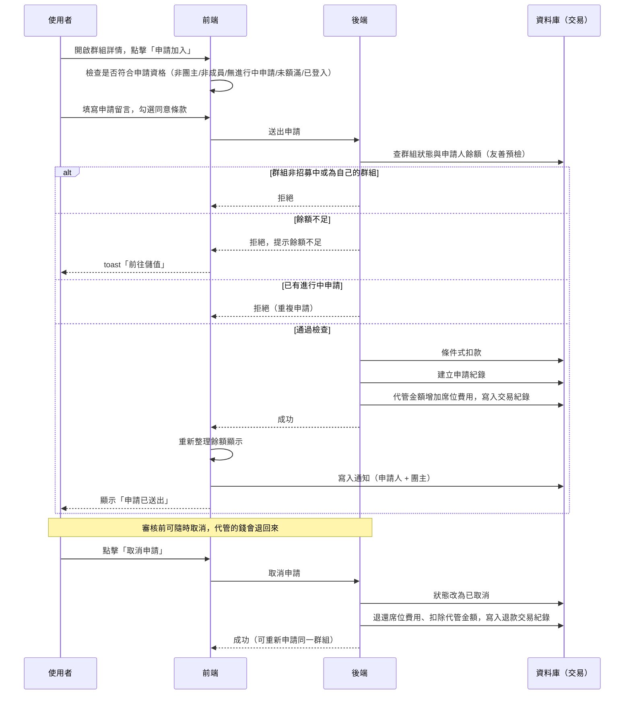

# 申請加入群組

## 使用者目標
在群組詳情頁對招募中（`recruiting`）的群組送出加入申請，等待團主審核。送出申請的當下就會把席位費用轉入平台代管，等待期間可以隨時取消拿回這筆錢。

## 流程圖

## 入口
- 群組詳情頁的「申請加入」按鈕（手機版與桌機版各自對應按鈕），會開啟申請彈窗
- 群組詳情彈窗透過共用事件開啟，在探索頁、快速搜尋結果、收藏頁等處點擊群組卡片皆會觸發

## 相關檔案

**前端**

| 路徑 | 說明 |
|------|------|
| `src/features/group/GroupDetailModal.jsx` | `canApply` 判斷、`handleApply`、`handleCancel` |
| `src/features/group/components/ApplyModal.jsx` | 申請留言、同意條款、送出/成功畫面 |
| `src/features/group/components/buildMobileFooter.jsx` | 未登入時導向登入頁；已登入且 `canApply` 時顯示「申請加入」按鈕 |
| `src/common/stores/useApplicationStore.js` | `create`、`withdraw`，成功後都會呼叫 `useAuthStore.refreshTokenBalance()` 同步餘額顯示 |
| `src/common/api/applicationsApi.js` | `insertApplication`、`deleteApplication` |
| `src/common/utils/toast.js` | PM 幣不足時的錯誤提示，含「前往儲值」action |

**後端**

| 路徑 | 說明 |
|------|------|
| `server/src/routes/applications.js` | `POST /applications`、`DELETE /applications/:id` |
| `server/src/utils/pricing.js` | `computeSeatCost`，計算席位費用 |

**資料表 / Model**

| Model | 用途 |
|-------|------|
| `Application` | 新建 / 取消；`escrowAmount` 記錄申請當下實際代管扣款的金額，取消退款要用這個值 |
| `Group` | 讀取 `status`、`hostId`、`monthlyFee`、`billingCycle`；取消時更新 `escrowTokens` |
| `User` | 讀取／扣款／退款 `tokenBalance` |
| `TokenTransaction` | 申請時寫入 `escrow`，取消時寫入 `refund` |

## 使用技術
- **不會先在畫面上更新**：申請成功要等後端真的確認才寫入本地狀態。如果送出當下就先顯示成功，遇到餘額不足這類錯誤時，探索頁的「已申請」標籤就會先跳出來又馬上消失，體驗反而更差
- **用「進行中才給值、其餘留空」模擬部分唯一索引**：申請在審核中或已通過時會標記為進行中，其餘狀態則清空；MySQL 的 unique index 允許多個空值並存，就靠這點擋掉併發時的重複申請
- **申請狀態即時從 store 讀，不放進彈窗自己的 state**：這樣團主審核完之後，群組詳情頁看到的狀態才不會跟 store 對不上
- **友善預檢 + 條件式扣款兩層把關**：送出申請前先讀一次餘額，餘額不夠就給明確的錯誤訊息；真正扣款時還是靠交易內的條件式更新確保不會扣成負數，避免使用者同時對兩個不同群組送出申請時被超扣

## 流程步驟

**1. 判斷是否可申請**
- 前端根據使用者與群組的關係，推導出是否已有進行中的申請（排除已拒絕/已移除/已退出/已取消，以及「已接受但已不是成員」的邊界情況），以及該申請是否仍在審核中
- 非團主、非成員、無進行中申請、群組未額滿、且已登入，才會顯示「申請加入」入口
- 未登入時改顯示導向登入頁的按鈕（登入後導向首頁，不會回到原本的群組頁）

**2. 填寫並送出申請**
- 點擊「申請加入」開啟申請彈窗（隱藏後方的群組詳情彈窗）
- 填寫選填的申請留言，勾選同意群組規則與付款條件
- 未勾選同意條款時「送出申請」按鈕停用；點擊後送出申請

**3. 後端驗證與代管扣款**
- 併發查詢群組與申請人餘額
- 依序檢查：群組存在、群組狀態為招募中、團主不能申請自己的群組
- 算出席位費用，餘額不足就回傳錯誤（這一步只是給友善錯誤訊息的預檢）
- 查該使用者對此群組最新一筆申請，若存在且仍算進行中，回傳重複申請錯誤
- 通過後進入交易：條件式扣款（不足則失敗）→ 建立申請紀錄，同時記下這次實際扣款的金額（之後取消/拒絕退款要用這個值，不能用即時價格重算）→ 群組代管金額增加 → 寫入代管交易紀錄；若資料庫層擋下重複申請，整筆交易回滾（不會留下扣了錢但沒建申請的中間狀態）

**4. 送出成功後**
- 前端把新申請加入本地列表，並重新整理餘額顯示，讓畫面上的 PM 幣同步扣款後的金額
- 即時通知申請人自己「申請已送出」
- 只寫入資料庫通知團主，不即時推送，需刷新頁面才會看到
- 彈窗切到成功畫面：「申請已送出！等待團主審核後即可加入」

**5. 取消申請**
- 申請仍在審核中時，群組詳情頁會提供「取消申請」
- 前端先把該筆狀態改成已取消並顯示在畫面上，再送出取消請求；失敗則重新拉取真實狀態並拋出錯誤
- 後端檢查：申請存在、僅申請人本人可取消、且申請仍在審核中
- 通過後進入交易：條件式更新（避免跟團主同時審核衝突）把狀態改為已取消、清空進行中標記，接著用共用的退款流程，取當初扣款金額與目前代管餘額中較小者退還、寫入退款交易紀錄
- 成功後前端重新整理餘額顯示

## 驗證重點
- 代管扣款發生在申請當下，不是等團主接受：友善預檢用讀到的餘額快照給明確錯誤訊息，正式扣款仍在交易內用條件式更新二次核對，兩邊都失敗才不會產生扣了一半的狀態
- 團主不能申請自己的群組
- 群組必須是招募中才能申請，額滿或已鎖定一律拒絕
- 重複申請防護雙層：應用層先查最新一筆申請擋掉一般情況，資料庫層再靠唯一索引擋併發（第二筆送出時整個交易一起回滾，不會留下已扣款但沒建立申請的資料）
- 取消只能取消自己、且仍在審核中的申請；已接受/已拒絕/已離開的無法取消，取消時的退款用條件式更新限定僅審核中才處理，避免跟團主幾乎同時審核造成重複退款
- 取消後可對同一群組重新申請（重新申請會是全新一筆代管扣款）
