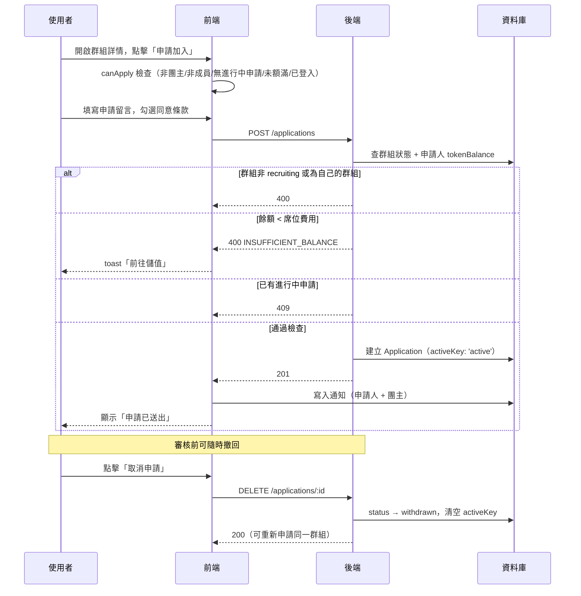

# 申請加入群組

## 使用者目標
在群組詳情頁對招募中（`recruiting`）的群組送出加入申請，等待團主審核。

## 流程圖

## 入口
- `GroupDetailModal` 內的「申請加入」按鈕（手機版在 `buildMobileFooter.jsx`，桌機版為對應按鈕），開啟 `ApplyModal` 子彈窗
- `GroupDetailModal` 透過 `pm:open-group` custom event 開啟，於探索頁 `ExploreGroupCard`、快速搜尋結果、收藏頁等處點擊群組卡片觸發

## 相關檔案

**前端**

| 路徑 | 說明 |
|------|------|
| `src/features/group/GroupDetailModal.jsx` | `canApply` 判斷、`handleApply`、`handleWithdraw` |
| `src/features/group/components/ApplyModal.jsx` | 申請留言、同意條款、送出/成功畫面 |
| `src/features/group/components/buildMobileFooter.jsx` | 未登入時導向登入頁；已登入且 `canApply` 時顯示「申請加入」按鈕 |
| `src/shared/stores/useApplicationStore.js` | `create`、`withdraw` |
| `src/shared/api/applicationsApi.js` | `insertApplication`、`deleteApplication` |
| `src/shared/utils/toast.js` | PM 幣不足時的錯誤提示，含「前往儲值」action |

**後端**

| 路徑 | 說明 |
|------|------|
| `server/src/routes/applications.js` | `POST /applications`、`DELETE /applications/:id` |
| `server/src/utils/pricing.js` | `computeSeatCost`，計算席位費用 |

**資料表 / Model**

| Model | 用途 |
|-------|------|
| `Application` | 新建 / 撤回 |
| `Group` | 讀取 `status`、`hostId`、`monthlyFee`、`billingCycle` |
| `User` | 讀取 `tokenBalance` 做餘額預檢 |

## 使用技術
- **不做樂觀更新**：`useApplicationStore.create` 要等 `insertApplication(...)` 真的成功才寫入 store。如果先樂觀更新，遇到餘額不足這類錯誤時，探索頁的「已申請」標籤就會先跳出來又馬上消失，體驗反而更差
- **`activeKey` 模擬 partial unique index**：`Application` 有 `@@unique([groupId, userId, activeKey])`，`pending`/`approved` 時 `activeKey = 'active'`，其餘狀態則是 `null`；MySQL 的 unique index 允許多個 `null` 並存，就靠這點擋掉併發時的重複申請
- **申請狀態即時從 store 讀，不放進 modal 自己的 state**：這樣團主審核完之後，群組詳情頁看到的狀態才不會跟 store 對不上

## 流程步驟

**1. 判斷是否可申請**
- `GroupDetailModal` 計算 `app = getByUserAndGroup(activeUserId, group.id)`，推導出：
  - `hasActiveApp`：排除 `rejected`/`removed`/`left`/`withdrawn`，以及「已核准但已不是成員」的邊界情況
  - `isPendingApp`：申請是否仍在審核中
- `canApply = !isHost && !isMember && !hasActiveApp && !isFull && !!activeUserId`，全部成立才顯示「申請加入」入口
- 未登入時 `buildMobileFooter` 改顯示導向 `/login?redirectTo=/groups/:id` 的按鈕

**2. 填寫並送出申請**
- 點擊「申請加入」→ 開啟 `ApplyModal`（隱藏後方群組詳情 modal）
- 填寫選填的申請留言（`applyMessage`），勾選同意群組規則與付款條件（`applyAgreed`）
- 「送出申請」在 `!applyAgreed` 時停用；點擊後呼叫 `useApplicationStore.create(...)` → `insertApplication` → `POST /applications`

**3. 後端驗證與建立**
- 併發查詢群組（`prisma.group.findUnique`）與申請人 `tokenBalance`
- 依序檢查：群組存在、`status === 'recruiting'`、`group.hostId !== req.user.id`（團主不能申請自己的群組）
- 用 `computeSeatCost(group)` 算出席位費用，`tokenBalance < seatCost` 回 `400 INSUFFICIENT_BALANCE`（**此階段只檢查，不預扣**）
- 查該使用者對此群組最新一筆申請，若存在且非 `['rejected','removed','left','withdrawn']`，回 `409`
- 通過後 `prisma.application.create(...)`；若資料庫層 unique constraint 擋下（`P2002`）同樣回 `409`

**4. 送出成功後**
- 前端把新申請（覆蓋為後端回傳的真實 `id`）加入 `applications` store
- 即時寫入「申請已送出」通知給申請人自己（本地 store + DB）
- 只寫 DB 通知團主（不即時推入團主 session 的 store，需刷新頁面才會看到）
- `ApplyModal` 切到成功畫面：「申請已送出！等待團主審核後即可加入」

**5. 撤回申請**
- `isPendingApp` 為真時，`GroupDetailModal` 提供「取消申請」（`handleWithdraw`）
- 前端樂觀把該筆狀態改為 `withdrawn` → `DELETE /applications/:id`；失敗則重新 `init()` 拉取真實狀態並拋出錯誤
- 後端檢查：申請存在、`userId === req.user.id`（僅申請人可撤回）、`status === 'pending'`（只能撤回審核中的）
- 符合則 `status → withdrawn`，清空 `activeKey`（釋放名額，可重新申請同一群組）

## 驗證重點
- 餘額只預檢不預扣：申請當下檢查 `tokenBalance >= seatCost`，實際扣款發生在核准當下（見 `approval-flow.md`），核准時 `admitMemberIntoGroup` 會二次檢查，等待期間餘額被花光就核准失敗
- 團主不能申請自己的群組（`group.hostId === req.user.id` → 400）
- 群組必須是 `recruiting` 才能申請，`full`／已鎖定一律 400
- 重複申請防護雙層：應用層先 `findFirst` 查最新一筆申請擋掉一般情況，資料庫層再靠 `(groupId, userId, activeKey)` unique index 擋併發（第二筆 `P2002` 回 409）
- 撤回只能撤自己、且仍為 `pending` 的申請；已核准/已拒絕/已離開的無法撤回
- 撤回後 `activeKey` 清空為 `null`，可對同一群組重新申請
