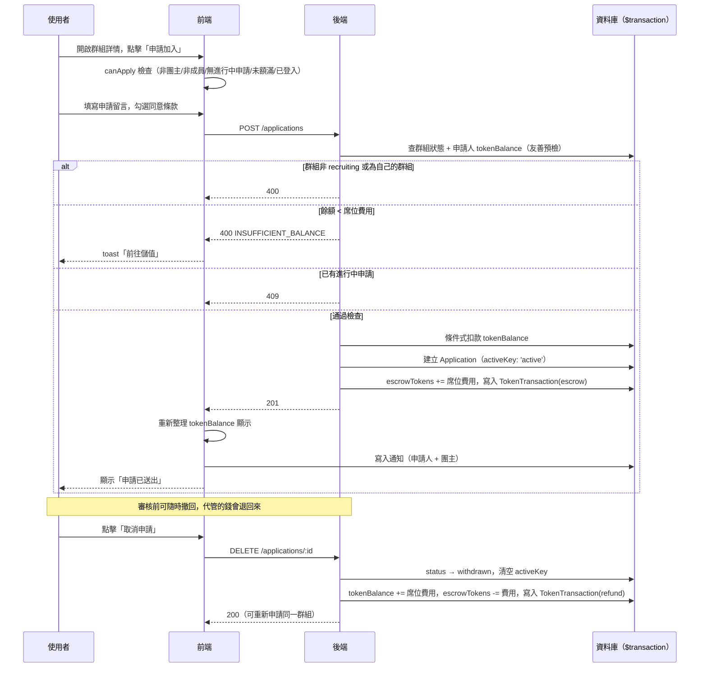

# 申請加入群組

## 使用者目標
在群組詳情頁對招募中（`recruiting`）的群組送出加入申請，等待團主審核。送出申請的當下就會把席位費用轉入平台代管，等待期間可以隨時撤回拿回這筆錢。

## 流程圖

## 入口
- `GroupDetailModal` 內的「申請加入」按鈕（手機版在 `buildMobileFooter.jsx`，桌機版為對應按鈕），開啟 `ApplyModal` 子彈窗
- `GroupDetailModal` 透過 `pm:open-group` custom event 開啟，於探索頁 `ExploreGroupCard`、快速搜尋結果、收藏頁等處點擊群組卡片觸發

## 相關檔案

**前端**

| 路徑 | 說明 |
|------|------|
| `src/features/group/GroupDetailModal.jsx` | `canApply` 判斷、`handleApply`、`handleWithdraw` |
| `src/features/group/components/ApplyModal.jsx` | 申請留言、同意條款、送出/成功畫面 |
| `src/features/group/components/buildMobileFooter.jsx` | 未登入時導向登入頁；已登入且 `canApply` 時顯示「申請加入」按鈕 |
| `src/shared/stores/useApplicationStore.js` | `create`、`withdraw`，成功後都會呼叫 `useAuthStore.refreshTokenBalance()` 同步餘額顯示 |
| `src/shared/api/applicationsApi.js` | `insertApplication`、`deleteApplication` |
| `src/shared/utils/toast.js` | PM 幣不足時的錯誤提示，含「前往儲值」action |

**後端**

| 路徑 | 說明 |
|------|------|
| `server/src/routes/applications.js` | `POST /applications`、`DELETE /applications/:id` |
| `server/src/utils/pricing.js` | `computeSeatCost`，計算席位費用 |

**資料表 / Model**

| Model | 用途 |
|-------|------|
| `Application` | 新建 / 撤回；`escrowAmount` 記錄申請當下實際代管扣款的金額，撤回退款要用這個值 |
| `Group` | 讀取 `status`、`hostId`、`monthlyFee`、`billingCycle`；撤回時更新 `escrowTokens` |
| `User` | 讀取／扣款／退款 `tokenBalance` |
| `TokenTransaction` | 申請時寫入 `escrow`，撤回時寫入 `refund` |

## 使用技術
- **不做樂觀更新**：`useApplicationStore.create` 要等 `insertApplication(...)` 真的成功才寫入 store。如果先樂觀更新，遇到餘額不足這類錯誤時，探索頁的「已申請」標籤就會先跳出來又馬上消失，體驗反而更差
- **`activeKey` 模擬 partial unique index**：`Application` 有 `@@unique([groupId, userId, activeKey])`，`pending`/`approved` 時 `activeKey = 'active'`，其餘狀態則是 `null`；MySQL 的 unique index 允許多個 `null` 並存，就靠這點擋掉併發時的重複申請
- **申請狀態即時從 store 讀，不放進 modal 自己的 state**：這樣團主審核完之後，群組詳情頁看到的狀態才不會跟 store 對不上
- **友善預檢 + 條件式扣款兩層把關**：送出申請前先讀一次餘額，餘額不夠就給明確的錯誤訊息；真正扣款時還是靠 transaction 內的條件式 `updateMany`（`tokenBalance: { gte: seatCost }`）確保不會扣成負數，避免使用者同時對兩個不同群組送出申請時被超扣

## 流程步驟

**1. 判斷是否可申請**
- `GroupDetailModal` 計算 `app = getByUserAndGroup(activeUserId, group.id)`，推導出：
  - `hasActiveApp`：排除 `rejected`/`removed`/`left`/`withdrawn`，以及「已接受但已不是成員」的邊界情況
  - `isPendingApp`：申請是否仍在審核中
- `canApply = !isHost && !isMember && !hasActiveApp && !isFull && !!activeUserId`，全部成立才顯示「申請加入」入口
- 未登入時 `buildMobileFooter` 改顯示導向 `/login` 的按鈕（登入後導向首頁，不會回到原本的群組頁）

**2. 填寫並送出申請**
- 點擊「申請加入」→ 開啟 `ApplyModal`（隱藏後方群組詳情 modal）
- 填寫選填的申請留言（`applyMessage`），勾選同意群組規則與付款條件（`applyAgreed`）
- 「送出申請」在 `!applyAgreed` 時停用；點擊後呼叫 `useApplicationStore.create(...)` → `insertApplication` → `POST /applications`

**3. 後端驗證與代管扣款**
- 併發查詢群組（`prisma.group.findUnique`）與申請人 `tokenBalance`
- 依序檢查：群組存在、`status === 'recruiting'`、`group.hostId !== req.user.id`（團主不能申請自己的群組）
- 用 `computeSeatCost(group)` 算出席位費用，`tokenBalance < seatCost` 回 `400 INSUFFICIENT_BALANCE`（這一步只是給友善錯誤訊息的預檢）
- 查該使用者對此群組最新一筆申請，若存在且非 `['rejected','removed','left','withdrawn']`，回 `409`
- 通過後進入 `$transaction`：條件式扣款 `tokenBalance`（不足則回 `400 INSUFFICIENT_BALANCE`）→ `prisma.application.create(...)` 同時把 `escrowAmount` 設成這次扣的 `seatCost`（之後撤回/拒絕退款要用這個值，不能用即時價格重算）→ `group.escrowTokens` 增加 → 寫入 `TokenTransaction(type: 'escrow')`；若資料庫層 unique constraint 擋下（`P2002`）回 `409`，整筆交易回滾（不會留下扣了錢但沒建申請的中間狀態）

**4. 送出成功後**
- 前端把新申請（覆蓋為後端回傳的真實 `id`）加入 `applications` store，並呼叫 `refreshTokenBalance()` 讓畫面上的 PM 幣顯示同步扣款後的餘額
- 即時寫入「申請已送出」通知給申請人自己（本地 store + DB）
- 只寫 DB 通知團主（不即時推入團主 session 的 store，需刷新頁面才會看到）
- `ApplyModal` 切到成功畫面：「申請已送出！等待團主審核後即可加入」

**5. 撤回申請**
- `isPendingApp` 為真時，`GroupDetailModal` 提供「取消申請」（`handleWithdraw`）
- 前端樂觀把該筆狀態改為 `withdrawn` → `DELETE /applications/:id`；失敗則重新 `init()` 拉取真實狀態並拋出錯誤
- 後端檢查：申請存在、`userId === req.user.id`（僅申請人可撤回）、`status === 'pending'`（只能撤回審核中的）
- 通過後進入 `$transaction`：條件式更新（僅 `status: 'pending'` 才處理，避免跟團主同時審核衝突）把 `status → withdrawn`、清空 `activeKey` → 呼叫共用的 `refundEscrow`，用 `escrowAmount`（跟目前 `escrowTokens` 取 `Math.min`）退還代管金額、寫入 `TokenTransaction(type: 'refund')`
- 成功後前端呼叫 `refreshTokenBalance()` 同步餘額顯示

## 驗證重點
- 代管扣款發生在申請當下，不是等團主接受：友善預檢用讀到的餘額快照給明確錯誤訊息，正式扣款仍在 transaction 內用條件式 `updateMany` 二次核對，兩邊都失敗才不會產生扣了一半的狀態
- 團主不能申請自己的群組（`group.hostId === req.user.id` → 400）
- 群組必須是 `recruiting` 才能申請，`full`／已鎖定一律 400
- 重複申請防護雙層：應用層先 `findFirst` 查最新一筆申請擋掉一般情況，資料庫層再靠 `(groupId, userId, activeKey)` unique index 擋併發（第二筆 `P2002` 回 409，且整個 transaction 一起回滾，不會留下已扣款但沒建立申請的資料）
- 撤回只能撤自己、且仍為 `pending` 的申請；已接受/已拒絕/已離開的無法撤回，撤回時的退款用條件式 `updateMany` 限定僅 `pending` 才處理，避免跟團主幾乎同時審核造成重複退款
- 撤回後 `activeKey` 清空為 `null`，可對同一群組重新申請（重新申請會是全新一筆代管扣款）
