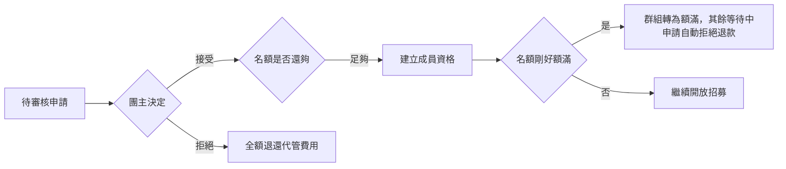

# 團主審核申請

## 使用者目標
團主檢視收到的加入申請，決定接受或拒絕。代管扣款在申請當下就已經完成，接受只需要建立成員資格，拒絕則要把代管的費用全額退還申請人；即使多筆申請幾乎同時被處理，也不能讓群組超收名額或重複處理同一筆申請。

## 流程圖

## 流程
1. 團主在申請管理面板看到所有待審核的申請，含申請人資訊與留言
2. 點擊「接受」：系統確認名額仍夠、申請仍在審核中後才正式生效，建立成員資格；若名額剛好額滿，群組狀態會自動推進為額滿，其他還在等待審核的申請則會被自動拒絕並退款
3. 點擊「拒絕」：把代管的費用全額退還給申請人
4. 雙方各自收到對應通知

## 產品決策
- **接受不再重複扣款**：代管扣款已在申請當下完成，接受這一步純粹是身分確認與建立成員資格
- **用樂觀鎖防止重複處理**：確保同一筆申請不會被兩個幾乎同時的操作重複接受或重複退款，也確保名額不會被超賣
- **拒絕時狀態一定會被寫入，退款則視情況而定**：避免申請卡在中間狀態出不去

## 驗證重點
- 只有團主本人能審核自己群組的申請
- 名額已滿時無法再接受新的申請
- 接受、建立成員資格、額滿轉態是一個不可分割的整體，任何一步失敗就整批不生效
