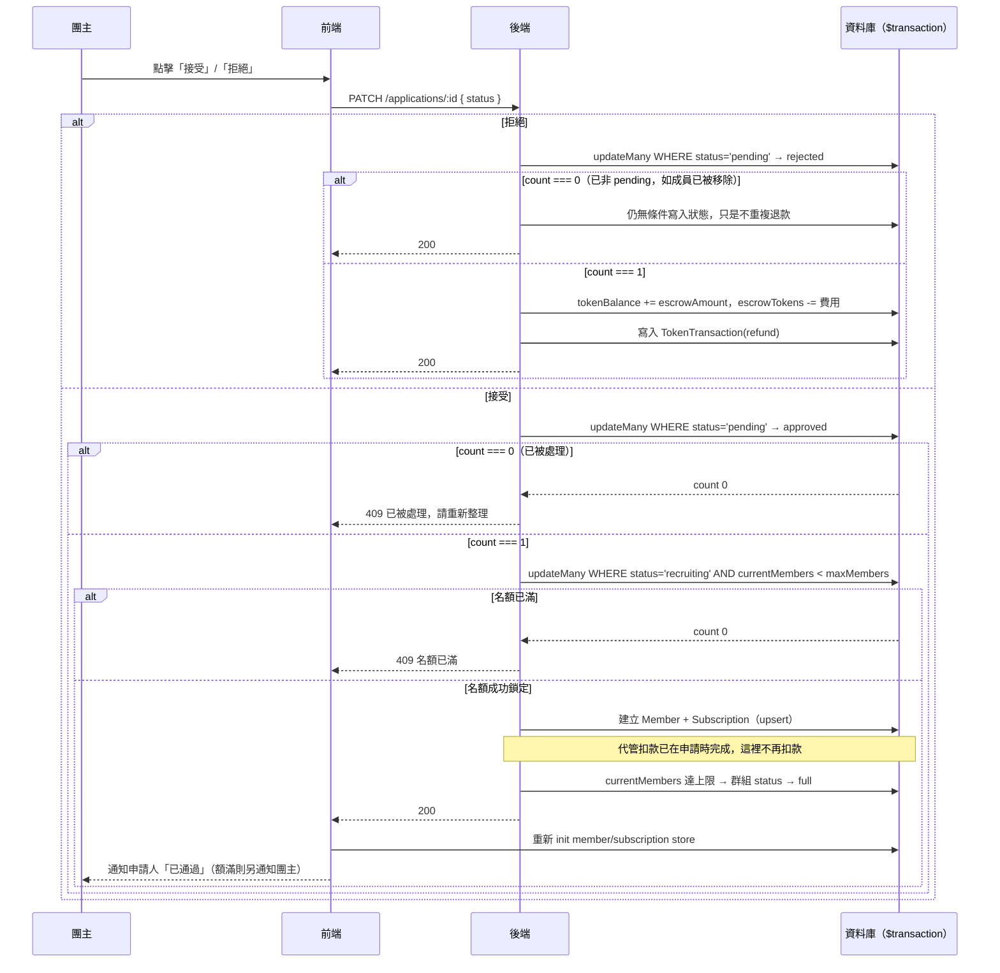

# 團主審核申請

## 使用者目標
團主檢視收到的加入申請，決定接受或拒絕。代管扣款在申請當下就已經完成，接受只需要建立成員與名額，拒絕則要把代管的金額退還申請人；高併發下也不能超賣名額或重複處理同一筆申請。

## 流程圖

## 入口
- `/manage-groups`（`ManageGroupsPage.jsx`）開啟某個群組的 `HostGroupView`，切到「申請管理」分頁（`buildApplicationsPanel`），會列出所有待審核（`pending`）的申請
- 也可以從通知中心點「收到新的加入申請」，經 `pm:open-host-group` custom event 直接跳到該群組的申請管理分頁

## 相關檔案

**前端**

| 路徑 | 說明 |
|------|------|
| `src/features/manage-groups/ManageGroupsPage.jsx` | 頁面入口 |
| `src/features/manage-groups/components/HostGroupView.jsx` | 團主視角群組詳情 |
| `src/features/manage-groups/components/hostGroupView/buildApplicationsPanel.jsx` | 申請管理面板 |
| `src/features/manage-groups/components/hostGroupView/ApplicationCard.jsx` | 單筆申請卡片：接受/拒絕按鈕、審核中/已接受/已拒絕/已移除/已退出狀態 badge |
| `src/features/manage-groups/hooks/useHostActions.js` | `handleApprove`、`handleReject` |
| `src/features/manage-groups/utils/hostFilters.js` | `calcApprovalSeatPatch`，前端本地名額計算 |
| `src/common/stores/useApplicationStore.js` | `updateStatus` |
| `src/common/api/applicationsApi.js` | `patchApplication` |

**後端**

| 路徑 | 說明 |
|------|------|
| `server/src/routes/applications.js` | `PATCH /applications/:id` |
| `server/src/utils/membership.js` | `finalizeApprovedApplication`（接受用）、`refundEscrow`（拒絕退款用） |
| `server/src/utils/pricing.js` | `computeSeatCost`，僅在申請沒有 `escrowAmount`（例如舊資料）時作為 fallback |

**資料表 / Model**

| Model | 用途 |
|-------|------|
| `Application` | 狀態變更：`pending → approved/rejected`；`escrowAmount` 記錄申請當下實際代管的金額 |
| `Group` | 更新 `currentMembers`、`status`；拒絕時退回 `escrowTokens` |
| `Member` | 接受時 `upsert` 建立 |
| `Subscription` | 接受時 `upsert` 建立，狀態預設 `pending` |
| `User` | 拒絕時退還申請人 `tokenBalance` |
| `TokenTransaction` | 拒絕時寫入 `type: 'refund'` 紀錄 |

## 使用技術
- **代管扣款不在這裡發生**：申請當下（見 `apply-join-flow.md`）就已經扣款代管，接受這一步只需要建立成員、更新名額，改呼叫 `finalizeApprovedApplication`（跟團主手動加人共用的 `admitMemberIntoGroup` 是兩個不同函式，各自只做自己那份工作，不用 flag 切換行為）
- **用 Prisma interactive transaction 包住整個接受流程**：查名額上限、呼叫 `finalizeApprovedApplication`（名額檢查、建立 member/subscription、額滿轉 full）全部包在同一個 `$transaction` 裡，任何一步出錯就整個回滾，不會發生「申請標成 approved，但成員卻沒建出來」這種半套狀態
- **用條件式 `updateMany` 當樂觀鎖**：`tx.application.updateMany({ where: { id, status: 'pending' }, data: { status: 'approved' } })`，靠 `WHERE status = 'pending'` 確保只有第一個請求能把 `count` 變成 1；重複點擊或多開分頁送出的第二個請求會拿到 `count === 0`，直接回 409 中止
- **拒絕分支：狀態一定寫入，退款才看情況**：拒絕（或團主移除已接受成員時前端連帶送出的 `status: 'removed'`）都會先嘗試條件式 `updateMany`（僅 `status: 'pending'` 才算數）；搶到了才退款，沒搶到（代表這筆申請已經不是 `pending`，例如成員被移除、`DELETE /members/:id` 已經處理過自己的退款）就退化成一次無條件的狀態寫入，只是不會再退一次款——狀態轉換跟退款是兩件事，不能共用同一個判斷式，不然申請狀態會卡住出不去（見下方「驗證重點」）
- **退款用當初實際扣的金額，不是即時價格**：`Application.escrowAmount` 記錄申請當下真正扣了多少 PM 幣，拒絕/撤回退款都讀這個值，並跟目前 `group.escrowTokens` 取 `Math.min` 夾住，避免團主事後改價格、或代管餘額因故不足時退款金額對不上或被扣成負數
- **退款邏輯抽成共用函式**：`refundEscrow(tx, { userId, groupId, amount, note })` 讓這裡（拒絕）、撤回申請（`DELETE /applications/:id`）、成員移除/退出（`members.js`）三處共用，不用各自重寫一次「加回餘額、扣代管、寫交易紀錄」
- **名額防超賣也是靠條件式 `updateMany`**：`count === 0` 就代表寫入的那一瞬間名額其實已經滿了，直接 409 擋下，避免兩筆申請同時接受、超過 `maxMembers`
- 前端 `handleApprove` 送出前會先做一次本地名額快照檢查，這只是給使用者的即時回饋，真正的防線還是後端的 transaction；接受成功後會重新拉一次真實資料，確保 store 裡拿到的是 transaction 建出來的真實 `Member`/`Subscription` id

## 流程步驟

**1. 查看待審核申請**
- 團主在「申請管理」分頁看到 `pendingApps`（`app.status === 'pending'`）
- `ApplicationCard` 顯示申請人姓名、信用分數 badge、相對時間，以及可展開的申請留言

**2. 點擊接受**
- `ApplicationCard` 呼叫 `onApprove(app.id)`，`buildApplicationsPanel` 先執行接受，成功後把面板收合
- `useHostActions.handleApprove(appId)` 依序做本地檢查：
  - 確認申請仍是 `pending`、對應群組還存在
  - `alreadyMember`：是否已經是成員（避免重複接受造成的邊界情況）
  - `seats.openSeats <= 0`：已經額滿就顯示「此群組已額滿，無法接受」，不會呼叫 API
- 通過檢查後，先樂觀把本地那筆申請改成 `approved`（順便把團主自己「收到新申請」的通知標成已讀），再打 `PATCH /applications/:id { status: 'approved' }`

**3. 後端接受邏輯**
- 先確認 `application.group.hostId === req.user.id`（只有團主本人能審核），否則回 403
- 進入 `$transaction`：
  1. 條件式 `updateMany` 搶佔申請，`count === 0` 就丟出 409（此申請已被處理，請重新整理頁面）
  2. 查群組的 `maxMembers`，不存在就丟出 404
  3. 呼叫 `finalizeApprovedApplication(tx, { groupId, userId, maxMembers })`（細節見下一步）
  4. 回傳更新後的 `Application`

**4. `finalizeApprovedApplication` 內部做的事**
- 不做任何餘額檢查或扣款，因為申請當下已經確認過餘額並扣款完成
- 用條件式 `updateMany` 檢查並鎖定名額，失敗就丟出 409
- 平行執行：`Member.upsert`、`Subscription.upsert`（用 `upsert` 是因為「團主直接加人」跟「申請接受」概念上是同一件事，就算使用者已經有殘留記錄也不會報錯）
- 重新查一次群組的 `currentMembers`/`maxMembers`，剛好達到上限就把群組狀態推進為 `full`

**5. 接受成功後**
- 前端重新拉取真實的成員/訂閱資料
- 用 `calcApprovalSeatPatch(seats, alreadyMember)` 算出本地 `usedSeats`/`openSeats`（剛好額滿會附帶 `status: 'full'`）並樂觀更新群組
- 只寫 DB 通知申請人「申請已通過」；如果剛好額滿，還會即時通知團主自己「群組名額已滿，可以點擊鎖定群組了」

**6. 點擊拒絕**
- `handleReject(appId)` 先確認仍是 `pending`，再打 `PATCH /applications/:id { status: 'rejected' }`
- 後端進入 `$transaction`：條件式 `updateMany`（僅 `status: 'pending'` 才算數）把狀態改為 `rejected`、清空 `activeKey`；搶到了才呼叫 `refundEscrow` 把代管的金額（`escrowAmount`，跟目前 `escrowTokens` 取 min）退還給申請人
- 前端寫入「申請未通過」通知給申請人（只寫 DB），並重新整理自己的餘額顯示（如果是申請人自己在看畫面的話，會透過輪詢/重新整理拿到最新餘額）

## 驗證重點
- 權限：`PATCH /applications/:id` 要求 `application.group.hostId === req.user.id`，非團主一律回 403
- 重複接受防護：條件式 `updateMany({ where: { status: 'pending' } })` 是唯一防線，重複點擊或網路重試送出兩個一樣的 PATCH，後到的那個拿 `count === 0` 整批回滾，不會建成員
- 名額超賣防護：`finalizeApprovedApplication` 的條件式 `updateMany` 確保兩筆申請幾乎同時接受時只有一筆能把 `currentMembers` 加 1，另一筆回 409，不會超過 `maxMembers`
- 接受不再重複扣款：代管扣款只在申請當下發生一次，接受時 `finalizeApprovedApplication` 完全不碰 `tokenBalance`/`escrowTokens`
- **拒絕/移除時狀態一定要寫入，即使不用退款**：狀態轉換一定會執行，只有退款金額的寫入受條件式保護
- 拒絕退款用 `escrowAmount` 而非即時 `computeSeatCost`，避免團主事後修改群組價格/計費週期時，退款金額跟當初真正扣的錢對不上
- 接受、建 `Member`/`Subscription`、額滿轉 `full` 全部包在同一個 transaction，任何一步失敗就整批回滾，不會出現「接受了但沒建成員」的中間狀態
