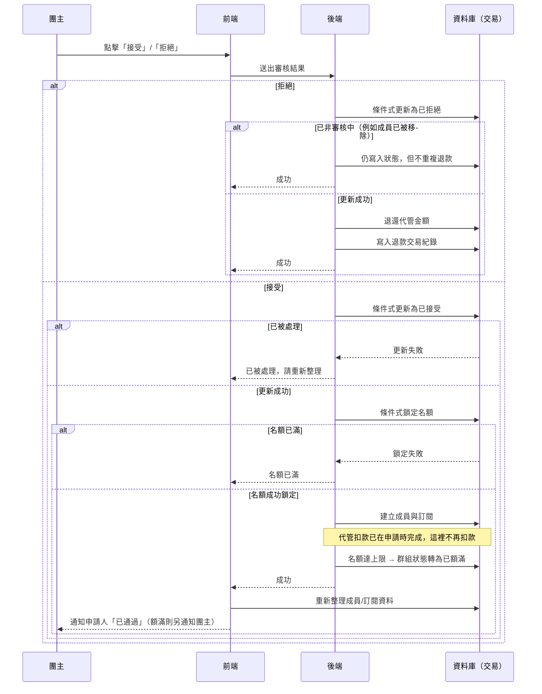

# 團主審核申請

## 使用者目標
團主檢視收到的加入申請，決定接受或拒絕。代管扣款在申請當下就已經完成，接受只需要建立成員與名額，拒絕則要把代管的金額退還申請人；高併發下也不能超賣名額或重複處理同一筆申請。

## 流程圖

## 入口
- 群組管理頁開啟某個群組的團主視角，切到「申請管理」分頁，會列出所有待審核的申請
- 也可以從通知中心點「收到新的加入申請」，透過共用事件直接跳到該群組的申請管理分頁

## 相關檔案

**前端**

| 路徑 | 說明 |
|------|------|
| `src/features/manage-groups/ManageGroupsPage.jsx` | 頁面入口 |
| `src/features/manage-groups/components/HostGroupView.jsx` | 團主視角群組詳情 |
| `src/features/manage-groups/components/hostGroupView/buildApplicationsPanel.jsx` | 申請管理面板 |
| `src/features/manage-groups/components/hostGroupView/ApplicationCard.jsx` | 單筆申請卡片：接受/拒絕按鈕、審核中/已接受/已拒絕/已移除/已退出狀態 badge |
| `src/features/manage-groups/hooks/useHostActions.js` | `handleApprove`、`handleReject` |
| `src/features/manage-groups/utils/hostFilters.js` | `calcApprovalSeatPatch`，前端本地名額計算 |
| `src/common/stores/useApplicationStore.js` | `updateStatus` |
| `src/common/api/applicationsApi.js` | `patchApplication` |

**後端**

| 路徑 | 說明 |
|------|------|
| `server/src/routes/applications.js` | `PATCH /applications/:id` |
| `server/src/utils/membership.js` | `finalizeApprovedApplication`（接受用）、`refundEscrow`（拒絕退款用） |
| `server/src/utils/pricing.js` | `computeSeatCost`，僅在申請沒有 `escrowAmount`（例如舊資料）時作為 fallback |

**資料表 / Model**

| Model | 用途 |
|-------|------|
| `Application` | 狀態變更：`pending → approved/rejected`；`escrowAmount` 記錄申請當下實際代管的金額 |
| `Group` | 更新 `currentMembers`、`status`；拒絕時退回 `escrowTokens` |
| `Member` | 接受時 `upsert` 建立 |
| `Subscription` | 接受時 `upsert` 建立，狀態預設 `pending` |
| `User` | 拒絕時退還申請人 `tokenBalance` |
| `TokenTransaction` | 拒絕時寫入 `type: 'refund'` 紀錄 |

## 使用技術
- **代管扣款不在這裡發生**：申請當下（見 `apply-join-flow.md`）就已經扣款代管，接受這一步只需要建立成員、更新名額；跟團主手動加人共用同一套建立邏輯，但走的是各自獨立的流程，不用旗標切換行為
- **用交易包住整個接受流程**：查名額上限、建立成員與訂閱、額滿轉為已額滿全部包在同一個交易裡，任何一步出錯就整個回滾，不會發生「申請標成已接受，但成員卻沒建出來」這種半套狀態
- **用條件式更新當樂觀鎖**：只有第一個請求能把申請狀態真的改成已接受；重複點擊或多開分頁送出的第二個請求會更新失敗，直接回應「已被處理」中止
- **拒絕分支：狀態一定寫入，退款才看情況**：拒絕（或團主移除已接受成員時前端連帶送出的移除狀態）都會先嘗試條件式更新（僅審核中才算數）；搶到了才退款，沒搶到（代表這筆申請已經不是審核中，例如成員被移除、退出時已經處理過自己的退款）就退化成一次無條件的狀態寫入，只是不會再退一次款——狀態轉換跟退款是兩件事，不能共用同一個判斷式，不然申請狀態會卡住出不去（見下方「驗證重點」）
- **退款用當初實際扣的金額，不是即時價格**：申請當下記錄的實際扣款金額，拒絕/取消退款都讀這個值，並跟目前代管餘額取較小者，避免團主事後改價格、或代管餘額因故不足時退款金額對不上或被扣成負數
- **退款邏輯抽成共用函式**：拒絕、取消申請、成員移除/退出三處共用同一套「加回餘額、扣代管、寫交易紀錄」邏輯，不用各自重寫一次
- **名額防超賣也是靠條件式更新**：鎖定失敗就代表寫入的那一瞬間名額其實已經滿了，直接擋下，避免兩筆申請同時接受、超過名額上限
- 前端送出接受前會先做一次本地名額快照檢查，這只是給使用者的即時回饋，真正的防線還是後端的交易；接受成功後會重新拉一次真實資料，確保 store 裡拿到的是交易建出來的真實資料

## 流程步驟

**1. 查看待審核申請**
- 團主在「申請管理」分頁看到所有審核中的申請
- 申請卡片顯示申請人姓名、信用分數 badge、相對時間，以及可展開的申請留言

**2. 點擊接受**
- 點擊「接受」後先執行接受動作，成功後把面板收合
- 前端依序做本地檢查：確認申請仍在審核中、對應群組還存在；是否已經是成員（避免重複接受造成的邊界情況）；是否已經額滿（額滿就顯示「此群組已額滿，無法接受」，不會呼叫 API）
- 通過檢查後，先把本地那筆申請顯示成已接受（順便把團主自己「收到新申請」的通知標成已讀），再送出接受請求

**3. 後端接受邏輯**
- 先確認請求人就是這個群組的團主本人，否則拒絕
- 進入交易：
  1. 條件式更新搶佔申請，失敗就回應「此申請已被處理，請重新整理頁面」
  2. 查群組的名額上限，不存在就回傳錯誤
  3. 執行接受後續處理（細節見下一步）
  4. 回傳更新後的申請資料

**4. 接受後續處理**
- 不做任何餘額檢查或扣款，因為申請當下已經確認過餘額並扣款完成
- 用條件式更新檢查並鎖定名額，失敗就回傳「名額已滿」
- 平行建立成員與訂閱（用可重複執行的方式建立，因為「團主直接加人」跟「申請接受」概念上是同一件事，就算使用者已經有殘留記錄也不會報錯）
- 重新查一次群組目前人數，剛好達到上限就把群組狀態推進為已額滿；額滿的同一個交易內還會把同群組其他還在審核中的申請批次轉為拒絕、依各自扣款金額退款，並各自發送「申請未通過（名額已滿）」通知，不用等團主之後手動一一拒絕（見 [Bug 紀錄](../testing/bug-log.md) BUG-035）

**5. 接受成功後**
- 前端重新拉取真實的成員/訂閱資料
- 先在畫面上更新群組已使用/剩餘名額（剛好額滿會一併標記為已額滿）
- 只寫入資料庫通知申請人「申請已通過」；如果剛好額滿，還會即時通知團主自己「群組名額已滿，可以點擊鎖定群組了」

**6. 點擊拒絕**
- 前端先確認仍在審核中，再送出拒絕請求
- 後端進入交易：條件式更新（僅審核中才算數）把狀態改為拒絕、清空進行中標記；搶到了才把代管的金額（取當初扣款金額與目前代管餘額中較小者）退還給申請人
- 前端寫入「申請未通過」通知給申請人（只寫資料庫），並重新整理自己的餘額顯示（如果是申請人自己在看畫面的話，會透過輪詢/重新整理拿到最新餘額）

## 驗證重點
- 權限：只有團主本人能審核，非團主一律拒絕
- 重複接受防護：條件式更新是唯一防線，重複點擊或網路重試送出兩個一樣的請求，後到的那個更新失敗整批回滾，不會建成員
- 名額超賣防護：條件式更新確保兩筆申請幾乎同時接受時只有一筆能把人數加 1，另一筆失敗，不會超過名額上限
- 接受不再重複扣款：代管扣款只在申請當下發生一次，接受時完全不碰餘額與代管金額
- **拒絕/移除時狀態一定要寫入，即使不用退款**：狀態轉換一定會執行，只有退款金額的寫入受條件式保護
- 拒絕退款用申請當下實際扣的金額而非即時重算，避免團主事後修改群組價格/計費週期時，退款金額跟當初真正扣的錢對不上
- 接受、建立成員與訂閱、額滿轉為已額滿全部包在同一個交易，任何一步失敗就整批回滾，不會出現「接受了但沒建成員」的中間狀態
