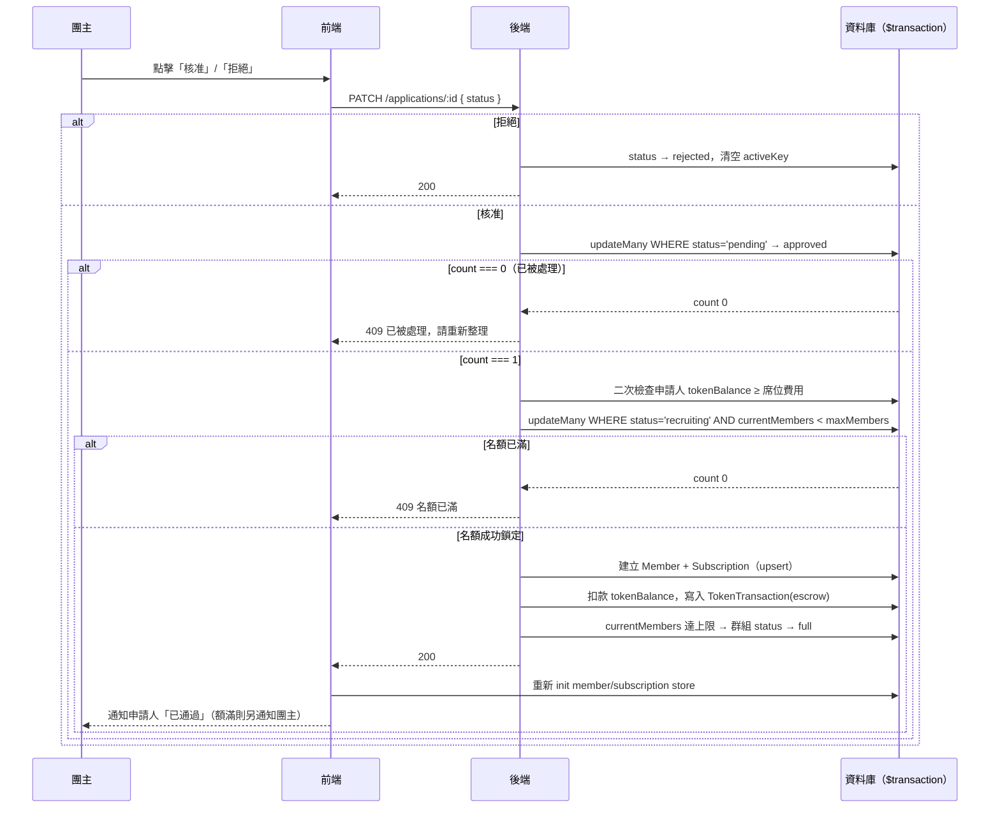

# 團主審核申請

## 使用者目標
團主檢視收到的加入申請，決定核准或拒絕；核准時系統要自動扣款、建立成員與訂閱、更新名額，而且在高併發下也不能超賣名額或重複扣款。

## 流程圖

## 入口
- `/my-groups?view=host`（`HostPage`）開啟某個群組的 `HostGroupView`，切到「申請管理」分頁（`buildApplicationsPanel`），會列出所有待審核（`pending`）的申請
- 也可以從通知中心點「收到新的加入申請」，經 `pm:open-host-group` custom event 直接跳到該群組的申請管理分頁

## 相關檔案

**前端**

| 路徑 | 說明 |
|------|------|
| `src/features/my-groups/host/HostPage.jsx` | 頁面入口 |
| `src/features/my-groups/host/components/HostGroupView.jsx` | 團主視角群組詳情 |
| `src/features/my-groups/host/components/hostGroupView/buildApplicationsPanel.jsx` | 申請管理面板 |
| `src/features/my-groups/host/components/hostGroupView/ApplicationCard.jsx` | 單筆申請卡片：核准/拒絕按鈕、審核中/已核准/已拒絕/已移除/已退出狀態 badge |
| `src/features/my-groups/host/hooks/useHostActions.js` | `handleApprove`、`handleReject` |
| `src/features/my-groups/host/utils/hostFilters.js` | `calcApprovalSeatPatch`，前端本地名額計算 |
| `src/shared/stores/useApplicationStore.js` | `updateStatus` |
| `src/shared/api/applicationsApi.js` | `patchApplication` |

**後端**

| 路徑 | 說明 |
|------|------|
| `server/src/routes/applications.js` | `PATCH /applications/:id` |
| `server/src/utils/membership.js` | `admitMemberIntoGroup`，核准申請與團主直接加人共用的入群邏輯 |
| `server/src/utils/pricing.js` | `computeSeatCost` |

**資料表 / Model**

| Model | 用途 |
|-------|------|
| `Application` | 狀態變更：`pending → approved/rejected` |
| `Group` | 更新 `currentMembers`、`status`、`escrowTokens` |
| `Member` | 核准時 `upsert` 建立 |
| `Subscription` | 核准時 `upsert` 建立，狀態預設 `pending` |
| `User` | 扣除申請人 `tokenBalance` |
| `TokenTransaction` | 寫入 `type: 'escrow'` 紀錄 |

## 使用技術
- **用 Prisma interactive transaction 包住整個核准流程**：核准申請、查名額上限、呼叫 `admitMemberIntoGroup`（餘額檢查、名額檢查、建立 member/subscription、扣款、寫交易紀錄、額滿轉 full）全部包在同一個 `$transaction` 裡，任何一步出錯就整個回滾，不會發生「申請標成 approved，但成員卻沒建出來」這種半套狀態
- **用條件式 `updateMany` 當樂觀鎖**：`tx.application.updateMany({ where: { id, status: 'pending' }, data: { status: 'approved' } })`，靠 `WHERE status = 'pending'` 確保只有第一個請求能把 `count` 變成 1；重複點擊或多開分頁送出的第二個請求會拿到 `count === 0`，直接回 409 中止，不會走到扣款那一步
- **把交易邏輯抽成共用函式**：`admitMemberIntoGroup(tx, {...})` 讓 `applications.js`（核准申請）跟 `members.js`（團主手動加人）共用，之後這組規則要改也只需要改一個地方
- **名額防超賣也是靠條件式 `updateMany`**：`tx.group.updateMany({ where: { id: groupId, status: 'recruiting', currentMembers: { lt: maxMembers } }, data: { currentMembers: { increment: 1 }, escrowTokens: { increment: seatCost } } })`，`count === 0` 就代表寫入的那一瞬間名額其實已經滿了，直接 409 擋下，避免兩筆申請同時核准、超過 `maxMembers`
- 前端 `handleApprove` 送出前會先做一次本地名額快照檢查，這只是給使用者的即時回饋，真正的防線還是後端的 transaction；核准成功後會 `await Promise.all([useMemberStore.init(), useSubscriptionStore.init()])` 重新拉一次真實資料，確保 store 裡拿到的是 transaction 建出來的真實 `Member`/`Subscription` id

## 流程步驟

**1. 查看待審核申請**
- 團主在「申請管理」分頁看到 `pendingApps`（`app.status === 'pending'`）
- `ApplicationCard` 顯示申請人姓名、信用分數 badge、相對時間，以及可展開的申請留言

**2. 點擊核准**
- `ApplicationCard` 呼叫 `onApprove(app.id)`，`buildApplicationsPanel` 先執行核准，成功後把面板收合
- `useHostActions.handleApprove(appId)` 依序做本地檢查：
  - 確認申請仍是 `pending`、對應群組還存在
  - `alreadyMember`：是否已經是成員（避免重複核准造成的邊界情況）
  - `seats.openSeats <= 0`：已經額滿就顯示「此群組已額滿，無法核准」，不會呼叫 API
- 通過檢查後，先樂觀把本地那筆申請改成 `approved`（順便把團主自己「收到新申請」的通知標成已讀），再打 `PATCH /applications/:id { status: 'approved' }`

**3. 後端核准邏輯**
- 先確認 `application.group.hostId === req.user.id`（只有團主本人能審核），否則回 403
- 進入 `$transaction`：
  1. 條件式 `updateMany` 搶佔申請，`count === 0` 就丟出 409（此申請已被處理，請重新整理頁面）
  2. 查群組的 `maxMembers`，不存在就丟出 404
  3. 呼叫 `admitMemberIntoGroup(tx, { groupId, userId, seatCost, maxMembers, note })`（細節見下一步）
  4. 回傳更新後的 `Application`

**4. `admitMemberIntoGroup` 內部做的事**
- 查申請人 `tokenBalance`，不足 `seatCost` 就丟出 400（PM幣餘額不足，無法加入）——這是核准當下的**第二次**餘額檢查，因為申請當下只做過一次預檢，這段等待期間餘額可能已經被花掉
- 用條件式 `updateMany` 檢查並鎖定名額，失敗就丟出 409
- 平行執行：`Member.upsert`、`Subscription.upsert`（用 `upsert` 是因為「團主直接加人」跟「申請核准」共用同一段邏輯，就算使用者已經有殘留記錄也不會報錯）、扣除申請人 `tokenBalance`、寫入 `TokenTransaction(type: 'escrow', amount: -seatCost)`
- 重新查一次群組的 `currentMembers`/`maxMembers`，剛好達到上限就把群組狀態推進為 `full`

**5. 核准成功後**
- 前端 `await Promise.all([useMemberStore.init(), useSubscriptionStore.init()])` 重新拉取真實資料
- 用 `calcApprovalSeatPatch(seats, alreadyMember)` 算出本地 `usedSeats`/`openSeats`（剛好額滿會附帶 `status: 'full'`）並樂觀更新群組
- 只寫 DB 通知申請人「申請已通過」；如果剛好額滿，還會即時通知團主自己「群組名額已滿，可以點擊鎖定群組了」

**6. 點擊拒絕**
- `handleReject(appId)` 先確認仍是 `pending`，再打 `PATCH /applications/:id { status: 'rejected' }`
- 後端直接把狀態改為 `rejected` 並清空 `activeKey`，不進 transaction（不涉及金流）
- 前端寫入「申請未通過」通知給申請人（只寫 DB）

## 驗證重點
- 權限：`PATCH /applications/:id` 要求 `application.group.hostId === req.user.id`，非團主一律回 403
- 重複核准防護：條件式 `updateMany({ where: { status: 'pending' } })` 是唯一防線，重複點擊或網路重試送出兩個一樣的 PATCH，後到的那個拿 `count === 0` 整批回滾，不會扣款也不會建成員
- 名額超賣防護：`admitMemberIntoGroup` 的條件式 `updateMany` 確保兩筆申請幾乎同時核准時只有一筆能把 `currentMembers` 加 1，另一筆回 409，不會超過 `maxMembers`
- 核准當下會二次查 `tokenBalance` 才扣款——因為申請跟核准中間可能隔了好幾天，這段期間餘額可能已經被花掉
- 核准、扣款、建 `Member`/`Subscription`、寫 `TokenTransaction`、額滿轉 `full` 全部包在同一個 transaction，任何一步失敗就整批回滾，不會出現「核准了但沒建成員」的中間狀態
- 拒絕不涉及金流：申請階段只預檢不預扣，拒絕就單純把狀態改成 `rejected` 並清空 `activeKey`，之後可以重新申請
