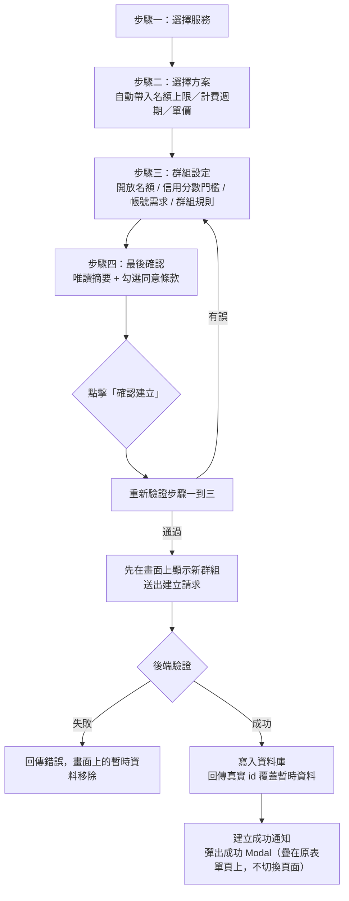

# 建立群組

## 使用者目標
以團主身分，透過 4 步驟表單（選擇服務 → 選擇方案 → 群組設定 → 最後確認）建立一個開放招募的合購群組。

## 流程圖

## 入口
- 首頁／導覽列的「建立群組」按鈕，會導向 `/create-group`
- `/create-group` 是獨立於 `AppLayout` 之外的全螢幕步驟流程頁面，由頂層 `ProtectedRoute` 包住，得先登入才能進來

## 相關檔案

**前端**

依「哪個步驟會用到」分類；被兩個以上步驟（含容器本身）共用的檔案歸在「共用」，不重複列在各步驟底下。

*容器*

| 路徑 | 說明 |
|------|------|
| `src/features/create/CreateGroupPage.jsx` | 步驟容器、表單 state、送出邏輯 |
| `src/common/stores/useGroupStore.js` | `create` action，送出時先在畫面上顯示新群組 |
| `src/common/api/groupsApi.js` | `insertGroup`，`POST /groups` 的前端封裝 |

*步驟一：選擇服務*

| 路徑 | 說明 |
|------|------|
| `src/features/create/components/steps/Step1Service.jsx` | 依分類列出服務卡片供選擇 |

*步驟二：選擇方案*

| 路徑 | 說明 |
|------|------|
| `src/features/create/components/steps/Step2Plan.jsx` | 選擇方案，月繳/年繳拆成獨立卡片 |
| `src/common/utils/resolvePlanDisplayPrice.js` | 「方案總價」實際顯示金額：優先官方年繳總價，其次美金年繳定價乘即時匯率，都沒有才退回 `monthlyPrice×12` 概算 |
| `src/common/utils/exchangeRate.js` | `useUsdToTwdRate` hook，取得即時美金匯率供 `resolvePlanDisplayPrice` 換算 |

*步驟三：群組設定*

| 路徑 | 說明 |
|------|------|
| `src/features/create/components/steps/Step3Settings.jsx` | 開放名額、最低信用分數門檻、帳號需求、群組規則 |

*步驟四：最後確認*

| 路徑 | 說明 |
|------|------|
| `src/features/create/components/steps/Step4Preview.jsx` | 最後確認頁，含服務條款勾選 |

*共用（2 個以上步驟／容器共用）*

| 路徑 | 說明 | 使用者 |
|------|------|--------|
| `src/features/create/components/steps/Field.jsx` | 表單欄位外殼元件，支援 `hint` 說明泡泡與 `endAdornment`（標籤列最右側可掛額外內容） | 步驟二、步驟三 |
| `src/features/create/components/LivePreviewPanel.jsx` | 桌機常駐 / 手機彈窗的即時預覽卡片，沿用探索頁卡片樣式 | 容器（手機彈窗）、步驟四（桌機常駐） |
| `src/features/create/utils/previewGroupId.js` | 預覽用的暫時群組 id | `LivePreviewPanel.jsx` |
| `src/common/utils/serviceUtils.js` | `getServiceById`，讀取 `serviceCatalog.js` 的服務/方案資料 | 容器、步驟一～四、`LivePreviewPanel.jsx` |
| `src/common/utils/pricingUtils.js` | `calcPricePerSeat`、`calcDisplayPrice` | 容器、步驟四 |

**後端**

| 路徑 | 說明 |
|------|------|
| `server/src/routes/groups/crud.js` | `POST /groups` |

**資料表 / Model**

| Model | 用途 |
|-------|------|
| `Group` | 新建 |
| `Service` | 讀取，決定方案選項與定價 |

## 使用技術
- **表單狀態集中管理**：整個表單共用同一份 state，各步驟都是受控元件，異動時統一回寫，不會各自散落狀態
- **先顯示、後確認**：送出時先把群組資料放進本地顯示，同時非同步送出到後端；成功後用真實 ID 覆蓋暫時資料，失敗則從畫面移除並記錄錯誤
- **逐步驗證**：每個步驟都有自己的錯誤檢查；送出前會重新檢查前三個步驟，有錯就導回第一個出錯的步驟，避免使用者繞過驗證直接送出
- 步驟切換有滑入動畫；內容過長時會顯示捲動提示
- 後端驗證會把前端與資料庫兩種不同的欄位命名互相轉換，規則陣列會轉成純文字再存

## 流程步驟

**1. 選擇服務**
- 依分類列出可選服務，點擊卡片即選定；換服務時會重置已選的方案與名額

**2. 選擇方案**
- 只列出可以合購（名額上限大於 1）的方案，第一次進入該服務會自動選第一個
- 選定方案後自動帶入名額上限、計費週期與每人單價
- 版面由上而下依序是服務說明、注意事項、方案選擇；注意事項會依服務類型提醒填寫方式與特殊限制（例如部分服務有帳號異動頻率限制或額外驗證流程）
- 桌機／平板寬度下，方案選擇區左右並排：左邊用箭頭切換方案卡片，右邊顯示對應的方案內容；手機版則由上而下堆疊
- 方案卡片標題不重複顯示計費週期（改用獨立徽章顯示），名稱過長會自動截斷，避免蓋到旁邊內容（見 [Bug 紀錄](../testing/bug-log.md) BUG-021）；「方案總價」優先採用官方年繳總價，其次用即時匯率換算美金定價，而不是用月費乘 12 概算
- 說明泡泡固定往下方展開，避免最上面的欄位說明被自己所在的捲動區域裁掉

**3. 群組設定**
- 「開放名額」（不含團主自己）：用加減按鈕調整，範圍由方案的名額上限決定；名額變動會即時重算每人單價，並提示整個方案（含團主）最多可以幾人共享
- 「信用分數門檻」：不限／90／70／50 分以上四選一
- 「帳號需求」：選填文字說明，上限 120 字
- 「群組規則」：固定 5 條輸入欄位，允許留白，每條上限 80 字，送出時自動過濾空白項目

**4. 最後確認**
- 顯示團主、服務／方案、每位價格、開放名額、信用分數、建立日期、帳號需求、群組規則的唯讀摘要
- 需勾選同意服務條款與隱私政策才能建立
- 手機版另外提供「查看預覽」按鈕，開啟即時預覽彈窗

**5. 送出建立**
- 送出前重新驗證步驟一到三，有問題就導回該步驟
- 通過後組出群組資料（預設狀態為招募中、加入方式為需審核），呼叫建立動作：前端立刻顯示在畫面上，同時非同步送出到後端

**6. 後端建立**
- 確認登入身分，以此作為團主
- 驗證欄位格式與型別後，只取資料庫認得的欄位建立群組
- 回傳建好的群組資料（含服務與團主關聯）

**7. 建立成功後**
- 寫入一筆通知給團主自己
- 不會另外切到成功頁，改用彈窗疊在原本的表單頁上顯示成功訊息，並提供「返回首頁」與「前往群組管理」兩個按鈕

## 驗證重點
- 前端逐步驗證：
  - 步驟一：服務為必填
  - 步驟二：方案為必填；若該服務完全沒有可合購的方案，會提示需返回選擇其他服務，但不會強制擋下一步
  - 步驟三：開放名額需在合法範圍內，否則報錯；規則去空白後不能超過 5 條、每條不超過 80 字
- 送出前會重新驗證前三個步驟，導回第一個仍有錯的步驟，避免有人繞過驗證送出不合法的資料
- 未勾選同意條款無法送出
- 後端也會驗證欄位格式與範圍，沒通過就直接回錯誤，不會寫入資料庫
- 建立失敗時，畫面上先顯示的暫時群組會被移除，避免留著一個伺服器端根本不存在的假群組
