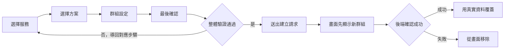

# 建立群組

## 使用者目標
以團主身分，透過 4 步驟表單（選擇服務 → 選擇方案 → 群組設定 → 最後確認）建立一個開放招募的合購群組。

## 流程圖

## 流程
1. **選擇服務**：依分類挑選要合購的訂閱服務
2. **選擇方案**：從該服務可合購的方案中選一個，系統自動帶入名額上限、計費週期與每人單價
3. **群組設定**：設定開放名額、加入門檻（信用分數）、帳號需求說明、群組規則
4. **最後確認**：唯讀摘要 + 勾選同意服務條款後送出
5. 送出前會重新驗證前三步，有問題會導回對應步驟；通過後先在畫面上顯示新群組，同時送出建立請求，成功後才用真實資料覆蓋、失敗則從畫面移除
6. 建立成功後彈出成功提示（疊在建立群組的視窗上，不換頁），並通知團主自己

## 產品決策
- **先顯示、後確認**：送出當下即顯示「群組已建立」的畫面回饋，背景同時向後端確認，讓使用者更快看到結果；確認失敗則自動移除該筆暫時顯示的資料
- **逐步驗證、不讓使用者繞過**：每步都有自己的檢查，送出前會整體重新驗證一次，避免有人跳過必填欄位直接送出
- 桌機／手機都能即時看到群組卡片的預覽外觀，讓使用者確認資訊呈現是否符合預期

## 驗證重點
- 服務、方案為必填；未勾選同意條款無法建立
- 開放名額需在方案允許的範圍內
- 前後端都會驗證欄位格式與範圍，不合法一律拒絕、不寫入資料庫
