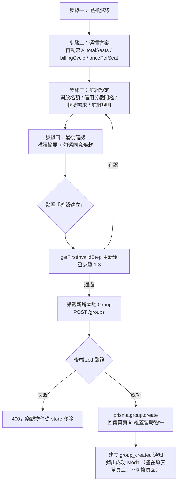

# 建立群組

## 使用者目標
以團主身分，透過 4 步驟表單（選擇服務 → 選擇方案 → 群組設定 → 最後確認）建立一個開放招募的合購群組。

## 流程圖

## 入口
- 首頁／導覽列的「建立群組」按鈕，會導向 `/create-group`
- `/create-group` 是獨立於 `AppLayout` 之外的全螢幕步驟流程頁面，由頂層 `ProtectedRoute` 包住，得先登入才能進來

## 相關檔案

**前端**

| 路徑 | 說明 |
|------|------|
| `src/features/create/CreateGroupPage.jsx` | 步驟容器、表單 state、送出邏輯 |
| `src/features/create/components/steps/Step1Service.jsx` | 步驟一：選擇服務 |
| `src/features/create/components/steps/Step2Plan.jsx` | 步驟二：選擇方案，月繳/年繳拆成獨立卡片 |
| `src/features/create/components/steps/Step3Settings.jsx` | 步驟三：開放名額、最低信用分數門檻、帳號需求、群組規則 |
| `src/features/create/components/steps/Step4Preview.jsx` | 步驟四：最後確認頁，含服務條款勾選 |
| `src/features/create/components/steps/Field.jsx` | 表單欄位外殼元件，支援 `hint` 說明泡泡與 `endAdornment`（標籤列最右側可掛額外內容） |
| `src/features/create/components/LivePreviewPanel.jsx` | 桌機常駐 / 手機彈窗的即時預覽卡片，沿用探索頁卡片樣式 |
| `src/features/create/utils/previewGroupId.js` | 預覽用的暫時群組 id |
| `src/shared/stores/useGroupStore.js` | `create` action |
| `src/shared/api/groupsApi.js` | `insertGroup` |
| `src/shared/utils/serviceUtils.js` | `getServiceById`，讀取 `serviceCatalog.js` 的服務/方案資料 |
| `src/shared/utils/pricingUtils.js` | `calcPricePerSeat`、`calcDisplayPrice` |

**後端**

| 路徑 | 說明 |
|------|------|
| `server/src/routes/groups.js` | `POST /groups` |

**資料表 / Model**

| Model | 用途 |
|-------|------|
| `Group` | 新建 |
| `Service` | 讀取，決定方案選項與定價 |

## 使用技術
- **表單狀態集中管理**：整個表單只有 `CreateGroupPage` 一個 `form` state（`INITIAL_FORM`），子步驟都是受控元件，透過 `onChange(key, value)` 回寫，不會各自散落 state
- **樂觀更新**：送出時先組好完整的 `Group` 物件塞進 `useGroupStore`，再非同步打 `POST /groups`；成功就用後端回傳的真實 `id` 覆蓋暫時物件，失敗則從 store 移除並記下 `error`（見 `useGroupStore.create`）
- **逐步驗證**：`getStepErrors(step, form)` 算出目前步驟的錯誤訊息；送出前 `getFirstInvalidStep(form)` 會重新掃一次步驟 1–3，只要有錯就把 `step` 導回第一個出錯的地方，避免使用者用瀏覽器上一頁/下一頁繞過驗證直接送出
- 步驟切換用 `key={step}` 搭配 `animate-step-slide-up` 做進場動畫；內容太長時由 `ScrollHint`／`useScrollEdge` 處理捲動提示
- 後端 `createGroupSchema`（zod）用 `.transform()` 同時吃前端命名（`totalSeats`/`pricePerSeat`）跟資料庫命名（`maxMembers`/`monthlyFee`），`rules` 如果是陣列會 join 成字串再存

## 流程步驟

**1. 選擇服務**
- `Step1Service` 依分類（`CategoryPills`）列出 `listServiceTypes()`
- 點擊服務卡片會呼叫 `onChange('serviceId', id)`；換服務時連動重置 `planName`、`pricePerSeat`、`totalSeats`

**2. 選擇方案**
- `Step2Plan` 只列出 `plan.maxSeats > 1`（可以合購）的方案
- 第一次進到這個服務會自動選第一個方案
- 選定方案後同步設定 `totalSeats = plan.maxSeats`、`billingCycle = plan.billingCycle`、`pricePerSeat = calcPricePerSeat(plan, plan.maxSeats)`
- 版面由上而下單欄排列（桌機/平板/手機皆同）：「服務說明」→「填寫服務資訊注意事項」（依服務 `sharingMethod` 讀 `serviceInfoFields.js` 的 `notice` 文案，提醒團主這個服務加入時成員要填什麼、有沒有 Apple/Google 家庭群組異動頻率限制、KKBOX 地址驗證、friDay 邀請碼方向相反等眉角，沒有特別注意事項的服務顯示預設文字）→「選擇方案」
- 「選擇方案」內部（`md` 以上，桌機/平板寬度，跟高度無關）左右並排：左邊是切換箭頭在左右兩側、方案卡在中間（一次只顯示目前選中的方案，點左右箭頭切換上一個/下一個方案），右邊是方案內容（不再另外顯示「方案說明」標題）；右欄內容全部直接顯示、不再內部捲動，左右兩欄改用 flex row 預設的 `items-stretch` 自動等高（不用 `ResizeObserver` 量測），左欄上下加跟右側方案內容一樣的 `p-3.5` 內距（`py-3.5`），方案卡用 `self-stretch` 撐滿這一列扣掉內距後的高度，讓卡片邊框頂部對齊方案內容第一行文字、底部對齊最後一行文字（而不是直接對齊到整個欄位的最頂端/最底端），左右箭頭則維持固定大小、垂直置中；方案卡保留邊框（選中為淡化過的 `border-brand/40`，未選中為 `border-slate-200`，避免選中顏色太深）但不加背景色，內容維持垂直置中；手機（`md` 以下）則自然由上而下堆疊。因為步驟二已經沒有內部捲動區，`CreateGroupPage.jsx` 的外層 `short-lg:overflow-hidden`／`forwardWheel: false` 這兩個「內部有自己捲動區」的特殊處理現在只保留給步驟三（群組設定），步驟二一律用外層 `overflow-y-auto` 捲動整頁
- 方案卡片標題不再重複顯示「（月繳）／（年繳）」字樣，計費週期改用卡片上方的獨立 badge 顯示（`currentPlan.billingCycle`），方案名稱因此變短；卡片本身（flex 項目）補上 `min-w-0`，讓 `truncate` 在名稱過長、卡片被壓縮時能正確截斷成「...」，不會撐開卡片、蓋到旁邊的切換箭頭跟方案說明欄（見 [Bug 紀錄](../testing/bug-log.md) BUG-021）；「方案總價」文字放在金額前面
- `Field` 元件的 hint 說明泡泡往「下方」展開，避免最上面那個欄位（例如「開放名額」）的說明泡泡往上展開時被自己所在的 `overflow-y-auto` 捲動容器裁切、看起來像被上方服務資訊卡蓋住

**3. 群組設定**
- 「開放名額」（`totalSeats - 1`，不含團主自己）：用加減按鈕調整 `totalSeats`，範圍是 `[2, maxSeats]`；每次變動都會重算每人單價（人數越多分攤越便宜）；標籤列右側用 `Field` 的 `endAdornment` 顯示「最多 {maxSeats} 人共享」（來自上一步選定方案的 `plan.maxSeats`），提醒團主整個方案（含團主自己）總共能有幾人
- 「信用分數門檻」：`minCreditScore` 四選一（不限/90/70/50 分以上）
- 「帳號需求」：選填文字說明，上限 120 字
- 「群組規則」：最多 5 條，每條上限 80 字

**4. 最後確認**
- `Step4Preview` 顯示團主、服務/方案、每位價格、開放名額、信用分數、建立日期、帳號需求、群組規則的唯讀摘要
- 要勾選「已閱讀並同意服務條款與隱私政策」才能按下「確認建立」
- 手機版另外提供「查看預覽」按鈕，開啟 `LivePreviewPanel` 彈窗

**5. 送出建立**
- 點擊「確認建立」先用 `getFirstInvalidStep(form)` 重新驗證步驟 1–3，有問題就導回該步驟
- 通過後 `mapFormToGroup(form)` 組出符合 `Group` 資料形狀的物件（`usedSeats: 1`、`openSeats: totalSeats - 1`、`joinMode: 'approval'`、`status: 'recruiting'`，以及依方案標籤與服務分類去重後的 `tags`）
- 呼叫 `useGroupStore.getState().create(groupData, host)`：前端立刻產生本地暫時 `id` 並塞進 store 做樂觀顯示，同時非同步打 `POST /groups`

**6. 後端建立**
- `requireAuth` 取得 `req.user.id` 作為 `hostId`
- `validate(createGroupSchema)` 完成欄位轉換與型別檢查後，只取 Prisma schema 認得的欄位（白名單），呼叫 `prisma.group.create`
- 回傳 201 與建好的群組（含 `service`、`host` 關聯）

**7. 建立成功後**
- 寫入一筆 `group_created` 通知給團主自己
- 流程只有 4 步驟，不會另外切到成功頁：改用 `Modal`（`showHeader={false}`）疊在原本的步驟四表單頁上，顯示「群組已成功上架！」，並提供「返回首頁」與「前往我的群組」兩個按鈕

## 驗證重點
- 前端逐步驗證（`getStepErrors`）：
  - 步驟一：`serviceId` 必填
  - 步驟二：`planName` 必填；如果該服務完全沒有 `maxSeats > 1` 的方案，會顯示提示「此服務無合購方案，請返回上一步選擇其他服務」，但不會硬擋下一步，得靠使用者自己返回
  - 步驟三：`totalSeats` 要是 2 到方案 `maxSeats` 之間的整數，否則報錯；`rules` 去空白後不能超過 5 條，每條不超過 80 字
- 送出前 `getFirstInvalidStep` 會重新掃一次步驟 1–3，導回第一個仍有錯的步驟，避免有人用瀏覽器前進/後退繞過驗證送出不合法的資料
- 「確認建立」在 `agreedToTerms` 是 false 時會停用，沒勾服務條款就送不出去
- 後端 `createGroupSchema`（zod）：`maxMembers`/`totalSeats` 限制在 `int().min(2).max(10)`；`minCreditScore`、`minGroupAge` 得是非負整數；`billingCycle` 只接受 `'monthly'|'yearly'`；驗證沒過就直接回 400，不會寫入資料庫
- 建立失敗時樂觀新增會被回滾：`useGroupStore.create` 的 `.catch()` 會把那一筆從 `groups` 移除，避免畫面上留著一個伺服器端根本不存在的假群組
