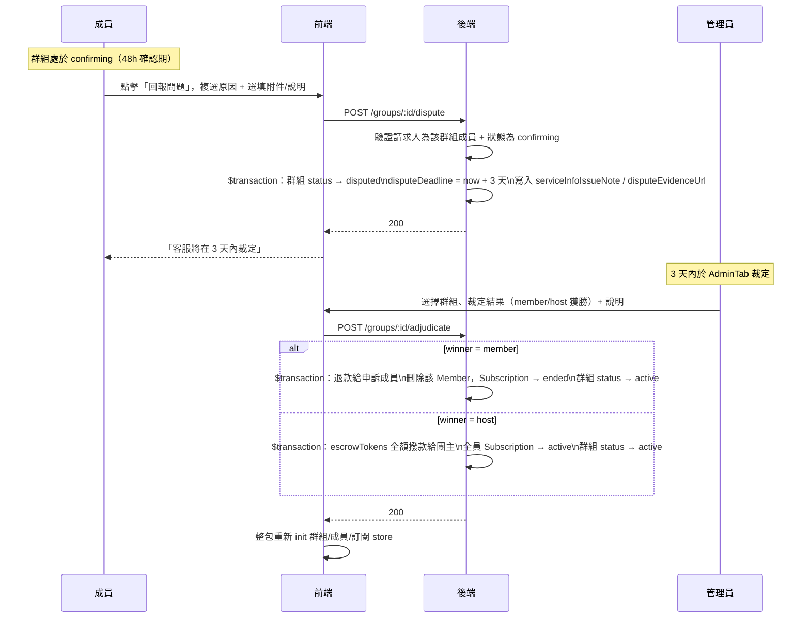

# 申訴流程

## 使用者目標
成員在確認期（`confirming`）內如果發現服務沒有正常啟用，或有其他問題，可以向平台正式申訴，凍結代管款項並等平台裁定，不用單方面相信團主說的話。

## 流程圖

## 入口
- `MemberGroupView` 確認期畫面的「回報問題」按鈕（`canConfirm` 為真時，跟「確認服務」按鈕並排）→ 開啟申訴表單 `subPanel`
- 裁定端在帳號中心的「管理員」分頁（`AdminTab`），只有 `isAdmin` 使用者看得到

## 相關檔案

**前端**

| 路徑 | 說明 |
|------|------|
| `src/features/subscriptions/components/MemberGroupView.jsx` | 申訴表單（`activePanel === 'dispute'`）、`handleDisputeSubmit`、`handleEvidenceSelect` |
| `src/components/ui/DisputeReasonDialog.jsx` | 唯讀對話框，顯示申訴人、申訴理由與附件連結；`MemberGroupView.jsx`／`src/features/manage-groups/components/HostGroupView.jsx` 都有掛載，讓成員與團主在群組進入 `disputed` 後都能點開查看同一份申訴內容，不用只靠聊天室文字傳達 |
| `src/common/api/storageApi.js` | `uploadDisputeEvidence`，附件上傳 |
| `src/common/stores/useGroupStore.js` | `disputeGroup`、`adjudicateGroup` |
| `src/common/api/groupsApi.js` | `disputeGroupApi`、`adjudicateGroupApi` |
| `src/features/account/components/tabs/AdminTab.jsx` | 申訴裁定表單：選擇群組、裁定結果、裁定說明；`disputeDeadline` 已過期的群組會排到清單最前面並標示「已逾期」 |

**後端**

| 路徑 | 說明 |
|------|------|
| `server/src/routes/groups/lifecycle.js` | `POST /groups/:id/dispute`（成員送出申訴）、`POST /groups/:id/adjudicate`（管理員裁定，`requireAdmin` 保護） |
| `server/src/middleware/auth.js` | `requireAdmin` |
| `server/src/utils/pricing.js` | `computeSeatCost` |

**資料表 / Model**

| Model | 用途 |
|-------|------|
| `Group` | `status`（`confirming → disputed → active`）、`disputeDeadline`（申訴提出時間 + 3 天）、`escrowTokens` |
| `Member` | `serviceInfoIssueNote`（申訴原因與補充說明合併存放）、`disputeEvidenceUrl`（選填附件 URL） |
| `TokenTransaction` | 裁定結果依 `winner` 寫入 `refund`（成員獲勝）或 `release`（團主獲勝） |

## 使用技術
- **Prisma `$transaction`（陣列形式）**：不管是送出申訴還是裁定，都把群組狀態變更跟 `Member` 欄位更新（或代管金額異動）包在同一個交易裡
- **多選項跟自由文字合併存放**：`DISPUTE_REASON_OPTIONS` 可以複選，跟補充說明用換行串接後寫進單一 `reason` 字串欄位——`serviceInfoIssueNote` 本身沒有拆成好幾個結構化欄位
- **附件上傳跟表單送出是分開兩步**：`handleEvidenceSelect` 先呼叫 `uploadDisputeEvidence` 拿到 URL 存在 state，等真的送出申訴時才一起帶進 `POST /groups/:id/dispute`
- 裁定結果會建立通知（見 [Bug 紀錄](../testing/bug-log.md) BUG-025）：`winner: 'member'` 通知申訴成員（`dispute_resolved`，退款）與團主（`dispute_resolved`，裁定結果）；`winner: 'host'` 通知團主（`escrow_released`，撥款）與申訴成員（`dispute_resolved`，裁定結果）；`FloatingMessages.jsx` 點擊 `dispute_resolved` 時會判斷該成員是否仍在群組內，決定導向會員視角或探索頁

## 流程步驟

**1. 進入確認期，看到申訴入口**
- 群組進入 `confirming`（服務已啟用，48 小時確認期）後，成員在 `MemberGroupView` 會看到「確認服務」跟「回報問題」兩個按鈕

**2. 填寫申訴表單**
- 點擊「回報問題」開啟申訴表單，可以從 6 個固定選項複選申訴原因（服務帳號未提供或有誤／服務尚未啟用／服務品質與描述不符／團主已讀不回無法聯繫／帳號被團主收回或更改密碼／其他），也能填補充說明
- 選填上傳附件截圖佐證：`handleEvidenceSelect` 呼叫 `uploadDisputeEvidence(file)` 上傳並拿到 URL，上傳中會先禁用送出按鈕

**3. 送出申訴**
- `handleDisputeSubmit` 把複選原因跟補充說明合併成單一 `reason` 字串，呼叫 `disputeGroup(group.id, { reason, evidenceUrl })` → `POST /groups/:id/dispute`
- 後端驗證請求人確實是該群組成員、且群組正處於 `confirming`，通過後在同一 `$transaction` 內：群組 `status → disputed`、`disputeDeadline = now + 3 天`，並把申訴原因與附件寫進該成員的 `Member` 記錄
- 前端收到成功回應後關閉表單、彈出「申訴已送出，客服將在 3 天內裁定」，並關閉整個群組 Modal
- 此時代管金額（`escrowTokens`）在資料庫層還原封不動，只是群組狀態鎖在 `disputed`，等於凍結——其他 route（`confirm`/`activate` 等）都要求特定的前置狀態，`disputed` 狀態下沒辦法再被觸發

**4. 平台裁定**
- 管理員在 `AdminTab` 看到所有 `status === 'disputed'` 的群組，選擇群組、裁定結果（團主獲勝／成員獲勝）與裁定說明後送出 → `POST /groups/:id/adjudicate`
- **`disputeDeadline`（申訴 +3 天）逾期後不會自動裁定**：任何一方獲勝都可能對另一方不公平，所以無論多久沒處理，代管金額都維持凍結、必須由管理員手動裁定；`AdminTab` 只是把逾期案件排到清單最前面並加上「已逾期」提示，方便管理員優先處理，本身不觸發任何金流異動
- 後端先找出「有 `serviceInfoIssueNote` 的成員」當作申訴人，找不到就回 400
- **成員獲勝**：`$transaction` 內群組 `status → active`、`disputeDeadline → null`，把該成員的席位費用從 `escrowTokens` 扣掉並退款給他、寫入 `TokenTransaction { type: 'refund' }`，接著刪掉這個 `Member` 記錄、把他的 `Subscription` 設成 `ended`（`SubscriptionStatus` enum 只有 `pending`/`active`/`ended` 三種值，沒有 `cancelled`；其餘成員的代管跟訂閱完全不受影響）
- **團主獲勝**：`$transaction` 內群組 `status → active`、`disputeDeadline → null`、`escrowTokens` 全額撥給團主並歸零、全體成員 `Subscription` 設成 `active`

**5. 裁定結果同步**
- 前端拿到 `adjudicateGroup` 的結果後不直接套用回傳值，而是整包重新 `init({ all: true })` 群組 store，並重新 `init()` 成員/訂閱 store，確保裁定牽動的多張表（成員名單、代管餘額、訂閱狀態）都拿到資料庫最新的真實狀態

## 驗證重點
- `POST /groups/:id/dispute` 要求群組是 `confirming`（否則 400）、請求人是該群組的 `Member`（否則 403）
- `POST /groups/:id/adjudicate` 用 `requireAdmin` 保護，只有管理員能呼叫；群組必須是 `disputed`、`winner` 只能填 `member`/`host`、`reason` 不能是空的
- 裁定成員獲勝時，只有申訴的那位成員會被移出並退款，其餘成員的代管、訂閱完全不受影響，裁定範圍精準限定在單一成員身上
- 裁定沒有做樂觀更新：因為牽動多張表、分支也多，前端裁定完成後選擇整包重新 `init`，直接信任資料庫回傳的結果，比自己去兜前端邏輯更不容易出錯
- 裁定結果會建立通知給申訴成員跟團主雙方，不需要自己重新整理頁面才會發現群組狀態變回 `active`
