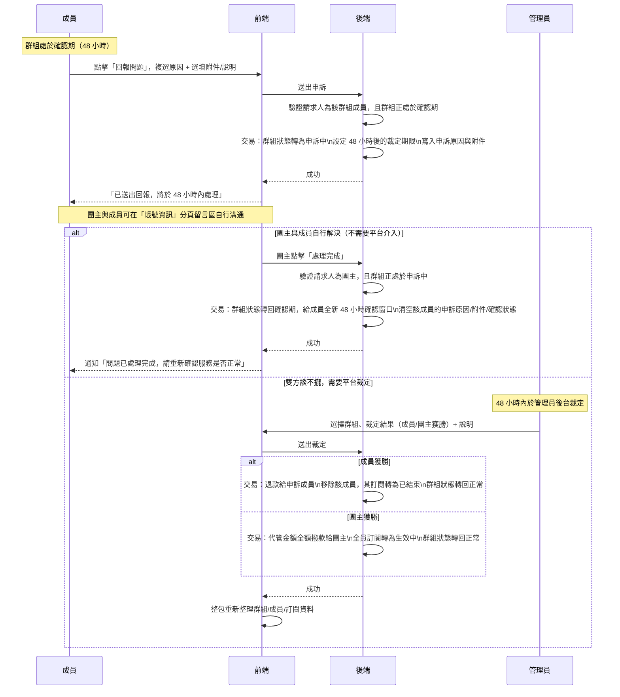

# 申訴流程

## 使用者目標
成員在確認期（`confirming`）內如果發現服務沒有正常啟用，或有其他問題，可以回報問題，凍結代管款項讓團主跟成員雙方有機會自行溝通解決；真的談不攏、需要第三方仲裁時，才由平台裁定金流歸屬，不用單方面相信團主說的話。

## 流程圖

## 入口
- 成員在確認期畫面的「回報問題」按鈕（跟「確認服務」按鈕並排），開啟堆疊在群組詳情彈窗上方的申訴表單（不是側邊欄，開啟時底下的群組詳情完全隱藏）
- 團主在「帳號資訊」分頁對應成員的卡片點一下展開（Accordion，收合狀態只顯示一行摘要），看得到申訴理由跟附件連結；雙方可以在分頁底部的留言區溝通，確認問題解決後，團主在展開內容右下角點「處理完成」，不需要每次小問題都送交平台仲裁
- 裁定端在帳號中心的「管理員」分頁，只有管理員身分的使用者看得到，用在雙方談不攏、需要第三方仲裁金流歸屬的情況

## 相關檔案

**前端**

| 路徑 | 說明 |
|------|------|
| `src/features/subscriptions/components/DisputeModal.jsx` | 回報問題表單本體（標題「回報問題」、欄位「回報原因」），`MemberGroupView.jsx` 用 `showDispute` state 控制開關 |
| `src/features/subscriptions/components/MemberGroupView.jsx` | `handleDisputeSubmit`，並透過 `useEvidenceUpload(uploadDisputeEvidence)` hook 管理附件上傳狀態 |
| `src/features/manage-groups/components/hostGroupView/buildMemberInfoPanel.jsx` | 團主端「帳號資訊」分頁：帳密區塊改標題形式呈現（`KeyRound` icon＋「帳號資訊」），成員清單改用 `MemberIssueCard` |
| `src/features/manage-groups/components/hostGroupView/MemberIssueCard.jsx` | 單一成員的狀態卡片：沒問題時顯示已填寫的服務帳號摘要；有問題回報時預設收合成一行摘要（頭像／名稱／「帳號問題已回報，等待修正」），點擊展開（`Collapsible`）看完整原因＋「查看附件」；申訴中（`group.status === 'disputed'`）才會在展開內容右下角顯示「處理完成」按鈕，呼叫 `onResolveDispute` |
| `src/components/ui/collapsible.jsx` | 薄包一層 Radix `Collapsible`（`Collapsible`／`CollapsibleTrigger`／`CollapsibleContent`），展開/收合動畫吃 Radix 注入的 `--radix-collapsible-content-height` 變數，不是寫死高度 |
| `src/features/subscriptions/components/memberGroupView/buildCredentialsPanel.jsx` | 成員端「帳號資訊」分頁：顯示自己頭像／名稱＋送出的申訴內容與附件連結，排版跟團主端一致；**限 `shared_credentials` 服務**才有這個分頁，其他共享機制的服務目前沒有對應頁面可以回顧自己送出的申訴內容 |
| `src/components/ui/group/CredentialCommentsSection.jsx` | 「帳號資訊」分頁底下的留言區（見 subscriptions-flow.md），送出申訴時後端會自動留一筆系統留言，團主與所有成員打開分頁就直接看到，不用只靠聊天室訊息才知道發生什麼事；帳號相關問題的後續溝通（包含團主說明已修正什麼）直接在這裡進行，不透過群組聊天室 |
| `src/common/utils/hooks.js` | `useEvidenceUpload`，選檔→上傳→存 url/name→失敗跳 toast→清空重選的共用流程 |
| `src/common/api/storageApi.js` | `uploadDisputeEvidence`，附件上傳 |
| `src/common/stores/useGroupStore.js` | `disputeGroup`、`resolveDispute`（團主與成員自行解決，不需要平台介入）、`adjudicateGroup`（管理員裁定）|
| `src/common/api/groupsApi.js` | `disputeGroupApi`、`resolveDisputeApi`、`adjudicateGroupApi` |
| `src/features/manage-groups/hooks/useHostActions.js` | `handleResolveDispute`，呼叫 `resolveDispute` 並跳 toast，失敗顯示錯誤訊息 |
| `src/features/account/components/tabs/AdminTab.jsx` | 申訴裁定表單：選擇群組、裁定結果、裁定說明；`disputeDeadline` 已過期的群組會排到清單最前面並標示「已逾期」 |

**後端**

| 路徑 | 說明 |
|------|------|
| `server/src/routes/groups/lifecycle.js` | `POST /groups/:id/dispute`（成員送出申訴）、`POST /groups/:id/resolve-dispute`（團主與成員自行解決，`disputed → confirming`，僅團主可呼叫）、`POST /groups/:id/adjudicate`（管理員裁定，`requireAdmin` 保護，涉及金流分配） |
| `server/src/middleware/auth.js` | `requireAdmin` |
| `server/src/utils/pricing.js` | `computeSeatCost` |

**資料表 / Model**

| Model | 用途 |
|-------|------|
| `Group` | `status`（`confirming → disputed → active`）、`disputeDeadline`（申訴提出時間 + 48 小時）、`escrowTokens` |
| `Member` | `serviceInfoIssueNote`（申訴原因與補充說明合併存放）、`disputeEvidenceUrl`（選填附件 URL） |
| `TokenTransaction` | 裁定結果依 `winner` 寫入 `refund`（成員獲勝）或 `release`（團主獲勝） |

## 使用技術
- **交易包住狀態變更**：不管是送出申訴還是裁定，都把群組狀態變更跟成員欄位更新（或代管金額異動）包在同一個交易裡
- **多選項跟自由文字合併存放**：申訴原因可以複選，跟補充說明合併成一段文字存進單一欄位，沒有拆成好幾個結構化欄位
- **附件上傳跟表單送出是分開兩步**：選檔當下就先上傳拿到網址存起來，等真的送出回報時才一起帶進申訴請求
- 裁定結果會建立通知（見 [Bug 紀錄](../testing/bug-log.md) BUG-025）：成員獲勝時通知申訴成員（退款）與團主（裁定結果）；團主獲勝時通知團主（撥款）與申訴成員（裁定結果）；點擊通知時會判斷該成員是否仍在群組內，決定導向會員視角或探索頁

## 流程步驟

**1. 進入確認期，看到申訴入口**
- 群組進入確認期（服務已啟用，48 小時確認期）後，成員會看到「確認服務」跟「回報問題」兩個按鈕

**2. 填寫申訴表單**
- 點擊「回報問題」開啟申訴表單，可以從 6 個固定選項複選申訴原因（服務帳號未提供或有誤／服務尚未啟用／服務品質與描述不符／團主已讀不回無法聯繫／帳號被團主收回或更改密碼／其他），也能填補充說明
- 選填上傳附件截圖佐證：選檔當下就上傳並拿到網址，上傳中會先禁用送出按鈕

**3. 送出申訴**
- 把複選原因跟補充說明合併成單一字串，送出申訴請求
- 後端驗證請求人確實是該群組成員、且群組正處於確認期，通過後在同一交易內：群組狀態轉為申訴中、設定 48 小時後的裁定期限，並把申訴原因與附件寫進該成員的紀錄
- 交易外額外做兩件事（失敗不影響申訴本身成立，只 log 錯誤）：發通知給團主、在群組聊天室留一則系統訊息，**以及在「帳號資訊」分頁的留言區留一筆「已提出問題回報：{原因}」**，讓團主與所有成員打開該分頁就直接看到，不用只靠聊天室訊息才知道發生什麼事
- 前端收到成功回應後關閉表單、彈出「已送出回報，將於 48 小時內處理」，並關閉整個群組彈窗
- 此時代管金額在資料庫層還原封不動，只是群組狀態鎖在申訴中，等於凍結——其他流程（確認服務/啟用等）都要求特定的前置狀態，申訴中狀態下沒辦法再被觸發

**4. 平台裁定**
- 管理員在後台看到所有申訴中的群組，選擇群組、裁定結果（團主獲勝／成員獲勝）與裁定說明後送出
- **裁定期限逾期後不會自動裁定**：任何一方獲勝都可能對另一方不公平，所以無論多久沒處理，代管金額都維持凍結、必須由管理員手動裁定；後台只是把逾期案件排到清單最前面並加上「已逾期」提示，方便管理員優先處理，本身不觸發任何金流異動
- 後端先找出提出申訴的成員，找不到就回傳錯誤
- **成員獲勝**：交易內群組狀態轉回正常、裁定期限清空，把該成員的席位費用從代管金額扣掉並退款給他、寫入退款交易紀錄，接著移除這個成員紀錄、把他的訂閱設為已結束（其餘成員的代管跟訂閱完全不受影響）
- **團主獲勝**：交易內群組狀態轉回正常、裁定期限清空、代管金額全額撥給團主並歸零、全體成員訂閱設為生效中

**5. 裁定結果同步**
- 前端拿到裁定結果後不直接套用回傳值，而是整包重新整理群組、成員、訂閱資料，確保裁定牽動的多張表（成員名單、代管餘額、訂閱狀態）都拿到資料庫最新的真實狀態

**6. 團主與成員自行解決（不需要平台裁定）**
- 狀態機早就允許 `disputed → confirming` 這條轉換（見 group-state-machine.md），但過去沒有任何路徑真的觸發它——申訴一旦送出，事實上除了等平台裁定之外沒有其他出路，即使雙方已經自己談好也一樣卡住，這是這次補上的缺口
- 團主跟成員可以直接在「帳號資訊」分頁底部的留言區溝通（見上方「入口」跟 subscriptions-flow.md），不透過群組聊天室
- 團主確認問題已經處理好後，在該成員卡片展開內容的右下角點「處理完成」，呼叫 `POST /groups/:id/resolve-dispute`：
  - 驗證請求人是團主本人、群組狀態確實是申訴中，並找出正在申訴的成員（`serviceInfoIssueNote` 不為空的那位）
  - 交易內：群組狀態轉回確認期，給一個全新的 48 小時 `confirmDeadline`（重新走一次確認流程，不是直接視為沒事發生）；清空該成員的 `serviceInfoIssueNote`／`disputeEvidenceUrl`／`confirmedAt`
  - 通知申訴成員「問題已處理完成，請重新確認服務是否正常」；並在留言區留一筆「問題已處理完成」的系統留言（可附團主說明）
  - 代管金額完全不動——這條路徑不涉及任何金流分配，跟需要仲裁輸贏、動用退款/撥款的 `/adjudicate` 是本質不同的兩件事

## 驗證重點
- 送出申訴要求群組是確認期（否則拒絕）、請求人是該群組的成員（否則拒絕）
- 自行解決只有團主能呼叫；群組必須是申訴中，找不到申訴成員會拒絕
- 裁定只有管理員能呼叫；群組必須是申訴中、裁定結果只能是成員或團主獲勝、裁定說明不能是空的
- 裁定成員獲勝時，只有申訴的那位成員會被移出並退款，其餘成員的代管、訂閱完全不受影響，裁定範圍精準限定在單一成員身上
- 裁定不會先在畫面上更新：因為牽動多張表、分支也多，前端裁定完成後選擇整包重新整理，直接信任資料庫回傳的結果，比自己去兜前端邏輯更不容易出錯
- 裁定結果會建立通知給申訴成員跟團主雙方，不需要自己重新整理頁面才會發現群組狀態變回正常；自行解決一樣會發通知，差別是不動代管金額
