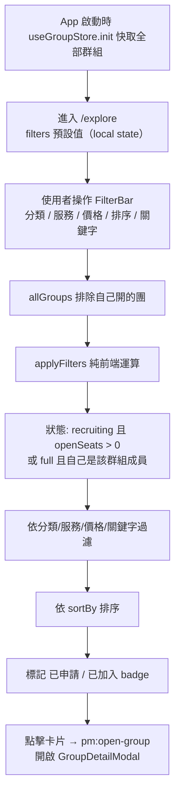

# 探索群組

## 使用者目標
瀏覽目前開放招募的群組，透過分類、服務、價格上限、關鍵字搜尋與排序，找到符合需求的合購群組。

## 流程圖

## 入口
- 導覽列／首頁進入 `/explore`（`ExplorePage`）
- 快速搜尋結果頁（`Step4Results`）的「探索所有群組」按鈕也會導向 `/explore`

## 相關檔案

**前端**

| 路徑 | 說明 |
|------|------|
| `src/features/explore/ExplorePage.jsx` | 頁面入口 |
| `src/features/explore/components/FilterBar.jsx` | 篩選列 |
| `src/features/explore/components/ExploreGroupCard.jsx` | 群組卡片 |
| `src/common/utils/searchUtils.js` | `applyFilters` |
| `src/common/utils/serviceUtils.js` | `listServiceTypes`、`getServiceById` |
| `src/common/stores/useGroupStore.js`、`useApplicationStore.js`、`useMemberStore.js` | 純讀取用 |

**後端**

| 路徑 | 說明 |
|------|------|
| `server/src/routes/groups/crud.js` | `GET /groups`，App 啟動時由 `useGroupStore.init()` 呼叫一次，探索頁本身不會再另外打 API |

**資料表 / Model**

| Model | 用途 |
|-------|------|
| `Group` | 含 `service` 關聯 |
| `Application` | 用來判斷「已申請」badge |
| `Member` | 用來判斷「已加入」badge |

## 使用技術
- **篩選條件不進 URL、也不放 store**：全部存在 `ExplorePage` 的本地 `useState`（`DEFAULT_FILTERS`），重新整理頁面就會回到預設值
- **關鍵字輸入用本地 state + 300ms debounce**：`FilterBar` 內用 `useEffect` + `setTimeout`，避免每敲一個字就觸發一次上層更新
- **篩選/排序全部是前端純運算**：對 `useGroupStore` 已經快取好的群組陣列做 `Array.filter`/`Array.sort`（`applyFilters`），不會另外打搜尋 API
- 用 `useMemo` 快取 `allGroups`（排除自己開的團）、`filtered`，以及已申請／已加入的 `Set`，避免每次 render 都重新掃一次整個列表
- **搜尋框跟三個篩選一律同時顯示**：服務/價格/排序用自製的 `FilterSelect`（不依賴 Radix Select，避免多個下拉框同時存在時「切換要點兩下」的問題），展開時從觸發按鈕下緣無縫延伸、有滑入動畫；桌機版與搜尋框同一列，手機版搜尋框獨立一列、三個篩選各自獨立一整列全寬顯示
- **分類切換時重播卡片進場動畫**：結果 grid 外層包 `key={filters.category}`，切換分類 pill 時強制整個 grid 重新掛載，讓卡片重新播放 slide-up 動畫

## 流程步驟

**1. 初次載入群組快取**
- `App.jsx` 在公開資料初始化階段就會呼叫 `useGroupStore.init(...)`（未登入拿 `recruiting`，登入後拿 `all`）
- 之後 `ExplorePage` 都是對這份快取做純前端運算，不會再打 API

**2. 進入探索頁**
- `filters` 初始化為 `DEFAULT_FILTERS`（分類/服務/價格上限/排序/關鍵字分別是不限/不限/不限/推薦排序/空字串）
- `allGroups` 會先排除自己身為團主開的群組

**3. 操作篩選列**
- 使用者調整分類 pill、服務下拉、價格下拉、排序下拉或輸入關鍵字時，都會呼叫 `onChange(patch)` 合併進本地的 `filters` state（不會觸發路由變化）

**4. 套用篩選**
- `applyFilters(allGroups, filters, memberGroupIds)` 依序套用：
  - 基礎條件：狀態是 `recruiting` 而且還有名額，**或**狀態是 `full` 但使用者自己是該群組成員（`memberGroupIds` 傳入自己已加入的群組 id 集合）——讓已加入的成員在群組額滿後仍能在探索頁看到自己的群組卡片，額滿群組對非成員（含團主本人）維持不可見
  - 分類／服務：分別比對 `getServiceById(serviceId).category` 或精確比對 `serviceId`
  - 價格：`pricePerSeat` 要小於等於設定的上限
  - 關鍵字：trim 後轉小寫，用 `includes` 比對服務或方案名稱是否包含（不是模糊比對，也不是全文檢索）
  - 排序：依團主評分、每人價格由低到高、或剩餘名額由少到多排序，預設是推薦排序

**5. 標記狀態**
- 算出使用者自己「申請中」與「已加入」的群組 id 集合，傳給卡片元件決定要不要顯示對應標籤（`ExploreGroupCard` 用 `Badge` primitive，固定保留一列高度給這個 badge，不管有沒有顯示都佔同樣空間，讓同一排卡片高度整齊）；沒有申請中/已加入的一般卡片不再額外顯示「招募中」標籤（探索頁本來就只會列出招募中或自己已加入的群組，標籤是多餘資訊），金額文字大小跟「我的訂閱」卡片一致（`text-base font-extrabold`）
- 額滿群組的「剩餘名額」直接顯示文字「已滿員」取代 `0 / 3` 這種數字寫法，字級不變（其餘正常招募中的群組仍顯示「剩餘名額 / 總名額」數字加進度條）

**6. 點擊卡片**
- 觸發 `pm:open-group` custom event 開啟 `GroupDetailModal`（不是路由跳轉），後續申請流程見 `apply-join-flow.md`

## 驗證重點
- 探索頁本身沒有寫入操作，也沒有表單驗證；篩選邏輯就是前端純運算，寫死在 `applyFilters`，沒有特別防呆——像是價格欄位傳進非數字字串時，比較結果恆為 false，那個群組就會直接被濾掉
- 只顯示狀態是 `recruiting` 而且還有名額的群組，額滿或非招募中的都不會出現，即使已登入時 store 其實快取了所有狀態的群組
- 關鍵字比對只用簡單的字串包含判斷，不是模糊比對也不是全文檢索；後端 `GET /groups` 的關鍵字搜尋只在初次載入快取時用得到，探索頁互動不會重新打 API
