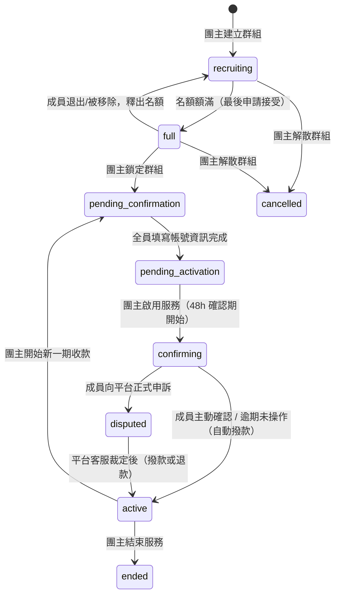

# 群組狀態機

## 流程圖



## 狀態定義

`GroupStatus` enum 定義於 `server/prisma/schema.prisma`：

```prisma
enum GroupStatus {
  recruiting
  full
  pending_confirmation
  pending_activation
  confirming
  disputed
  active
  cancelled
  ended
}
```

## 合法轉換表（`ALLOWED_TRANSITIONS`）

一般狀態轉換透過 `PATCH /groups/:id`（`server/src/routes/groups/crud.js`）處理，該路由用一份寫死在程式碼裡的白名單檢查來源狀態是否可以轉往目標狀態：

```js
const ALLOWED_TRANSITIONS = {
  recruiting:           ['full', 'cancelled'],
  full:                 ['recruiting', 'pending_confirmation', 'cancelled'],
  pending_confirmation: ['pending_activation'],
  pending_activation:   ['active'],
  active:               ['confirming', 'ended', 'pending_confirmation'],
  confirming:           ['active', 'disputed', 'cancelled'],
  disputed:             ['confirming', 'active', 'cancelled', 'ended'],
  cancelled:            [],
  ended:                [],
}
```

如果目標狀態不在允許清單中，就會回傳 400 錯誤。不過實際上大部分狀態轉換並不是走這支泛用的 PATCH，而是走下面列出的專屬端點——這些端點各自有自己的前置條件檢查，有些轉換甚至沒出現在上表裡（例如 `confirming → active` 其實是由「確認服務」端點處理的，不是直接呼叫 PATCH）。

## 各狀態與轉換觸發者

| 狀態 | 說明 | 觸發者 / 端點 | 前置條件 |
|------|------|----------------|----------|
| `recruiting` | 招募中，開放申請 | `POST /groups`（建立時預設值） | — |
| `recruiting → full` | 名額額滿 | 團主接受申請（`PATCH /applications/:id`）或直接加人（`POST /members`） | 加入後人數達到上限才自動推進；用條件式更新避免同時有多筆申請把名額擠爆 |
| `full → recruiting` | 成員退出或被移除，釋出名額 | 團主移除成員，或成員主動退出，前端會先把狀態顯示成招募中並同時處理退款 | 只有原本已經額滿的群組才會改回招募中 |
| `full → pending_confirmation` | 團主鎖定群組 | `POST /groups/:id/lock` | 僅團主可操作，群組狀態須為額滿；成功後統一設定所有成員的下次扣款日，並給 24 小時的填寫帳號資訊期限（前端顯示倒數，逾期不會自動處理） |
| `pending_confirmation → pending_activation` | 全員填寫服務帳號資訊完成 | 前端偵測全員都已填寫後，呼叫狀態更新 API 推進 | — |
| `pending_activation → confirming` | 團主啟用服務 | `POST /groups/:id/activate` | 僅團主可操作，狀態須為待啟用；設定 48 小時後到期的確認期限 |
| `confirming → active` | 全員主動確認，或確認期逾期未操作 | 成員主動確認（`POST /groups/:id/confirm`）；或查詢群組詳情時惰性偵測確認期限已過，自動撥款（見下方「惰性求值」） | 需為群組成員且群組狀態為確認中；全員都已確認、或確認期限已過，才觸發撥款與狀態轉換；更新狀態、撥款、寫入交易紀錄、訂閱轉為活躍這幾個動作包在同一筆交易內一起完成 |
| `confirming → disputed` | 成員向平台申訴 | `POST /groups/:id/dispute` | 需為群組成員，狀態須為確認中；設定 48 小時的申訴處理期限，同時記錄成員回報的問題說明與佐證資料 |
| `disputed → active` | 平台客服裁定 | `POST /groups/:id/adjudicate`（僅管理員） | 狀態須為申訴中；依裁定結果分支：申訴成員勝訴則退款給該成員、把該成員移出群組並結束其訂閱，其餘代管金額回到活躍狀態；團主勝訴則全額撥款給團主，所有成員訂閱恢復活躍 |
| `active → pending_confirmation` | 團主開始新一期收款 | `POST /groups/:id/renew` | 僅團主可操作，狀態須為服務中；先確認所有成員餘額足夠支付下一期費用，不足就回傳錯誤並附上餘額不足的成員清單；扣款成功後清空所有成員的帳號資訊與確認紀錄，重新進入填寫階段；扣款途中若偵測到餘額被其他請求同時變動，會中止整筆交易避免扣錯 |
| `active → ended` | 團主結束服務 | 前端呼叫狀態更新 API，受合法轉換表允許 | — |
| `recruiting/full → cancelled` | 團主在鎖定前解散群組 | `POST /groups/:id/cancel` | 僅團主可操作，狀態須為招募中或額滿（一旦鎖定就無法解散）；把每位成員的代管費用整筆退回，並清空群組代管餘額 |
| `disputed → cancelled/ended` | 白名單中允許但目前前端未實作對應操作入口 | — | 僅在合法轉換表定義層面允許，程式碼中沒有觸發這兩條路徑的 UI |

## 惰性求值（lazy evaluation）撥款

查詢群組詳情時，後端會順便檢查這個群組是不是還在確認期、而且確認期限已經過了；如果是，就重新確認一次狀態，確定還沒被別的請求處理過才執行撥款跟狀態轉換，避免同一個過期群組被多個請求同時讀到、重複撥款兩次。也因為這樣，`confirming → active` 不一定是使用者主動按下什麼按鈕觸發的，很可能只是剛好有人點開了這個群組的詳情頁，順便就把它撥款了。

## PM 幣代管流程對照

| 時機 | PM幣異動 | `TokenTransaction.type` |
|------|----------|--------------------------|
| 送出申請（`POST /applications`） | 申請人 `tokenBalance` -= 席位費用；`group.escrowTokens` += 費用 | `escrow` |
| 團主拒絕 / 申請人取消 | `group.escrowTokens` -= 費用；申請人 `tokenBalance` += 費用 | `refund` |
| 申請接受 | 僅建立成員/訂閱、更新名額，代管金額已在申請時扣過，不再異動 | — |
| 確認期結束（`/confirm` 或惰性撥款） | `group.escrowTokens` → 團主 `tokenBalance` | `release` |
| 成員退出 / 被移除 | `group.escrowTokens` → 該成員 `tokenBalance` | `refund` |
| 團主解散群組（`/cancel`） | 所有成員 `group.escrowTokens` → 各自 `tokenBalance` | `refund` |
| 申訴裁定：成員獲勝（`/adjudicate`） | 該成員份額 `escrowTokens` → 其 `tokenBalance` | `refund` |
| 申訴裁定：團主獲勝（`/adjudicate`） | `group.escrowTokens` → 團主 `tokenBalance` | `release` |
| 新一期收款（`/renew`） | 每位成員 `tokenBalance` -= 席位費用；`group.escrowTokens` += 總額 | `escrow` |
