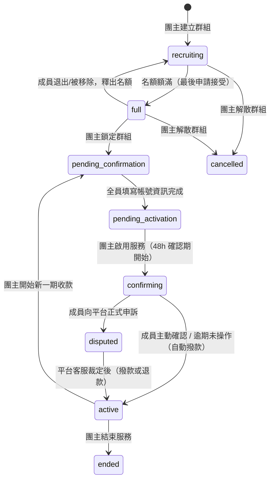

# 群組狀態機

## 流程圖



## 狀態定義

`GroupStatus` enum 定義於 `server/prisma/schema.prisma`：

```prisma
enum GroupStatus {
  recruiting
  full
  pending_confirmation
  pending_activation
  confirming
  disputed
  active
  cancelled
  ended
}
```

## 合法轉換表（`ALLOWED_TRANSITIONS`）

一般狀態轉換透過 `PATCH /groups/:id`（`server/src/routes/groups/crud.js`）處理，該路由用一份寫死在程式碼裡的白名單檢查來源狀態是否可以轉往目標狀態：

```js
const ALLOWED_TRANSITIONS = {
  recruiting:           ['full', 'cancelled'],
  full:                 ['recruiting', 'pending_confirmation', 'cancelled'],
  pending_confirmation: ['pending_activation'],
  pending_activation:   ['active'],
  active:               ['confirming', 'ended', 'pending_confirmation'],
  confirming:           ['active', 'disputed', 'cancelled'],
  disputed:             ['confirming', 'active', 'cancelled', 'ended'],
  cancelled:            [],
  ended:                [],
}
```

如果目標狀態不在允許清單中，就會回傳 400 錯誤。不過實際上大部分狀態轉換並不是走這支泛用的 PATCH，而是走下面列出的專屬端點——這些端點各自有自己的前置條件檢查，有些轉換甚至沒出現在上表裡（例如 `confirming → active` 其實是由「確認服務」端點處理的，不是直接呼叫 PATCH）。

## 各狀態與轉換觸發者

| 狀態 | 說明 | 觸發者 / 端點 | 前置條件 |
|------|------|----------------|----------|
| `recruiting` | 招募中，開放申請 | `POST /groups`（建立時預設值） | — |
| `recruiting → full` | 名額額滿 | `server/src/utils/membership.js` 的 `finalizeApprovedApplication()`（由 `PATCH /applications/:id` 接受申請呼叫）或 `admitMemberIntoGroup()`（由 `POST /members` 團主直接加人呼叫） | 加入後重新查詢 `currentMembers >= maxMembers` 才自動推進；用條件式 `updateMany({ where: { status: 'recruiting', currentMembers: { lt: maxMembers } } })` 防止併發加入超額 |
| `full → recruiting` | 成員退出或被移除，釋出名額 | 團主移除成員（`src/features/manage-groups/hooks/useHostActions.js` 的 `handleRemoveMember`）或成員主動退出（`src/features/group/utils/leaveGroupFlow.js`），前端樂觀 `updateGroup(groupId, { status: 'recruiting' })`，同時退款 | 僅當群組目前狀態為 `full` 時才把狀態改回 `recruiting`（見 `useHostActions.js` 內 `group?.status === 'full' ? { status: 'recruiting' } : {}`） |
| `full → pending_confirmation` | 團主鎖定群組 | `POST /groups/:id/lock` | 僅團主可操作；群組狀態須為 `full`，否則 400；成功後以 transaction 同步設定所有成員 `Subscription.nextBillingDate`，並設定 `Group.serviceInfoDeadline`（鎖定時間 + 24h，前端顯示倒數，逾期不自動處理） |
| `pending_confirmation → pending_activation` | 全員填寫服務帳號資訊完成 | 前端偵測全員 `member.serviceInfo` 皆已填寫後，呼叫 `PATCH /groups/:id`（`status: 'pending_activation'`），受 `ALLOWED_TRANSITIONS` 表允許 | — |
| `pending_activation → confirming` | 團主啟用服務 | `POST /groups/:id/activate` | 僅團主；狀態須為 `pending_activation`；設定 `confirmDeadline = now + 48h` |
| `confirming → active` | 全員主動確認，或確認期逾期未操作 | `POST /groups/:id/confirm`（成員主動確認）；`GET /groups/:id`（惰性檢查 `confirmDeadline` 已過期則自動撥款，見下方「惰性求值」） | `/confirm`：需為群組成員且群組狀態為 `confirming`；全員 `confirmedAt` 皆非 null，或 `confirmDeadline` 已過期，才觸發撥款與狀態轉換；用 Prisma `$transaction` 把「更新群組狀態」「撥款給團主」「清空 escrowTokens」「寫入 TokenTransaction」「訂閱狀態轉 active」包在一起 |
| `confirming → disputed` | 成員向平台申訴 | `POST /groups/:id/dispute` | 需為群組成員；狀態須為 `confirming`；`disputeDeadline = now + 48 小時`；同一 transaction 寫入該成員 `serviceInfoIssueNote` / `disputeEvidenceUrl` |
| `disputed → active` | 平台客服裁定 | `POST /groups/:id/adjudicate`（`requireAdmin` 中介層，僅管理員） | 狀態須為 `disputed`；依 `winner` 分支：`member` 贏→退款給申訴成員、`member.delete`、該成員訂閱設 `ended`（`SubscriptionStatus` 只有 `pending`/`active`/`ended` 三種，沒有 `cancelled`），群組 `escrowTokens` 扣除該席位費用後回 `active`；`host` 贏→全額撥款給團主、`escrowTokens` 歸零、全體訂閱轉 `active` |
| `active → pending_confirmation` | 團主開始新一期收款 | `POST /groups/:id/renew` | 僅團主；狀態須為 `active`；先檢查所有成員 `tokenBalance >= seatCost`，不足則回傳 `400 INSUFFICIENT_BALANCE` 並附 `memberIds`；transaction 內用條件式 `updateMany({ where: { tokenBalance: { gte: seatCost } } })` 扣款，若 `charged.count !== memberIds.length` 代表扣款當下餘額被其他請求變動，丟出 409 中止；同時清空所有成員 `serviceInfo`/`confirmedAt`，重新進入填寫階段 |
| `active → ended` | 團主結束服務 | 前端 `endGroup(id)` → `useGroupStore.update(id, { status: 'ended' })` → `PATCH /groups/:id`，受 `ALLOWED_TRANSITIONS` 允許 | — |
| `recruiting/full → cancelled` | 團主在鎖定前解散群組 | `POST /groups/:id/cancel` | 僅團主；狀態須屬於 `['recruiting', 'full']`（一旦鎖定即無法解散）；transaction 內把每位成員的席位費用（`computeSeatCost`）退回 `tokenBalance`，並各自寫入 `TokenTransaction(type: 'refund')`，群組 `escrowTokens` 歸零 |
| `disputed → cancelled/ended` | 白名單中允許但目前前端未實作對應操作入口 | — | 僅 `ALLOWED_TRANSITIONS` 定義層面允許，程式碼中沒有觸發這兩條路徑的 UI |

## 惰性求值（lazy evaluation）撥款

查詢群組詳情時，後端會順便檢查這個群組是不是還在確認期、而且確認期限已經過了；如果是，就在交易內重新確認一次狀態，確定還沒被別的請求處理過才執行撥款跟狀態轉換，避免同一個過期群組被多個請求同時讀到、重複撥款兩次。也因為這樣，`confirming → active` 不一定是使用者主動按下什麼按鈕觸發的，很可能只是剛好有人點開了這個群組的詳情頁，順便就把它撥款了。

## PM 幣代管流程對照

| 時機 | PM幣異動 | `TokenTransaction.type` |
|------|----------|--------------------------|
| 送出申請（`POST /applications`） | 申請人 `tokenBalance` -= 席位費用；`group.escrowTokens` += 費用 | `escrow` |
| 團主拒絕 / 申請人撤回 | `group.escrowTokens` -= 費用；申請人 `tokenBalance` += 費用 | `refund` |
| 申請接受（`finalizeApprovedApplication`） | 僅建立成員/訂閱、更新名額，代管金額已在申請時扣過，不再異動 | — |
| 確認期結束（`/confirm` 或惰性撥款） | `group.escrowTokens` → 團主 `tokenBalance` | `release` |
| 成員退出 / 被移除 | `group.escrowTokens` → 該成員 `tokenBalance` | `refund` |
| 團主解散群組（`/cancel`） | 所有成員 `group.escrowTokens` → 各自 `tokenBalance` | `refund` |
| 申訴裁定：成員獲勝（`/adjudicate`） | 該成員份額 `escrowTokens` → 其 `tokenBalance` | `refund` |
| 申訴裁定：團主獲勝（`/adjudicate`） | `group.escrowTokens` → 團主 `tokenBalance` | `release` |
| 新一期收款（`/renew`） | 每位成員 `tokenBalance` -= 席位費用；`group.escrowTokens` += 總額 | `escrow` |
