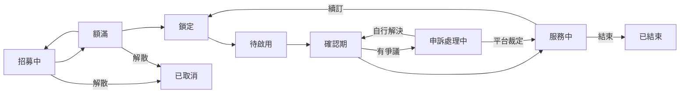

# 群組狀態機

## 概念

一個群組從建立到結束，只會照固定的順序推進，不會跳步驟：招募中 → 額滿 → 鎖定（填寫帳號資訊）→ 待啟用 → 確認期 → 服務中 → 續訂或結束。中途如果成員退出釋出名額，額滿的群組會退回招募中；確認期內若成員回報問題，會先進入申訴處理——雙方自行溝通解決就直接回到確認期，重新給一段確認窗口；真的談不攏才由平台裁定，裁定完直接回到服務中。

## 設計重點

- **每個階段轉換都有明確的前置條件與唯一觸發者**（多半是團主的操作，或成員自己的動作），不允許跳過或逆向轉換
- **確認期的自動撥款是「惰性」觸發的**：只要有人讀取到這個群組已經超過確認期限，系統就會順便完成撥款，不需要額外的排程機制去主動掃描
- **申訴處理有兩條出路**：團主與成員能自己在留言區談好就直接回到確認期，不動任何金流；談不攏才交由平台裁定金流歸屬
- **PM幣的代管、撥款、退款會跟著群組狀態一起走**：進入代管的時機、撥款給團主的時機、退款給成員的時機都對應到特定的狀態轉換，詳見 [PM幣代管與付款流程](./payment-token-flow.md)
- 部分狀態轉換路徑（例如申訴處理中直接轉為已取消或已結束）目前在設計上是允許的，但前端還沒有對應的操作入口
