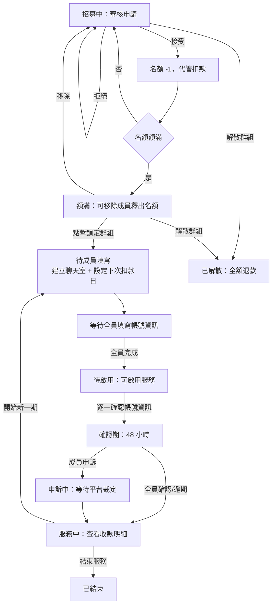

# 群組管理（團主視角）

## 使用者目標
團主管理自己建立的群組：審核申請、鎖定群組開始收款、啟用服務、查看收款明細、回報成員帳號問題，以及在服務期滿後決定續訂或結束群組。

## 流程圖

## 入口
- `/manage-groups`（獨立頁面，`ManageGroupsPage.jsx`）
- 也可以從通知點擊（`new_application`/`group_full`/`group_activated`/`member_left` 等）直接開啟指定群組，並自動展開對應面板

## 相關檔案

**前端**

| 路徑 | 說明 |
|------|------|
| `src/features/manage-groups/ManageGroupsPage.jsx` | 頁面總入口 |
| `src/features/manage-groups/hooks/useHostActions.js` | 所有團主操作的事件處理（鎖定、啟用、移除成員、審核、續訂、解散等） |
| `src/features/manage-groups/components/HostGroupView.jsx` | 團主視角群組詳情 Modal，含成員填寫中／確認期的倒數橫幅；「成員評價」只顯示這個群組的評價，且只在群組曾經啟用過才會出現；已解散的群組不顯示評價、收款、群組訊息、續訂管理、成員資料這幾個分頁，因為這些階段根本沒發生過；「收款管理」只要群組沒解散就會顯示，不限鎖定後，因為招募中期間也可能已經有代管入帳；「成員資料」只在鎖定後、非解散狀態顯示，因為要鎖定群組後成員才會填寫帳號資訊 |
| `src/features/manage-groups/components/HostReviewsModal.jsx` | 獨立的「我的評價」Modal，彙總團主名下所有群組的評價，入口在帳號中心，跟群組詳情裡只看單一群組的「成員評價」分頁分開 |
| `src/components/ui/primitives/CountdownText.jsx` | 顯示距截止時間剩餘時間的小元件，逾期顯示自訂文字 |
| `src/common/utils/hooks.js` | 倒數計時 hook，每秒重算剩餘時間，純顯示用 |
| `src/features/manage-groups/components/HostedGroupCard.jsx` | 群組卡片 |
| `src/components/ui/FilterTabsBar.jsx` | 狀態篩選列，手機/桌機同一套橫向 tabs；「群組紀錄」按鈕獨立放在頁面標題列，不屬於這個元件 |
| `src/features/manage-groups/components/ActivateServiceModal.jsx` | 啟用服務前逐一確認成員帳號的 Modal |
| `src/features/manage-groups/components/ReportServiceIssueModal.jsx` | 回報成員帳號問題 |
| `src/features/manage-groups/components/RenewalModal.jsx` | 續訂管理（見續訂流程文件） |
| `src/features/manage-groups/components/hostGroupView/buildMembersPanel.jsx` | 群組名單子面板（含團主），含移除成員；群組啟用過時右下角另有「成員評價」入口 |
| `src/features/manage-groups/components/hostGroupView/buildApplicationsPanel.jsx` | 申請管理子面板，只列待審核 |
| `src/features/manage-groups/components/hostGroupView/ApplicationCard.jsx` | 單筆申請卡片，接受／拒絕 |
| `src/features/manage-groups/components/hostGroupView/buildReviewHistoryPanel.jsx` | 審核紀錄第三層面板，只列已接受／已拒絕的申請（已退出／已移除是成員異動不是審核結果，不放進來） |
| `src/features/manage-groups/components/LockGroupCredentialsModal.jsx` | 鎖定群組時，官方無多人邀請機制的服務改用這個結構化表單填帳密，跟成員端「填寫服務帳號」的堆疊模式一致 |
| `src/common/utils/hostCredentialFields.js` | 依服務別定義的結構化帳密欄位（例如 Netflix 多一個 Profile 名稱、VPN 服務多一個裝置名額）與帳密風險提醒文案 |
| `src/components/ui/DisputeReasonDialog.jsx` | 查看回報原因與附件的唯讀對話框，團主可用它查看成員送出的申訴理由，跟成員端共用同一個元件 |
| `src/features/manage-groups/components/hostGroupView/buildBillingPanel.jsx` | 收款管理面板（見 PM幣代管流程文件） |
| `src/features/manage-groups/components/hostGroupView/buildMemberInfoPanel.jsx` | 「成員資料」分頁，團主查看每位成員填寫的服務帳號資訊，可直接從這裡回報帳號問題，不用等到啟用服務那一步才能看 |
| `src/features/manage-groups/utils/hostFilters.js` | 狀態篩選分類（招募中/處理中/服務中三個大分類，待鎖定、成員填寫中、待啟用、確認期中、申訴中五種細分狀態都併入「處理中」，細分階段交給卡片本身的狀態 badge 顯示）與名額計算邏輯 |
| `src/features/account/components/tabs/AdminTab.jsx` | 管理員裁定申訴，跨群組，非團主本人操作 |

**後端**

| 路徑 | 說明 |
|------|------|
| `server/src/routes/groups/lifecycle.js` | `POST /:id/lock`、`POST /:id/activate`、`POST /:id/cancel`、`POST /:id/renew` |
| `server/src/routes/groups/crud.js` | `GET /:id/transactions`、`PATCH /:id` |
| `server/src/routes/applications.js` | `PATCH /:id`（接受／拒絕） |
| `server/src/routes/members.js` | `POST /`（團主手動加人）、`PATCH /:id`（回報帳號問題）、`DELETE /:id`（移除成員） |
| `server/src/routes/conversations.js` | `POST /group`（鎖定群組時建立聊天室） |
| `server/src/utils/membership.js` | `finalizeApprovedApplication`（接受申請）、`admitMemberIntoGroup`（團主手動加人）、`refundEscrow`（移除成員退款） |

**資料表 / Model**

| Model | 用途 |
|-------|------|
| `Group` | `status`、`currentMembers`/`maxMembers`、`escrowTokens`、`nextBillingDate` |
| `Application` | `status`（`pending`/`approved`/`rejected`） |
| `Member` | `serviceInfoIssueNote` |
| `TokenTransaction` | 收款管理面板依 `relatedGroupId` 查詢 |

## 使用技術
- **自訂 hook 抽出頁面邏輯**：頁面本身只負責純 UI，另有一個 hook 訂閱群組、申請、成員三個 store，只要有任何一個變動就重算團主要看到的資料
- **統一的開啟事件**：不管是點通知還是帶狀態導覽進來，都會走同一個處理函式，統一設定要開哪個群組、要不要自動展開鎖定/啟用/申請管理/收款面板
- **三層滑動面板**：申請管理是第二層，審核紀錄是第三層；桌機版側邊欄在左側，手機版仍堆疊在下方
- **倒數／狀態提醒橫幅不綁定分頁**：切到群組名單、收款管理等分頁時倒數橫幅仍會顯示，不會只留在群組概覽
- **服務說明／方案說明顯示在群組概覽畫面**，跟探索頁群組詳情的呈現方式統一；服務說明拆成「服務說明」「方案說明」兩個並列的大標題區塊，字級一樣大
- **群組詳情 Modal Header 顯示「服務名稱 | 方案名稱」**
- **先更新畫面，背景再同步**：接受/拒絕申請、移除成員時會先更新本地資料，畫面立刻反應，再到背景呼叫對應 API 跟建立通知
- 解散群組、移除成員這兩個不可逆的操作，都要透過倒數確認對話框才能執行；鎖定群組則是另一套機制，兩顆按鈕直接確認，沒有倒數
- **側邊欄固定項目**：招募中時側邊欄底部固定顯示「解散群組」；鎖定後（且非已解散）改成固定顯示一組「續訂管理」＋「群組訊息」（只有服務中狀態才有「續訂管理」，「續訂管理」在「群組訊息」正上方）——招募中分支跟鎖定後分支互斥，不會同時出現，因此可以共用側邊欄下半部同一塊區域；已解散狀態三者皆不顯示
- **群組卡片依狀態切換統計格內容**：服務中狀態第一格顯示「群組狀態」（正常/追蹤中/問題處理中等）、第三格顯示「續訂日期」（其他狀態叫「下次扣款」）；其餘已啟用狀態（已解散/已結束）第一格仍顯示「收款紀錄」；招募中第一格顯示「待處理申請」、第三格顯示「建立日期」；其餘鎖定後尚未啟用的狀態第一格與第三格皆顯示「群組狀態」／「下次扣款」。「群組狀態」欄位文字顯示已滿員/成員填寫中/待啟用服務/確認期中/申訴中/已結束等，跟頂部狀態徽章是同一個狀態階段的兩種呈現——徽章在額滿時顯示「等待鎖定」（只影響這張卡片，探索頁等其他地方仍顯示「已滿員」），待成員填寫階段則直接沿用預設的「成員填寫中」；統計格則維持原始的細分階段文字（例如額滿時顯示「已滿員」）。待成員填寫這個階段代管費用其實已經在申請被接受當下扣完了（見 PM幣代管流程文件），不是在「收款」，因此用「成員填寫中」，跟這個階段實際在等待的事情（成員填寫服務帳號資訊）一致
- **群組卡片列表依容器寬度自動排欄數，不用螢幕斷點**：依容器實際可用寬度（扣掉側邊欄與 padding 後）決定一列能排幾張卡片，不會像用固定斷點時，卡片被螢幕寬度硬擠出比實際可用空間更多的欄數，導致統計格內的日期文字被迫換行
- **深連結自動對應篩選分類**：從通知點擊開啟、沒有明確指定篩選分類時，會依目標群組目前的狀態自動找出對應的分類並切過去，避免使用者關閉 modal 後，背景列表因為預設篩選分類（招募中）對不上群組實際狀態而讓群組憑空消失

## 流程步驟

**1. 查看自己的群組**
- 依分頁跟篩選條件顯示所有群組

**2. 審核申請（招募中）**
- 側邊欄「申請管理」列出待審核清單；面板右下角有一個固定貼在角落、附文字的「審核紀錄」按鈕（內容捲動時仍維持在角落，樣式跟最上方的「群組紀錄」按鈕統一）；「申請管理」「審核紀錄」兩個分頁的標題列都不顯示文字，返回鍵一律浮動在左上角，不佔用整列高度；審核紀錄只放審核結果本身（已接受/已拒絕），已退出/已移除屬於成員異動而非審核動作，不混進這份清單
- 點「接受」：先檢查名額是否足夠，通過就送出接受請求（後端在同一筆交易內完成餘額檢查、代管扣款、建立成員與訂閱）；前端等後端完成後重新拉一次真實資料，並更新本地名額，剛好額滿的話還會額外通知團主自己
- 點「拒絕」：送出拒絕請求並通知申請人；申請人點擊該通知時會重新拉取自己的申請資料，讓探索頁「已申請」標記立即消失、恢復成可重新申請的狀態
- 申請人也可以自行取消待審核的申請：後端把狀態改成已取消並退款，前端會通知團主，團主端的申請資料會在輪詢偵測到這則通知時自動刷新，不需要團主手動點擊或重新整理頁面就會把這筆申請從待審核清單移除

**3. 移除已接受成員（招募中或額滿期間）**
- 成員名單面板提供移除按鈕，倒數確認後才會真的執行
- 後端會退款、釋出名額、把對應申請標為已移除
- 前端同步更新本地名額，通知被移除的成員；如果聊天室已經存在，會發一則系統訊息並把該成員移出聊天室
- 已退出／已移除的成員異動記錄仍完整保留在申請資料表，但前端不再提供查看入口——這類異動只會發生在招募中或額滿階段，此時代管款項尚未進入服務中週期、沒有金流爭議風險，團主不需要在前端查證，真的要查只能從後台/資料庫直接查詢

**4. 鎖定群組（額滿 → 待成員填寫）**
- 官方無多人邀請機制的服務點擊鎖定時會先跳出結構化表單，要求填完該服務對應的帳密欄位（帳號/密碼，依服務再加 Profile 名稱、裝置名額、Discord 邀請連結等）才能繼續，並顯示帳密外流風險提醒；填完的內容存起來，成員填寫服務帳號時會直接看到（套浮水印）
- 先建立群組聊天室（把團主跟所有成員加進去），再呼叫鎖定 API，後端會同時設定所有成員的下次扣款日，以及 24 小時的填寫帳號資訊期限（僅供前端顯示倒數，逾期不會有任何自動處理）
- 通知團主自己與所有成員聊天室已開啟／請填寫服務帳號；填寫帳號本身改在成員端群組詳情的 sub-modal 進行，聊天室不再另外發送提示訊息卡片
- 群組詳情頁（團主與成員兩側）在這個階段都會顯示「等待成員填寫服務帳號資訊，剩餘 HH:MM:SS」的倒數橫幅，每秒更新

**5. 查看成員資料**
- 側邊欄「成員資料」分頁（鎖定後、非已解散都看得到）列出每位成員目前的填寫狀態：已填寫顯示摘要、尚未填寫顯示提示、已回報問題顯示等待修正中；可直接從這裡點「帳號問題」開啟回報視窗，不用等到啟用服務那一步才能檢查

**6. 啟用服務（待啟用 → 確認期）**
- 要求逐一勾選確認每位成員的帳號資訊都沒問題，才能按下最終確認
- 確認後群組進入 48 小時確認期，聊天室發系統訊息，並通知團主與所有成員服務已啟用
- 群組詳情頁（團主與成員兩側）在確認期期間都會顯示「確認期進行中，剩餘 HH:MM:SS」的倒數橫幅

**7. 回報成員帳號問題**
- 填寫問題說明後送出，會把說明寫進該成員的記錄，聊天室發系統訊息請該成員重新提交，並通知該成員

**8. 收款管理**
- 「收款管理」分頁非已解散就能看到（不限鎖定後），面板掛載時查詢該群組的所有交易紀錄（僅團主本人可查）
- 只呈現每位成員「目前」狀態：最新一筆代管入帳紀錄即可（不管取消重新申請等留下的舊代管/退款歷史），頂部彙總目前代管中尚未撥款的總額與已撥款給團主的總額；代管中總額刻意不用群組上的代管總額欄位（那個數字包含還在等審核的申請人代管，不是「已成為成員」的人），改成加總每位成員最新一筆代管交易金額；退款等歷史紀錄改到（使用者端）PM幣交易紀錄查詢
- **「代管入帳」顯示的時間是接受申請的時間，不是實際扣款時間**：代管扣款實際發生在使用者送出申請的當下（見 PM幣代管流程文件），但團主/成員在收款/付款管理面板看到的「代管入帳」時間刻意改顯示團主按下「接受」的那一刻——這是團主/成員主觀認知「入帳」發生的時間點，跟背後帳務上實際扣款的時間點是兩回事，只影響顯示，不影響扣款/退款金額與時機

**9. 解散群組（僅招募中或額滿，見 PM幣代管流程文件）**
- 入口固定在側邊欄右下角（跟鎖定後的「群組訊息」共用同一個位置）
- 解散後所有代管金額會退回給各成員，並通知所有成員

**10. 續訂／結束服務**
- 見「續訂流程」文件

**11. 平台裁定申訴**
- 申訴不在團主自己的操作範圍內，是由平台管理員在管理員後台選擇處於申訴中狀態的群組並送出裁定，見申訴流程文件

**12. 查看評價**
- 群組詳情群組名單子面板內的「成員評價」按鈕只顯示這個群組的評價（平均分數/則數只算這個群組），且只在群組曾經啟用過才會出現這個入口
- 帳號中心 Hero 區塊的「我的評價」按鈕點開獨立的 Modal，彙總團主名下所有群組的評價；沒有評價時顯示「尚無評價」

## 驗證重點
- 所有團主專屬的 route（鎖定/啟用/解散/續訂/查交易紀錄）都會檢查請求人確實是該群組的團主，不是就回 403
- 鎖定只允許在額滿狀態操作、啟用只允許待啟用、解散只允許招募中或額滿、續訂只允許服務中——都在 route 層明確檢查狀態，擋下不合法的轉換
- 審核申請用條件式更新而不是先讀後寫，避免同一筆申請被重複接受、重複扣款
- 團主手動加人只允許在招募中狀態操作，而且跟申請接受共用同一套入群邏輯，不會繞過名額上限跟代管帳務
- 移除成員只允許在招募中或額滿狀態操作，一旦鎖定成員名單就不能再變動
- 查交易紀錄只有團主本人可以看，非團主一律 403
- 通知非自己的使用者時，後端會驗證請求人跟目標使用者都跟該群組有關聯（成員／團主／曾送申請），避免任意使用者偽造通知
- **解散群組退款**：解散 API 會在同一筆交易裡重新查詢當下真正的成員名單再退款，避免跟同時發生的成員退出/移除撞在一起造成重複退款
- **群組額滿判斷**：現有人數（不含團主）加上團主自己達到人數上限，才會推進為額滿
