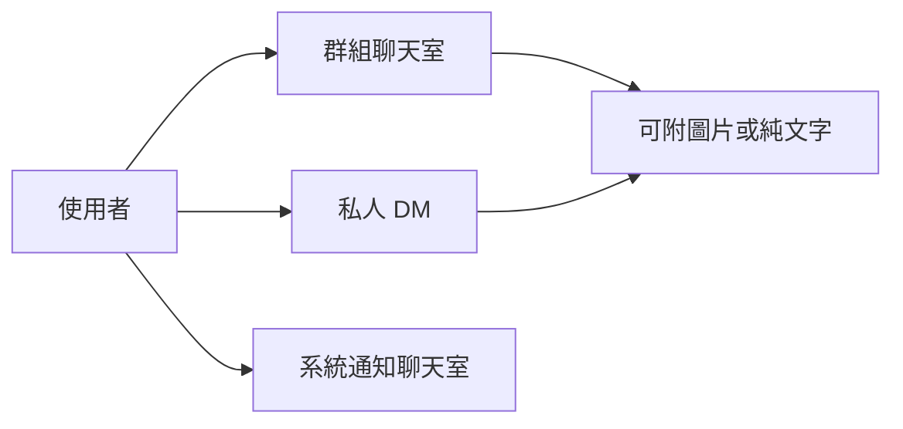

# 訊息 / 聊天室流程

## 使用者目標
使用者希望能跟團主或群組成員溝通——可能是群組聊天室的多人討論、私人 DM，或是查看平台系統通知的訊息式呈現。

## 流程圖

## 流程
- **群組聊天室**：團主鎖定群組時自動建立，參與者是團主加上全體成員，用於群組期間的日常溝通
- **私人 DM**：點擊「聯絡團主/成員」建立一對一對話；發起後若未送出任何訊息，雙方的對話列表都不會顯示這個空對話，直到送出第一則訊息才會同時曝光給雙方，避免累積大量空對話
- **系統通知聊天室**：每位使用者註冊時自動建立，唯讀，由平台發送公告或客服訊息
- **圖片附件**：訊息可以只附圖片、只打字，或兩者都有；選圖後立即上傳並顯示縮圖預覽，送出後訊息氣泡顯示縮圖，點擊可開大圖檢視

## 產品決策
- **採用輪詢（Polling）而非即時連線（WebSocket）**：這是群組媒合聊天，不是需要極低延遲的即時互動場景，輪詢已經足夠好用；換來的是架構更簡單、跟現有的水平擴展模式天然相容，也能直接複用既有的身分驗證機制。等使用者規模或使用情境真的需要更即時的體驗時，再重新評估
- **使用者狀態點是手動選擇、不是自動偵測**：線上/忙碌/離線由使用者自己在帳號設定裡選，離線用紅色顯示是刻意的設計選擇

## 驗證重點
- 只有對話的實際參與者能收發訊息
- 同一對使用者的私訊只會存在一個對話，不會重複建立
