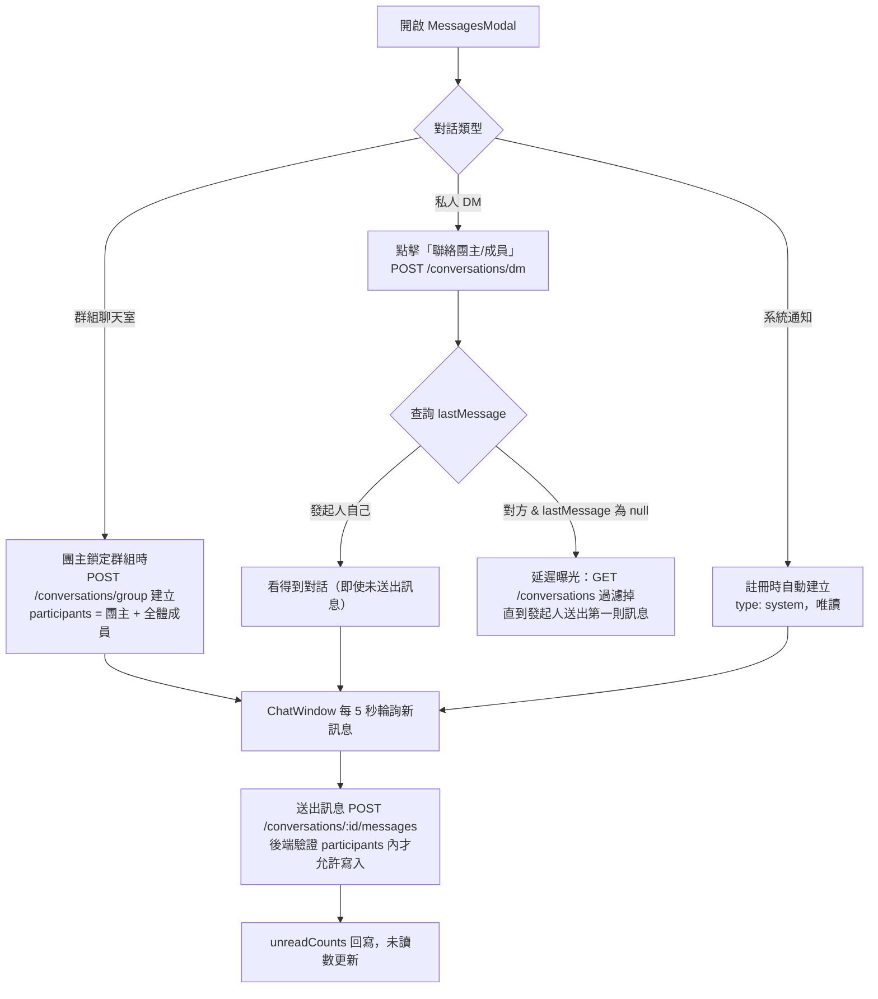

# 訊息 / 聊天室流程

## 使用者目標
使用者希望能跟團主或群組成員溝通——可能是群組聊天室的多人討論、私人 DM，或是查看平台系統通知的訊息式呈現。

## 流程圖

## 入口
- 全域 `MessagesModal`：由 `dispatchEvent(new CustomEvent('pm:open-messages'))` 觸發開啟，統一在 `AppLayout` 監聽
- `AppNav`（桌機 sidebar / 手機 header）的訊息按鈕
- `FloatingMessages`：點擊通知後也可能連帶開啟對應對話
- `pm:open-dm` custom event：點擊「聯絡團主/成員」時觸發，開啟指定對象的私訊對話
- `/quick-match`（`QuickMatchPage.jsx`）獨立於 `AppLayout` 之外，額外自己掛了一份 `MessagesModal`（`lazy` + `Suspense`），否則群組詳情內團主評價區的「聯絡團主」在這個頁面會沒有 `pm:open-dm` 監聽者，私訊開不起來

## 相關檔案

**前端**

| 路徑 | 說明 |
|------|------|
| `src/features/messages/MessagesModal.jsx` | 狀態管理與整體協調 |
| `src/features/messages/utils.js` | `formatTime` 共用工具 |
| `src/features/messages/components/ConversationList.jsx` | 對話列表 |
| `src/features/messages/components/ChatWindow.jsx` | 聊天視窗 |
| `src/features/messages/components/ChatMembersPanel.jsx` | 群組成員面板 |
| `src/features/messages/components/ConversationAvatar.jsx` | 對話頭像 |
| `src/features/messages/components/ConversationMenu.jsx` | 對話選單 |
| `src/features/messages/components/MessageBubble.jsx` | 單則訊息氣泡 |
| `src/features/messages/hooks/useMessageScroll.js` | 捲動控制 |
| `src/features/messages/hooks/useParticipantNames.js` | 參與者名稱查詢 |
| `src/shared/stores/useConversationStore.js` | 對話 store |
| `src/shared/api/messagesApi.js` | 訊息 API 封裝 |
| `src/shared/utils/poller.js` | 輪詢共用機制 |

**後端**

| 路徑 | 說明 |
|------|------|
| `server/src/routes/conversations.js` | 對話與訊息相關 route |

**資料表 / Model**

| Model | 用途 |
|-------|------|
| `Conversation` | `type`: `group` / `dm` / `system`；`participants`、`unreadCounts`、`lastReadAt`、`lastMessage` 是 JSON 欄位；`initiatorId` 記錄 DM 發起人 |
| `Message` | 一般訊息 `type: 'text'`；系統訊息另有 `actionType`/`payload`，供前端渲染成可操作的訊息 |

## 使用技術
- **用 Polling 而不是 WebSocket**：`useConversationStore` 每 5 秒輪詢對話列表，`subscribeToMessages` 輪詢單一對話的訊息。原因不是「不知道 WebSocket」，而是實際權衡過現階段的成本效益：
  - **基礎設施成本**：WebSocket 需要維護一條持久連線，後端要處理連線生命週期（心跳、斷線偵測）；一旦未來多開一台後端實例做水平擴展，同一個對話的兩端可能連到不同實例，訊息要能互通就得再加一層 pub/sub broker（例如用已經在跑的 Redis 做 `PUBLISH`/`SUBSCRIBE`）。polling 完全不需要這些，每次都是一次獨立、無狀態的 HTTP request，天然跟現有的水平擴展模型相容
  - **複用既有機制**：polling 沿用跟其他 REST API 一樣的 `axiosClient`（自動帶 token、401 自動 refresh），WebSocket 連線的身分驗證、token 過期後怎麼重新握手，是另一套要單獨設計的邏輯
  - **前端複雜度**：WebSocket 要處理斷線重連（背景分頁、電腦休眠喚醒後連線斷了要偵測並重建）、多分頁同時開著同一個對話時誰負責維護連線、訊息到達順序跟去重；polling 因為每次都是完整重新拉一次列表，這些問題天然不存在
  - **延遲是否重要**：這是群組合購媒合聊天室，不是股票報價或多人協作編輯，5-10 秒的延遲對使用情境影響很小，換取上面這些複雜度不划算
  - **什麼時候該換**：使用者規模大到 polling 的請求量本身變成後端負擔（每個在線使用者每 5 秒一次 request，人數一多會線性增加無效請求）、或使用情境變成需要低延遲的即時互動（例如客服即時對話），才是重新評估 WebSocket 的時機點；目前規模下這個交換點還沒到
- **三處輪詢共用同一套機制**：通知、對話列表、訊息內容都靠 `poller.js` 的 `startPolling(pollOnce, intervalMs)`——先立刻跑一次，之後每隔一段時間再跑；並把 `isActive()` 傳給 callback，讓輪詢邏輯在等待回應的過程中自己判斷這次結果還要不要寫回，避免使用者登出後，前一次還沒跑完的請求回來把過期資料寫進畫面
- DM 的延遲曝光完全靠後端判斷，不依賴前端輪詢的時機點

## 流程步驟

### 群組聊天室
- 群組額滿並被團主鎖定後，會自動建立群組聊天室，`participants` 是該群組所有成員加上團主
- 成員或團主開啟 `MessagesModal`，`ConversationList` 顯示所有看得到的對話
- 選定對話後 `ChatWindow` 取得歷史訊息，並開始輪詢新訊息
- 送出訊息時，後端會驗證發送者確實在 `participants` 裡才允許寫入

### 私人 DM（延遲曝光）
- 使用者在某個情境下點擊「聯絡團主/成員」，會呼叫 `getOrCreateDmConversation(targetUserId)`
- 後端把兩個使用者的 id 排序後查詢是否已經有 `type: 'dm'` 的對話，沒有就建立新對話，並記下是誰發起的（`initiatorId`）
- **延遲曝光**：如果對話有發起人、目前查詢的不是發起人自己、而且對話還沒有任何訊息，`GET /conversations` 就會把這筆對話從列表濾掉——對方要等到發起人真的送出第一則訊息，才會在自己的對話列表看到它
- 這個判斷完全寫在後端 `GET /conversations` 的查詢邏輯裡，不依賴前端輪詢時機

### 系統通知聊天室
- 每個使用者註冊時都會自動建立一間 `type: 'system'` 的對話，參與者只有自己
- 這個對話是唯讀的，使用者無法回覆，由平台系統帳號發送公告或客服訊息；訊息可能帶 `actionType`/`payload`，讓前端渲染成可以互動的操作型訊息

## 驗證重點
- 所有跟訊息有關的 route 都會先解析 `participants`（要相容陣列或字串兩種儲存格式），確認發送者確實在裡面，不是參與者一律拒絕
- 建立 DM 時會先把兩個使用者的 id 排序再查詢，確保同一對使用者不會重複建出好幾個 DM 對話
- 已讀狀態跟未讀數要跟訊息送出保持同步，避免未讀數跟實際訊息數量對不上
