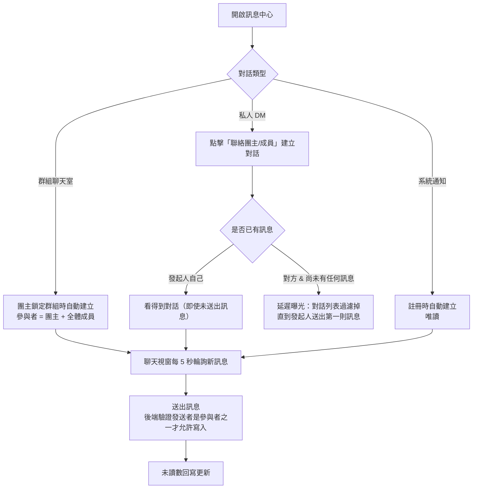

# 訊息 / 聊天室流程

## 使用者目標
使用者希望能跟團主或群組成員溝通——可能是群組聊天室的多人討論、私人 DM，或是查看平台系統通知的訊息式呈現。

## 流程圖

## 入口
- 全域訊息中心：透過自訂事件觸發開啟，統一在頁面外層監聽
- 桌機側邊欄／手機頂部導覽列的訊息按鈕
- 點擊通知後也可能連帶開啟對應對話
- 點擊「聯絡團主/成員」時觸發自訂事件，開啟指定對象的私訊對話
- 快速配對頁獨立於一般版面之外，額外自己掛了一份訊息中心，否則群組詳情內團主評價區的「聯絡團主」在這個頁面會開不起私訊

## 相關檔案

**前端**

| 路徑 | 說明 |
|------|------|
| `src/features/messages/MessagesModal.jsx` | 狀態管理與整體協調 |
| `src/features/messages/utils.js` | `formatTime` 共用工具 |
| `src/features/messages/components/ConversationList.jsx` | 對話列表 |
| `src/features/messages/components/ChatWindow.jsx` | 聊天視窗 |
| `src/features/messages/components/ChatMembersPanel.jsx` | 群組成員面板 |
| `src/features/messages/components/ConversationAvatar.jsx` | 對話頭像 |
| `src/features/messages/components/ConversationHeaderActions.jsx` | 聊天視窗 header 右側的「查看群組」「成員」兩顆按鈕，只有兩個選項就不用三個點點開下拉選單 |
| `src/features/messages/components/MessageBubble.jsx` | 單則訊息氣泡 |
| `src/features/messages/hooks/useMessageScroll.js` | 捲動控制 |
| `src/features/messages/hooks/useParticipantNames.js` | 參與者名稱查詢 |
| `src/common/stores/useConversationStore.js` | 對話 store |
| `src/common/api/messagesApi.js` | 訊息 API 封裝 |
| `src/common/utils/poller.js` | 輪詢共用機制 |

**後端**

| 路徑 | 說明 |
|------|------|
| `server/src/routes/conversations.js` | 對話與訊息相關 route |

**資料表 / Model**

| Model | 用途 |
|-------|------|
| `Conversation` | `type`: `group` / `dm` / `system`；`participants`、`unreadCounts`、`lastReadAt`、`lastMessage` 是 JSON 欄位；`initiatorId` 記錄 DM 發起人 |
| `Message` | 一般訊息 `type: 'text'`；系統訊息另有 `actionType`/`payload`，供前端渲染成可操作的訊息 |

## 使用技術
- **用 Polling 而不是 WebSocket**：對話 store 每 5 秒輪詢對話列表，另有機制輪詢單一對話的訊息。原因不是「不知道 WebSocket」，而是實際權衡過現階段的成本效益：
  - **基礎設施成本**：WebSocket 需要維護一條持久連線，後端要處理連線生命週期（心跳、斷線偵測）；一旦未來多開一台後端實例做水平擴展，同一個對話的兩端可能連到不同實例，訊息要能互通就得再加一層 pub/sub broker（例如用已經在跑的 Redis 做 `PUBLISH`/`SUBSCRIBE`）。polling 完全不需要這些，每次都是一次獨立、無狀態的 HTTP request，天然跟現有的水平擴展模型相容
  - **複用既有機制**：polling 沿用跟其他 REST API 一樣的 `axiosClient`（自動帶 token、401 自動 refresh），WebSocket 連線的身分驗證、token 過期後怎麼重新握手，是另一套要單獨設計的邏輯
  - **前端複雜度**：WebSocket 要處理斷線重連（背景分頁、電腦休眠喚醒後連線斷了要偵測並重建）、多分頁同時開著同一個對話時誰負責維護連線、訊息到達順序跟去重；polling 因為每次都是完整重新拉一次列表，這些問題天然不存在
  - **延遲是否重要**：這是群組合購媒合聊天室，不是股票報價或多人協作編輯，5-10 秒的延遲對使用情境影響很小，換取上面這些複雜度不划算
  - **什麼時候該換**：使用者規模大到 polling 的請求量本身變成後端負擔（每個在線使用者每 5 秒一次 request，人數一多會線性增加無效請求）、或使用情境變成需要低延遲的即時互動（例如客服即時對話），才是重新評估 WebSocket 的時機點；目前規模下這個交換點還沒到
- **三處輪詢共用同一套機制**：通知、對話列表、訊息內容都靠同一個輪詢工具——先立刻跑一次，之後每隔一段時間再跑；並讓輪詢邏輯在等待回應的過程中自己判斷這次結果還要不要寫回，避免使用者登出後，前一次還沒跑完的請求回來把過期資料寫進畫面
- DM 的延遲曝光完全靠後端判斷，不依賴前端輪詢的時機點

## 流程步驟

### 群組聊天室
- 群組額滿並被團主鎖定後，會自動建立群組聊天室，參與者是該群組所有成員加上團主
- 成員或團主開啟訊息中心，對話列表顯示所有看得到的對話
- 選定對話後聊天視窗取得歷史訊息，並開始輪詢新訊息
- 送出訊息時，後端會驗證發送者確實是參與者才允許寫入

### 私人 DM（延遲曝光）
- 使用者在某個情境下點擊「聯絡團主/成員」，會呼叫建立或取得 DM 對話的動作
- 後端把兩個使用者的 id 排序後查詢是否已經有對應的 DM 對話，沒有就建立新對話，並記下是誰發起的（目前只在建立時寫入，不影響下面的過濾邏輯，保留供未來除錯/分析用）
- **延遲曝光**：只要這個 DM 對話目前一則訊息都還沒有，查詢對話列表時就會把這筆對話濾掉——**雙方都看不到**，不限對方。發起人自己點了「聯絡」卻反悔沒打字就關掉，下次打開訊息中心也不會再看到這個空聊天室；等發起人真的送出第一則訊息，雙方的對話列表才會同時看到它
- 這個判斷完全寫在後端查詢對話列表的邏輯裡，不依賴前端輪詢時機；群組聊天室不受影響，因為建立當下就會發一則系統訊息，不會有「已建立但沒有任何訊息」的空窗期

### 系統通知聊天室
- 每個使用者註冊時都會自動建立一間系統類型的對話，參與者只有自己
- 這個對話是唯讀的，使用者無法回覆，由平台系統帳號發送公告或客服訊息；訊息可能帶操作型的資料，讓前端渲染成可以互動的訊息

## 使用者狀態點（Presence）
- 對話列表頭像、聊天視窗訊息氣泡（含私訊對象頭像與群組聊天室每則訊息的發送者頭像）、群組成員面板都會在頭像右下角疊一個狀態點，顯示對方目前狀態
- 狀態是使用者在帳號頁的一般偏好裡手動選擇的三選一（線上中/忙碌中/已離線），不是依活動自動偵測，變更方式與大頭照顯示設定一致，見 [使用者流程總覽](./user-flows.md)
- 顏色對應：線上中＝綠、忙碌中＝amber、已離線＝紅（已離線用紅色是刻意的設計選擇，不是誤用危險色）
- 頭像本身若對方關閉「顯示自己的大頭照」，會改顯示 PartyMatch logo 取代真實大頭貼；這條規則跟狀態點是分開兩個獨立設定，頭像換成 logo 不影響狀態點照常顯示

## 驗證重點
- 所有跟訊息有關的 route 都會先解析參與者名單（要相容陣列或字串兩種儲存格式），確認發送者確實在裡面，不是參與者一律拒絕；這段解析邏輯統一抽出共用函式，避免每支 route 各自複製一份
- 建立 DM 時會先把兩個使用者的 id 排序再查詢，確保同一對使用者不會重複建出好幾個 DM 對話
- 已讀狀態跟未讀數要跟訊息送出保持同步，避免未讀數跟實際訊息數量對不上

## 系統／操作訊息總覽（發在群組聊天室，不是 Notification）

| 觸發時機 | 訊息內容 |
|---|---|
| 團主鎖定群組 | 建立群組聊天室（不發送提示訊息；填寫服務帳號在群組詳情頁的 sub-modal 進行，不透過聊天室操作卡片） |
| 團主啟用服務 | 系統訊息「XXX 服務已啟用！請在 48 小時內確認服務是否正常運作。」 |
| 團主回報帳號問題 | 系統訊息「XXX，服務帳號需要修正」＋一則要求重新提交的操作型訊息 |
| 團主開始新一期續訂 | 系統訊息「新一期已開始，請重新填寫訂閱帳號資訊。」 |
| 團主結束群組 | 系統訊息「團主已結束「XXX」群組」 |
| 團主移除成員 | 系統訊息「XXX 已被移出群組」，並把該成員移出參與者名單 |
| 成員自行退出群組 | 系統訊息「XXX 已退出群組」，並把自己移出參與者名單 |
| 成員確認服務 | 系統訊息「XXX 已確認服務正常。」；若剛好觸發撥款，再加發一則「確認期結束，代管款項已撥款給團主。」 |
| 成員送出申訴 | 系統訊息「XXX 對服務問題提出申訴，等待客服裁定。」 |
| 管理員後台廣播 | 對全平台每個人的系統聊天室各發一則相同訊息，平行送出，個別失敗不中斷整批 |
| 管理員後台單發 | 對單一使用者的系統聊天室發一則訊息 |

以群組 id 反查其群組聊天室，附加一則系統訊息是共用的小工具；找不到聊天室（例如群組還沒鎖定過）就靜默略過，不影響主流程。
