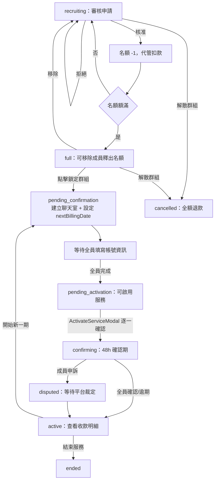

# 我的群組（團主視角）

## 使用者目標
團主管理自己建立的群組：審核申請、鎖定群組開始收款、啟用服務、查看收款明細、回報成員帳號問題，以及在服務期滿後決定續訂或結束群組。

## 流程圖

## 入口
- `/my-groups?view=host`（`MyGroupsPage` → `HostPage`）
- 也可以從通知點擊（`new_application`/`group_full`/`group_activated`/`member_left` 等）直接開啟指定群組，並自動展開對應面板

## 相關檔案

**前端**

| 路徑 | 說明 |
|------|------|
| `src/features/my-groups/host/HostPage.jsx` | 頁面總入口 |
| `src/features/my-groups/host/hooks/useHostActions.js` | 所有團主操作的事件處理（鎖定、啟用、移除成員、審核、續訂、解散等） |
| `src/features/my-groups/host/components/HostGroupView.jsx` | 團主視角群組詳情 Modal，含 `pending_confirmation`/`confirming` 倒數橫幅 |
| `src/shared/ui/primitives/CountdownText.jsx` | 顯示距 deadline 剩餘時間的小元件，逾期顯示 `expiredText` |
| `src/shared/utils/hooks.js` | `useCountdown`，每秒重算剩餘時間，純顯示用不觸發任何副作用 |
| `src/features/my-groups/host/components/HostedGroupCard.jsx` | 群組卡片 |
| `src/features/my-groups/host/components/ActivateServiceModal.jsx` | 啟用服務前逐一確認成員帳號的 Modal |
| `src/features/my-groups/host/components/ReportServiceIssueModal.jsx` | 回報成員帳號問題 |
| `src/features/my-groups/host/components/RenewalModal.jsx` | 續訂管理（見續訂流程文件） |
| `src/features/my-groups/host/components/hostGroupView/buildMembersPanel.jsx` | 成員名單子面板，含移除成員 |
| `src/features/my-groups/host/components/hostGroupView/buildApplicationsPanel.jsx` | 申請管理子面板，只列待審核 |
| `src/features/my-groups/host/components/hostGroupView/ApplicationCard.jsx` | 單筆申請卡片，核准／拒絕 |
| `src/features/my-groups/host/components/hostGroupView/buildReviewHistoryPanel.jsx` | 審核紀錄第三層面板，含篩選 |
| `src/features/my-groups/host/components/hostGroupView/buildBillingPanel.jsx` | 收款管理面板（見 PM幣代管流程文件） |
| `src/features/my-groups/host/utils/hostFilters.js` | `STATUS_FILTER_TABS`、`matchesFilter`、`calcApprovalSeatPatch` |
| `src/features/account/components/tabs/AdminTab.jsx` | 管理員裁定申訴，跨群組，非團主本人操作 |

**後端**

| 路徑 | 說明 |
|------|------|
| `server/src/routes/groups.js` | `POST /:id/lock`、`POST /:id/activate`、`POST /:id/cancel`、`POST /:id/renew`、`GET /:id/transactions`、`PATCH /:id` |
| `server/src/routes/applications.js` | `PATCH /:id`（核准／拒絕） |
| `server/src/routes/members.js` | `POST /`（團主手動加人）、`PATCH /:id`（回報帳號問題）、`DELETE /:id`（移除成員） |
| `server/src/routes/conversations.js` | `POST /group`（鎖定群組時建立聊天室） |
| `server/src/utils/membership.js` | `finalizeApprovedApplication`（核准申請）、`admitMemberIntoGroup`（團主手動加人）、`refundEscrow`（移除成員退款） |

**資料表 / Model**

| Model | 用途 |
|-------|------|
| `Group` | `status`、`currentMembers`/`maxMembers`、`escrowTokens`、`nextBillingDate` |
| `Application` | `status`（`pending`/`approved`/`rejected`） |
| `Member` | `serviceInfoIssueNote` |
| `TokenTransaction` | 收款管理面板依 `relatedGroupId` 查詢 |

## 使用技術
- **自訂 hook 抽出頁面邏輯**：`useHostActions` 把 `HostPage` 拆成純 UI 加一個 hook，訂閱 `useGroupStore`/`useApplicationStore`/`useMemberStore` 三個 store，只要有任何一個變動就重算 `hostData`
- **`pm:open-host-group` window event**：不管是點通知還是帶著 `location.state` 進來，都會走同一個處理函式，統一設定要開哪個群組、要不要自動展開鎖定/啟用/申請管理/收款面板
- **`GroupModalShell` 三層滑動 Panel**：申請管理是第二層，審核紀錄是第三層
- **樂觀更新 + 背景同步**：核准/拒絕申請、移除成員時會先更新本地資料，畫面立刻反應，再到背景呼叫對應 API 跟建立通知
- 鎖定群組、解散群組、移除成員這幾個不可逆的操作，都要透過 `CountdownConfirmDialog` 倒數確認才能執行

## 流程步驟

**1. 查看自己的群組**
- `HostPage` 依分頁跟篩選條件顯示 `allGroups`，統計卡上會顯示本月預估收入、平均每組收入、服務中的成員數

**2. 審核申請（`recruiting`）**
- 側邊欄「申請管理」列出待審核清單
- 點「核准」：先檢查名額是否足夠，通過就打 `PATCH /applications/:id { status: 'approved' }`（後端在同一個 transaction 內完成餘額檢查、代管扣款、建立成員與訂閱）；前端等後端完成後重新拉一次真實資料，並更新本地名額，剛好額滿的話還會額外通知團主自己
- 點「拒絕」：打 `PATCH /applications/:id { status: 'rejected' }`，並通知申請人

**3. 移除已核准成員（`recruiting`/`full` 期間）**
- 成員名單面板提供移除按鈕，倒數確認後才會真的執行
- 後端會退款、釋出名額、把對應申請標為 `removed`
- 前端同步更新本地名額，通知被移除的成員；如果聊天室已經存在，會發一則系統訊息並把該成員移出聊天室

**4. 鎖定群組（`full → pending_confirmation`）**
- 先建立群組聊天室（把團主跟所有成員加進去），再呼叫鎖定 API，後端會同時設定所有成員的下次扣款日，以及 `serviceInfoDeadline`（鎖定時間 + 24h，僅供前端顯示倒數，逾期不會有任何自動處理）
- 聊天室發出「請填寫服務帳號」的提示訊息，並通知團主自己與所有成員聊天室已開啟
- 群組詳情頁（團主與成員兩側）在 `pending_confirmation` 期間都會顯示「等待成員填寫服務帳號資訊，剩餘 HH:MM:SS」的倒數橫幅（`CountdownText`，每秒更新）

**5. 啟用服務（`pending_activation → confirming`）**
- `ActivateServiceModal` 要求逐一勾選確認每位成員的帳號資訊都沒問題，才能按下最終確認
- 確認後群組進入 48 小時確認期，聊天室發系統訊息，並通知團主與所有成員服務已啟用
- 群組詳情頁（團主與成員兩側）在 `confirming` 期間都會顯示「確認期進行中，剩餘 HH:MM:SS」的倒數橫幅，讀 `group.confirmDeadline`

**6. 回報成員帳號問題**
- 填寫問題說明後送出，會把說明寫進該成員的記錄，聊天室發系統訊息請該成員重新提交，並通知該成員

**7. 收款管理（鎖定後）**
- 面板掛載時會查詢該群組的所有交易紀錄（僅團主本人可查），依成員分組展開顯示代管、退款、撥款明細，並在頂部彙總已經撥給團主的總額

**8. 解散群組（僅 `recruiting`/`full`，見 PM幣代管流程文件）**
- 解散後所有代管金額會退回給各成員，並通知所有成員

**9. 續訂／結束服務**
- 見「續訂流程」文件

**10. 平台裁定申訴**
- 申訴不在團主自己的操作範圍內，是由平台管理員在 `AdminTab` 選擇處於 `disputed` 狀態的群組並送出裁定，見申訴流程文件

## 驗證重點
- 所有團主專屬的 route（鎖定/啟用/解散/續訂/查交易紀錄）都會檢查請求人確實是該群組的團主，不是就回 403
- 鎖定只允許在 `full` 狀態操作、啟用只允許 `pending_activation`、解散只允許 `recruiting`/`full`、續訂只允許 `active`——都在 route 層明確檢查狀態，擋下不合法的轉換
- 審核申請用條件式 `updateMany` 而不是先讀後寫，避免同一筆申請被重複核准、重複扣款
- 團主手動加人只允許在 `recruiting` 狀態操作，而且跟申請核准共用同一套入群邏輯，不會繞過名額上限跟代管帳務
- 移除成員只允許在 `recruiting`/`full` 狀態操作，一旦鎖定（進入 `pending_confirmation` 之後）成員名單就不能再變動
- 查交易紀錄只有團主本人可以看，非團主一律 403
- 通知非自己的使用者時，後端會驗證請求人跟目標使用者都跟該群組有關聯（成員／團主／曾送申請），避免任意使用者偽造通知
