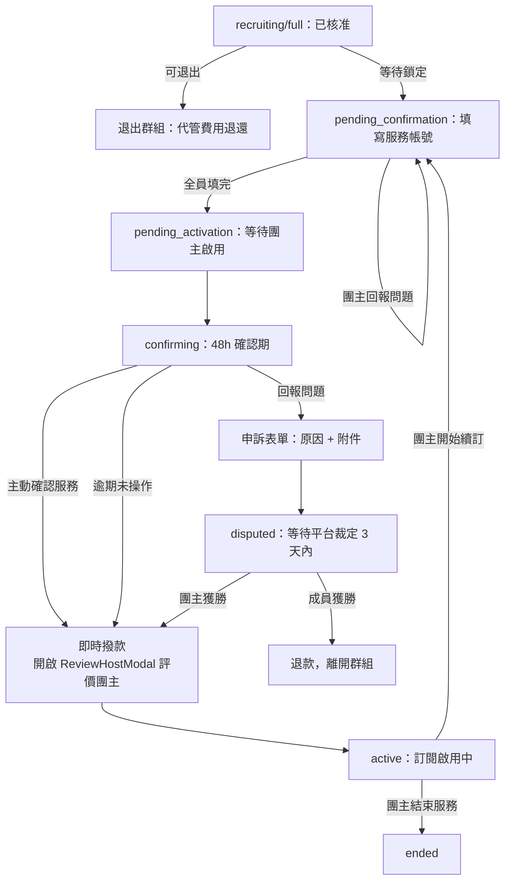

# 我的群組（成員視角）

## 使用者目標
成員在申請通過後追蹤自己的訂閱進度：填寫服務帳號、確認服務是否正常啟用、有問題時申訴，或在群組鎖定前退出。

## 流程圖

## 入口
- `/my-groups?view=member`（`MyGroupsPage` → `MemberPage`）
- 也可以透過通知點擊，或 `TopupModal` 交易紀錄列點擊，間接開啟特定群組的 `MemberGroupView`

## 相關檔案

**前端**

| 路徑 | 說明 |
|------|------|
| `src/features/my-groups/member/MemberPage.jsx` | 頁面總入口，串接分頁與訂閱卡片 grid |
| `src/features/my-groups/member/components/SubscriptionCard.jsx` | 單一訂閱卡片 |
| `src/features/my-groups/member/components/MemberGroupView.jsx` | 成員視角群組詳情 Modal：填寫帳號、確認服務、申訴、退出、查看成員名單 |
| `src/features/my-groups/member/components/ReviewHostModal.jsx` | 確認服務完成後的團主評價彈窗 |
| `src/features/my-groups/member/utils/memberFilters.js` | 分頁篩選邏輯 |
| `src/shared/ui/group/GroupViewModal.jsx` | 依身分決定渲染團主或成員視角的薄殼 |
| `src/shared/ui/group/GroupModalShell.jsx` | 三層滑動 Panel 共用殼；`hideServiceIntro` 為 true 時群組概覽改顯示精簡版（方案名稱＋一句話簡介），完整服務介紹留在服務內容分頁 |
| `src/shared/ui/group/ServiceContentPanel.jsx` | 「服務內容」分頁內容（服務介紹＋方案內容），從群組概覽搬出獨立成頁 |
| `src/shared/utils/groupStatus.js` | `isEffectivelyActive`，成員自行確認服務後個人視角提前視為已啟用 |

**後端**

| 路徑 | 說明 |
|------|------|
| `server/src/routes/members.js` | `GET /members`、`PATCH /members/:id`（填寫帳號資訊）、`DELETE /members/:id`（退出） |
| `server/src/routes/groups.js` | `POST /groups/:id/confirm`（確認服務）、`POST /groups/:id/dispute`（申訴） |
| `server/src/routes/subscriptions.js` | `GET /subscriptions`，附帶即將續訂提醒的副作用 |
| `server/src/utils/pricing.js` | `computeSeatCost` |

**資料表 / Model**

| Model | 用途 |
|-------|------|
| `Member` | `serviceInfo`（JSON，帳號資訊）、`serviceInfoIssueNote`、`disputeEvidenceUrl`、`confirmedAt` |
| `Subscription` | `status`（`pending`/`active`/`ended`）、`nextBillingDate` |
| `Group` | `status`、`serviceInfoDeadline`、`confirmDeadline`、`disputeDeadline`、`escrowTokens` |
| `Review` | 確認服務完成後可對團主留下的評價 |

## 使用技術
- **樂觀更新，失敗會回滾**：填寫服務帳號時先寫本地 state，如果 `PATCH` 失敗就把資料復原成送出前的樣子（不是清空），避免使用者辛苦填好的內容無故消失
- **三層滑動 Panel**：從總覽切到填寫帳號／申訴／成員名單／服務內容這類子面板，都是同一套滑動元件
- **`headerBanner`（倒數/狀態提醒橫幅）不綁定分頁**：渲染在 `activeDetail` 判斷之外，切到服務內容／成員名單等分頁時倒數橫幅仍會顯示，不會只留在群組概覽
- **群組概覽跟服務內容分頁共用同一份服務介紹內容**：`ServiceIntro`（`GroupOverviewContent.jsx` 匯出）被 `ServiceContentPanel.jsx` 直接複用，避免同一段 UI 兩處維護；`GroupModalShell` 收到 `hideServiceIntro` 時，概覽只留方案名稱＋服務簡介一句話（避免團主資訊填得少時版面空白），完整內容仍要點進服務內容分頁才看得到；探索頁 `GroupDetailModal`（未走側邊欄分頁）不受影響，維持原本在概覽顯示完整服務介紹
- **不可逆操作要倒數確認**：確認服務、退出群組都要透過 `CountdownConfirmDialog` 倒數幾秒才能真的送出，避免手滑誤觸
- 申訴附件會先上傳到圖床拿到 URL，再隨申訴表單一起送出
- 從群組概覽或成員名單可以直接觸發開啟群組聊天室或私訊團主

## 流程步驟

**1. 查看訂閱列表**
- `MemberPage` 依分頁（全部／處理中／啟用中／已結束）過濾出屬於自己的訂閱資料

**2. 填寫服務帳號（`pending_confirmation`）**
- 還沒填寫帳號資訊時，`MemberGroupView` 會顯示「填寫帳號」按鈕，點開表單輸入 email 後送出
- 頁面頂部會顯示「請填寫服務帳號以完成加入流程，剩餘 HH:MM:SS」倒數橫幅（讀 `group.serviceInfoDeadline`，鎖定時間 + 24h，每秒更新；逾期只顯示「已逾期」，不會有任何自動處理）
- 後端會檢查群組內是否全員都已經填寫，如果是，就自動把群組狀態推進到「等待團主啟用」

**3. 帳號問題修正**
- 如果團主回報帳號有問題，`MemberGroupView` 會顯示警示訊息，並允許重新填寫

**4. 確認服務（`confirming`）**
- 服務啟用後的確認期內，會顯示「確認服務」跟「回報問題」兩個按鈕，頂部橫幅顯示「服務已啟用，請確認是否正常，剩餘 HH:MM:SS」倒數（讀 `group.confirmDeadline`）
- 點「確認服務」需要倒數確認；送出後如果全員都已確認，後端會立即撥款給團主，前端提示「款項已撥付」；如果還有人沒確認，就只標記自己已確認，並提示還在等其他人

**5. 確認後邀請評價**
- 確認服務送出後一定會跳出團主評價視窗；如果剛好撥款完成，評價視窗關閉時會一併關閉整個群組 Modal

**6. 申訴（`confirming` 期間）**
- 點「回報問題」進入申訴表單，可以複選申訴原因、填說明、上傳附件
- 送出後群組進入等待平台裁定的狀態，關閉 Modal 並提示「客服將在 3 天內裁定」

**7. 退出群組（`recruiting`/`full`）**
- 符合條件時可以退出，需要倒數確認
- 退出時會發送系統訊息並退出聊天室、移除自己的成員與訂閱資料、把對應申請標為已離開、釋出名額，並通知團主

**8. 成員名單／聯絡團主**
- 可以查看團主與其他成員名單，點擊個別成員的訊息圖示能直接開啟私訊

## 驗證重點
- 填寫帳號資訊只有本人或該群組團主可以操作，其他人一律 403
- 退出群組只允許在 `recruiting`/`full` 狀態操作，一旦鎖定（進入 `pending_confirmation` 之後）成員名單就不能再變動，會回 400
- 確認服務／申訴都會檢查請求人確實是該群組成員，非成員回 403；群組狀態不是確認期一律回 400
- 確認服務時，後端會在同一個交易內同時更新群組狀態、撥款、清空代管金額、寫入交易紀錄、把全員訂閱設成啟用中，避免只寫一半造成資料不一致
- 填寫帳號失敗時前端會把資料復原成送出前的樣子，不是清空，避免使用者原本填好的資料無故消失
- 只要自己已經確認服務，即使其他成員還沒確認，個人視角也會提前顯示為已啟用
