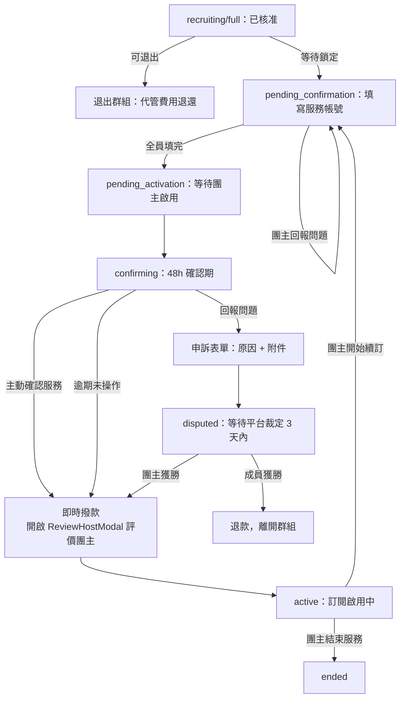

# 我的群組（成員視角）

## 使用者目標
成員在申請通過後追蹤自己的訂閱進度：填寫服務帳號、確認服務是否正常啟用、有問題時申訴，或在群組鎖定前退出。

## 流程圖

## 入口
- `/my-groups?view=member`（`MyGroupsPage` → `MemberPage`）
- 也可以透過通知點擊，或 `TopupModal` 交易紀錄列點擊，間接開啟特定群組的 `MemberGroupView`

## 相關檔案

**前端**

| 路徑 | 說明 |
|------|------|
| `src/features/my-groups/member/MemberPage.jsx` | 頁面總入口，串接分頁與訂閱卡片 grid |
| `src/features/my-groups/member/components/SubscriptionCard.jsx` | 單一訂閱卡片 |
| `src/features/my-groups/member/components/MemberGroupView.jsx` | 成員視角群組詳情 Modal：填寫帳號、確認服務、申訴、退出、查看群組名單、付款管理 |
| `src/features/my-groups/member/components/memberGroupView/buildPaymentsPanel.jsx` | 付款管理面板，顯示自己這期最新一筆代管紀錄（見 PM幣代管流程文件） |
| `src/shared/utils/serviceInfoFields.js` | `SHARING_METHOD_CONFIG`（各共享機制的欄位設定與提醒文案）、`hasFilledServiceInfo`、`getServiceInfoSummary` |
| `src/features/my-groups/member/components/ReviewHostModal.jsx` | 確認服務完成後的團主評價彈窗 |
| `src/features/my-groups/member/utils/memberFilters.js` | 分頁篩選邏輯：`FILTER_TABS`（審核中/招募中/處理中/服務中四個大分類；已移除「全部」，待鎖定/填寫資訊中/待啟用/確認期中/申訴中五種細分狀態併入「處理中」，`PROCESSING_STATUSES` 定義在 `src/shared/utils/groupStatus.js`，跟 host 端共用） |
| `src/shared/ui/group/GroupViewModal.jsx` | 依身分決定渲染團主或成員視角的薄殼 |
| `src/shared/ui/group/GroupModalShell.jsx` | 三層滑動 Panel 共用殼；桌機版側邊欄在左側（`md:order-first`），手機版仍堆疊在下方；Header 顯示「服務名稱 \| 方案名稱」 |
| `src/shared/ui/group/GroupOverviewContent.jsx` | 群組概覽內容，含服務說明／方案說明（原本獨立的「服務內容」分頁已整併回這裡） |
| `src/shared/utils/groupStatus.js` | `isEffectivelyActive`，成員自行確認服務後個人視角提前視為已啟用 |

**後端**

| 路徑 | 說明 |
|------|------|
| `server/src/routes/members.js` | `GET /members`、`PATCH /members/:id`（填寫帳號資訊）、`DELETE /members/:id`（退出） |
| `server/src/routes/groups.js` | `POST /groups/:id/confirm`（確認服務）、`POST /groups/:id/dispute`（申訴） |
| `server/src/routes/subscriptions.js` | `GET /subscriptions`，附帶即將續訂提醒的副作用 |
| `server/src/utils/pricing.js` | `computeSeatCost` |

**資料表 / Model**

| Model | 用途 |
|-------|------|
| `Member` | `serviceInfo`（JSON，帳號資訊）、`serviceInfoIssueNote`、`disputeEvidenceUrl`、`confirmedAt` |
| `Subscription` | `status`（`pending`/`active`/`ended`）、`nextBillingDate` |
| `Group` | `status`、`serviceInfoDeadline`、`confirmDeadline`、`disputeDeadline`、`escrowTokens` |
| `Review` | 確認服務完成後可對團主留下的評價 |

## 使用技術
- **樂觀更新，失敗會回滾**：填寫服務帳號時先寫本地 state，如果 `PATCH` 失敗就把資料復原成送出前的樣子（不是清空），避免使用者辛苦填好的內容無故消失
- **三層滑動 Panel**：從總覽切到填寫帳號／申訴／群組名單這類子面板，都是同一套滑動元件
- **`headerBanner`（倒數/狀態提醒橫幅）不綁定分頁**：渲染在 `activeDetail` 判斷之外，切到群組名單等分頁時倒數橫幅仍會顯示，不會只留在群組概覽
- **「付款管理」面板只顯示最新一筆代管紀錄**：邏輯跟團主端「收款管理」對齊，只看自己這期最新一筆 `escrow` 交易；未撥款時文案「本期費用已交由平台代管，尚未撥款至團主帳戶」，`group.status` 進入 `active`/`paused`/`ended` 後視為已撥款，文案改「本期費用已撥款給團主」；退款等歷史紀錄不在這裡處理
- **「服務內容」分頁已整併回群組概覽**：獨立分頁已移除，服務說明／方案說明直接顯示在群組概覽畫面，跟探索頁 `GroupDetailModal` 的呈現方式統一；服務說明拆成「服務說明」「方案說明」兩個並列的大標題區塊，字級一樣大
- **「填寫帳號」改成群組概覽底部的動態按鈕**：不再是側邊欄項目，改成跟「確認服務」「回報問題」一樣，需要填寫帳號（`needsFillInfo`）或帳號被回報有問題（`hasServiceInfoIssue`）時才會出現在 `GroupModalShell` 的 `centeredCta`
- **不可逆操作要倒數確認**：確認服務、退出群組都要透過 `CountdownConfirmDialog` 倒數幾秒才能真的送出，避免手滑誤觸
- **側邊欄 pinned 項目**：符合退出條件（`recruiting`/`full`）時側邊欄底部固定顯示「退出群組」，跟「群組訊息」共用側邊欄右下角同一個位置
- **`SubscriptionCard` 已啟用（`active`）狀態統計格**：由左到右為團主／成員人數／下次扣款，不顯示加入日期
- **`ApplicationCard`（已申請分頁的卡片）跟其他訂閱卡片視覺一致**：套用同樣的 `card-lift` hover 放大效果，狀態標籤改用共用 `Badge` 元件（不再手刻不同高度的 badge）
- 申訴附件會先上傳到圖床拿到 URL，再隨申訴表單一起送出
- 從群組概覽或群組名單可以直接觸發開啟群組聊天室或私訊團主
- **`SubscriptionCard` 頂部 `Badge` 額滿時同步比照團主端**：`displayStatus === 'full'` 時用 `label` 覆蓋成「等待鎖定」，跟 `HostedGroupCard` 的處理方式一致（成員卡片沒有對應的「群組狀態」StatCell，只有團主/成員人數/下次扣款或加入日期三格，所以不需要額外調整 StatCell）

## 流程步驟

**1. 查看訂閱列表**
- `MemberPage` 依分頁（審核中／招募中／處理中／服務中）過濾出屬於自己的訂閱資料；待鎖定／填寫資訊中／待啟用／確認期中／申訴中都併在「處理中」，細分階段交給卡片本身的狀態 badge 顯示（見 `memberFilters.js` 的 `FILTER_TABS`）；已結束／已取消的訂閱不在這幾個分頁裡，要點最上方的「群組紀錄」按鈕查看

**2. 填寫服務帳號（`pending_confirmation`）**
- 還沒填寫帳號資訊時，`MemberGroupView` 會在群組概覽底部顯示「填寫帳號」動態按鈕（跟「確認服務」「回報問題」同一個位置，不是側邊欄項目），點開表單依該服務的 `sharingMethod` 動態顯示對應欄位（一般是 email；KKBOX 多一個地址欄位；friDay影音是邀請碼；無官方邀請機制的服務則是一個確認勾選框），送出後寫入 `Member.serviceInfo`（詳見 [各服務填寫帳號資訊需求調查](../product/service-info-requirements.md)）
- 頁面頂部會顯示「請填寫服務帳號以完成加入流程，剩餘 HH:MM:SS」倒數橫幅（讀 `group.serviceInfoDeadline`，鎖定時間 + 24h，每秒更新；逾期只顯示「已逾期」，不會有任何自動處理）
- 後端會檢查群組內是否全員都已經填寫，如果是，就自動把群組狀態推進到「等待團主啟用」

**3. 帳號問題修正**
- 如果團主回報帳號有問題，`MemberGroupView` 會顯示警示訊息，並允許重新填寫

**4. 確認服務（`confirming`）**
- 服務啟用後的確認期內，會顯示「確認服務」跟「回報問題」兩個按鈕，頂部橫幅顯示「服務已啟用，請確認是否正常，剩餘 HH:MM:SS」倒數（讀 `group.confirmDeadline`）
- 點「確認服務」需要倒數確認；送出後如果全員都已確認，後端會立即撥款給團主，前端提示「款項已撥付」；如果還有人沒確認，就只標記自己已確認，並提示還在等其他人

**5. 確認後邀請評價**
- 確認服務送出後一定會跳出團主評價視窗；如果剛好撥款完成，評價視窗關閉時會一併關閉整個群組 Modal

**6. 申訴（`confirming` 期間）**
- 點「回報問題」進入申訴表單，可以複選申訴原因、填說明、上傳附件
- 送出後群組進入等待平台裁定的狀態，關閉 Modal 並提示「客服將在 3 天內裁定」

**7. 退出群組（`recruiting`/`full`）**
- 入口固定在側邊欄右下角（跟「群組訊息」共用同一個位置）
- 符合條件時可以退出，需要倒數確認
- 退出時會發送系統訊息並退出聊天室、移除自己的成員與訂閱資料、把對應申請標為已離開、釋出名額，並通知團主
- 退出邏輯統一寫在 `src/features/group/utils/leaveGroupFlow.js` 的 `finalizeLeaveGroup`，`GroupDetailModal` 跟 `MyGroupsPage`／`MemberPage` 兩個入口都呼叫同一份，避免各自維護一份重複邏輯、行為不一致（曾經修過其中一份漏呼叫 `leaveConversation` 導致退出後仍留在聊天室的 bug，見 [Bug 紀錄](../testing/bug-log.md) BUG-011）

**8. 群組名單／聯絡團主**
- 可以查看團主與其他成員名單（分頁命名為「群組名單」，因為裡面包含團主，不只是成員），團主標示為一個只有文字「團主」的圓角標籤（不再有盾牌圖示）；點擊個別成員的訊息圖示能直接開啟私訊

**9. 付款管理**
- 側邊欄「付款管理」分頁顯示自己這期最新一筆代管紀錄與目前狀態（尚未撥款／已撥款給團主），資料來源跟團主端收款管理一樣是 `GET /tokens`，前端依 `relatedGroup.id` 篩選出屬於這個群組的交易

## 驗證重點
- 填寫帳號資訊只有本人或該群組團主可以操作，其他人一律 403
- 退出群組只允許在 `recruiting`/`full` 狀態操作，一旦鎖定（進入 `pending_confirmation` 之後）成員名單就不能再變動，會回 400
- 確認服務／申訴都會檢查請求人確實是該群組成員，非成員回 403；群組狀態不是確認期一律回 400
- 確認服務時，後端會在同一個交易內同時更新群組狀態、撥款、清空代管金額、寫入交易紀錄、把全員訂閱設成啟用中，避免只寫一半造成資料不一致
- 填寫帳號失敗時前端會把資料復原成送出前的樣子，不是清空，避免使用者原本填好的資料無故消失
- 只要自己已經確認服務，即使其他成員還沒確認，個人視角也會提前顯示為已啟用
