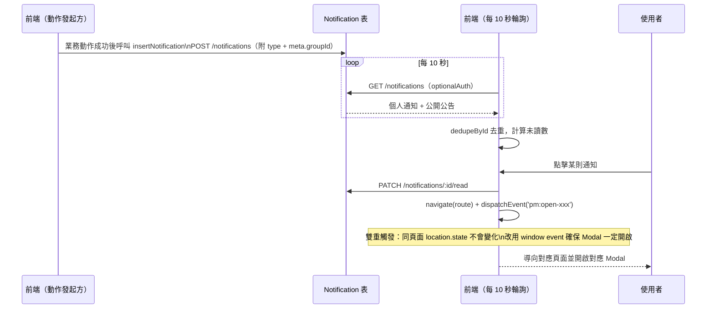

# 通知流程

## 使用者目標
使用者希望即時知道跟自己有關的動態（申請結果、群組狀態變化、成員異動等），並能一鍵點擊直接跳到對應畫面，不用自己在各頁面裡找。

## 流程圖

## 入口
- `AppNav` 的通知按鈕
- `FloatingMessages`：全域監聽開啟通知面板的事件並渲染面板

## 相關檔案

**前端**

| 路徑 | 說明 |
|------|------|
| `src/shared/layout/FloatingMessages.jsx` | 通知面板 UI + 點擊後的導向邏輯 |
| `src/shared/layout/AppNav.jsx` | 觸發開啟通知面板 |
| `src/shared/stores/useNotificationStore.js` | 通知 store |
| `src/shared/api/notificationsApi.js` | 通知 API 封裝（`insertNotification` 是各業務流程寫入通知的共用函式） |
| `src/features/my-groups/host/hooks/useHostActions.js`、`src/features/group/utils/leaveGroupFlow.js`、`src/shared/stores/useApplicationStore.js` | 各業務動作成功後呼叫 `insertNotification` 通知對方的實際發起處 |

**後端**

| 路徑 | 說明 |
|------|------|
| `server/src/routes/notifications.js` | `GET /notifications`（個人通知＋公開公告）、`POST /notifications`（建立通知，會驗證發起人與目標使用者是否都跟該群組有關聯）、已讀相關 route |
| `server/src/routes/subscriptions.js` | `notifyUpcomingRenewals`，距下次扣款日 7 天內由後端主動建立提醒通知，是少數不經前端 `insertNotification` 的例外 |

**資料表 / Model**

| Model | 用途 |
|-------|------|
| `Notification` | 個人通知 + 系統公告（`isPublic: true` 為公告）；`meta` 存放 `groupId` 等關聯資訊供前端導向使用 |

## 使用技術
- **用 Polling**：`useNotificationStore` 每 10 秒輪詢一次，跟其他輪詢共用同一套機制
- **事件驅動導向**：點擊通知不是單純換頁，而是「換頁 + 廣播一個 window event」雙重觸發——如果只換頁，同一頁面內重複點同一個群組的通知不會有變化，得靠 window event 才能保證 Modal 每次都真的打開
- **去重保險**：依 `id` 過濾掉重複項目，避免初次載入跟輪詢交錯時，同一筆通知在列表裡出現兩次

## 流程步驟

**1. 通知建立**
- `POST /notifications` 是通用端點，實際上大多數通知（申請核准、成員移除、群組額滿等）是前端動作成功之後，由發起動作的那一端呼叫 `insertNotification(...)` 寫入，不是後端業務 route 自動建立；例外是 `server/src/routes/subscriptions.js` 的 `notifyUpcomingRenewals`（距下次扣款日 7 天內的提醒）這種沒有對應前端互動時機的通知，才由後端在讀取訂閱資料時順便建立
- 通知自己（例如申請已送出）會同時寫本地 store（即時顯示）跟呼叫 API；通知別人（例如通知團主）只呼叫 API 寫 DB，不會即時出現在對方畫面，要等對方輪詢或重新整理才看得到

**2. 前端取得通知**
- 未登入的使用者也能看到公開的系統公告，登入後則會額外看到自己的個人通知
- 前端每 10 秒輪詢一次通知列表，依已讀狀態算出未讀數顯示在通知按鈕上

**3. 點擊通知**
- 先把這則通知標記為已讀
- 再依通知類型決定要換到哪個頁面、要開啟哪個 Modal——每種通知類型的導向邏輯不太一樣，例如收到新申請的通知，會先確保申請資料是最新的才開啟 Modal；申請相關的通知則會先確認使用者目前的身分，決定要開成員視角還是探索頁視角

**4. 全部標為已讀**
- 提供一鍵把所有通知都標記為已讀的操作

## 驗證重點
- 建立通知時不會信任前端傳來的「是否為公開公告」欄位，一律當作個人通知處理，避免有人偽造公開公告
- 通知其他使用者時，後端會驗證請求人跟目標使用者是不是都跟該群組有關聯（成員／團主／曾送申請），避免任意使用者對別人偽造通知
- 點擊「成員被移除／退出」這類通知時，會先廣播一個刷新事件讓相關 store 同步更新，再切換畫面，避免顯示過期的成員名單

## 通知類型總覽

`NotificationType` enum（`schema.prisma`）共 18 種，實際觸發點與收件人如下：

| UI 標題／訊息內容（`{}` 為代入變數） | 類型 | 觸發時機 | 收件人（即時／僅寫DB） | 點擊導向 |
|---|---|---|---|---|
| 「申請已送出」／「你的加入申請已送達「{groupName}」團主，等待審核。」 | `application_sent` | 送出加入申請當下 | 申請人自己（即時） | 我的群組（成員）「已申請」分頁 |
| 「收到新的加入申請」／「{applicantName} 申請加入「{groupName}」群組。」 | `new_application` | 同上 | 團主（僅寫DB） | 我的群組（團主）該群組，自動開申請列表 |
| 「申請已通過」／「恭喜！你加入「{groupName}」群組的申請已通過，請前往我的訂閱查看。」 | `application_approved` | 團主核准申請 | 申請人（僅寫DB） | 已有訂閱→成員視角群組頁；否則→探索頁開該群組 |
| 「申請未通過」／「很遺憾，你加入「{groupName}」群組的申請未通過，你可以繼續探索其他群組。」 | `application_rejected` | 團主拒絕申請 | 申請人（僅寫DB） | 探索頁 |
| 「群組已成功建立」／「「{serviceName}」群組已上架，開始招募成員中！」 | `group_created` | 建立群組成功當下 | 團主自己（即時） | 我的群組（團主）該群組 |
| 「群組名額已滿」／「「{groupName}」群組名額已滿，可以點擊鎖定群組了。」 | `group_full` | 核准申請後名額剛好滿 | 團主自己（即時） | 我的群組（團主）該群組 |
| 團主：「群組聊天室已開啟」／「「{serviceName}」群組已鎖定，聊天室已建立，點擊查看。」；成員：同標題／「「{serviceName}」群組聊天室已建立，請進入填寫服務帳號並完成付款。」 | `group_chat_opened` | 團主鎖定群組（建立聊天室） | 團主自己（即時）＋全體成員（僅寫DB） | 直接開啟該群組聊天室 |
| 團主：「服務已啟用，確認期開始」／「「{serviceName}」群組服務已啟用，成員有 48 小時確認期。」；成員：「服務已啟用，請確認」／「「{serviceName}」服務已啟用！請在 48 小時內確認服務是否正常，否則將自動完成。」 | `group_activated` | 團主啟用服務 | 團主自己（即時）＋全體成員（僅寫DB） | 團主→自己群組頁；成員→成員視角群組頁 |
| 「新一期已開始」／「「{serviceName}」群組開始新一期，請前往填寫最新服務帳號資訊。」 | `group_renewal` | 團主開始新一期續訂 | 全體成員（僅寫DB） | 我的群組（成員）該群組 |
| 「群組已結束」／「「{groupLabel}」群組已由團主結束，合購服務將不再續訂。」 | `group_ended` | 團主結束群組 | 全體成員（僅寫DB） | 探索頁 |
| 「群組已解散」／「「{serviceName}」群組已被團主解散，代管費用已退還至你的PM幣餘額。」 | `group_cancelled` | 團主解散群組（鎖定前） | 全體成員（僅寫DB） | 我的群組（成員）列表 |
| 「已被移出群組」／「團主已將你移出「{groupLabel}」群組。」 | `member_removed` | 團主移除成員 | 被移除的成員（僅寫DB） | 探索頁 |
| 「成員退出群組」／「{userName} 已退出「{groupLabel}」群組。」 | `member_left` | 成員自行退出群組（`finalizeLeaveGroup`） | 團主（僅寫DB） | 團主→該群組；成員自己不會收到這則 |
| 「服務帳號需要修正」／「團主在「{groupName}」發現服務帳號問題，請前往修正。」 | `service_info_issue` | 團主回報帳號問題 | 該成員（僅寫DB） | 我的群組（成員）該群組 |
| 「即將續訂」／「「{serviceName}」將於 今天／{days} 天後扣款，請確認PM幣餘額充足。」 | `upcoming_renewal` | 呼叫 `GET /subscriptions` 時後端檢查：`active` 訂閱且距下次扣款 ≤7 天，依 `nextBillingDate` 去重、同一期只發一次 | 該訂閱使用者 | 我的群組（成員）「服務中」分頁 |
| 「收到成員申訴」／「{memberName} 針對「{groupLabel}」服務提出申訴，平台客服將於 3 天內裁定。」 | `dispute_raised` | 成員送出申訴（`POST /groups/:id/dispute`） | 團主（僅寫DB） | 我的群組（團主）該群組 |
| 「代管款項已撥款」／「「{groupLabel}」群組確認期結束，代管款項已撥入你的PM幣餘額。」 | `escrow_released` | 全員確認服務（或確認期逾期）觸發撥款（`POST /groups/:id/confirm`） | 團主（僅寫DB） | 我的群組（團主）該群組 |
| 無 | `token_topup` | 無——定義了但沒有任何程式碼建立這個類型 | — | — |
| 無固定文案 | `system` | 保留給公開系統公告（`isPublic: true`），但 `POST /notifications` 明確禁止一般使用者建立 `isPublic:true`，目前**沒有任何後端流程會真的建立**這種通知——公告目前只走「系統聊天室」訊息廣播（見 [訊息流程](messages-flow.md)），不是走通知中心 | — | 探索頁 |

### 已知落差
- `token_topup` 是定義了但完全沒接的死 enum 值
- 公開系統公告的 Notification（`isPublic: true`）從未被建立過，實務上公告都是走 `system-messages` 聊天室廣播

> 原本「確認服務／送出申訴不會通知團主」的落差已修復：`POST /groups/:id/confirm`／`POST /groups/:id/dispute` 現在會分別建立 `escrow_released`／`dispute_raised` 通知給團主，並在群組聊天室留一則系統訊息（見 [訊息流程](messages-flow.md)）。
