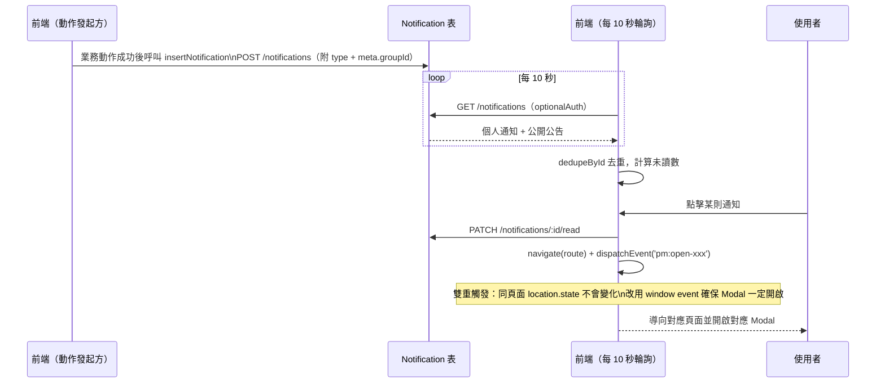

# 通知流程

## 使用者目標
使用者希望即時知道跟自己有關的動態（申請結果、群組狀態變化、成員異動等），並能一鍵點擊直接跳到對應畫面，不用自己在各頁面裡找。

## 流程圖

## 入口
- `AppNav` 的通知按鈕
- `FloatingMessages`：全域監聽開啟通知面板的事件並渲染面板

## 相關檔案

**前端**

| 路徑 | 說明 |
|------|------|
| `src/shared/layout/FloatingMessages.jsx` | 通知面板 UI + 點擊後的導向邏輯 |
| `src/shared/layout/AppNav.jsx` | 觸發開啟通知面板 |
| `src/shared/stores/useNotificationStore.js` | 通知 store |
| `src/shared/api/notificationsApi.js` | 通知 API 封裝（`insertNotification` 是各業務流程寫入通知的共用函式） |
| `src/features/my-groups/host/hooks/useHostActions.js`、`src/features/group/utils/leaveGroupFlow.js`、`src/shared/stores/useApplicationStore.js` | 各業務動作成功後呼叫 `insertNotification` 通知對方的實際發起處 |

**後端**

| 路徑 | 說明 |
|------|------|
| `server/src/routes/notifications.js` | `GET /notifications`（個人通知＋公開公告）、`POST /notifications`（建立通知，會驗證發起人與目標使用者是否都跟該群組有關聯）、已讀相關 route |
| `server/src/routes/subscriptions.js` | `notifyUpcomingRenewals`，距下次扣款日 7 天內由後端主動建立提醒通知，是少數不經前端 `insertNotification` 的例外 |

**資料表 / Model**

| Model | 用途 |
|-------|------|
| `Notification` | 個人通知 + 系統公告（`isPublic: true` 為公告）；`meta` 存放 `groupId` 等關聯資訊供前端導向使用 |

## 使用技術
- **用 Polling**：`useNotificationStore` 每 10 秒輪詢一次，跟其他輪詢共用同一套機制
- **事件驅動導向**：點擊通知不是單純換頁，而是「換頁 + 廣播一個 window event」雙重觸發——如果只換頁，同一頁面內重複點同一個群組的通知不會有變化，得靠 window event 才能保證 Modal 每次都真的打開
- **去重保險**：依 `id` 過濾掉重複項目，避免初次載入跟輪詢交錯時，同一筆通知在列表裡出現兩次

## 流程步驟

**1. 通知建立**
- `POST /notifications` 是通用端點，實際上大多數通知（申請核准、成員移除、群組額滿等）是前端動作成功之後，由發起動作的那一端呼叫 `insertNotification(...)` 寫入，不是後端業務 route 自動建立；例外是 `server/src/routes/subscriptions.js` 的 `notifyUpcomingRenewals`（距下次扣款日 7 天內的提醒）這種沒有對應前端互動時機的通知，才由後端在讀取訂閱資料時順便建立
- 通知自己（例如申請已送出）會同時寫本地 store（即時顯示）跟呼叫 API；通知別人（例如通知團主）只呼叫 API 寫 DB，不會即時出現在對方畫面，要等對方輪詢或重新整理才看得到

**2. 前端取得通知**
- 未登入的使用者也能看到公開的系統公告，登入後則會額外看到自己的個人通知
- 前端每 10 秒輪詢一次通知列表，依已讀狀態算出未讀數顯示在通知按鈕上

**3. 點擊通知**
- 先把這則通知標記為已讀
- 再依通知類型決定要換到哪個頁面、要開啟哪個 Modal——每種通知類型的導向邏輯不太一樣，例如收到新申請的通知，會先確保申請資料是最新的才開啟 Modal；申請相關的通知則會先確認使用者目前的身分，決定要開成員視角還是探索頁視角

**4. 全部標為已讀**
- 提供一鍵把所有通知都標記為已讀的操作

## 驗證重點
- 建立通知時不會信任前端傳來的「是否為公開公告」欄位，一律當作個人通知處理，避免有人偽造公開公告
- 通知其他使用者時，後端會驗證請求人跟目標使用者是不是都跟該群組有關聯（成員／團主／曾送申請），避免任意使用者對別人偽造通知
- 點擊「成員被移除／退出」這類通知時，會先廣播一個刷新事件讓相關 store 同步更新，再切換畫面，避免顯示過期的成員名單
