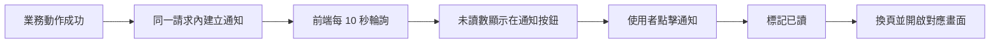

# 通知流程

## 使用者目標
使用者希望即時知道跟自己有關的動態（申請結果、群組狀態變化、成員異動等），並能一鍵點擊直接跳到對應畫面，不用自己在各頁面裡找。

## 流程圖

## 流程
1. 業務動作成功後（例如申請被接受、群組額滿、成員退出、下次扣款日被調整），系統於同一次請求內就建立一筆通知給相關的人，不需前端另外補送請求
2. 前端每 10 秒定期輪詢通知列表，未讀數顯示在通知按鈕上；未登入使用者也能看到公開的系統公告
3. 部分通知類型（例如成員被移除/退出、餘額被異動、有新申請）在輪詢偵測到的當下即會一併刷新對應畫面資料，使用者不需點開通知或重新整理頁面
4. 點擊某則通知後，先標記為已讀，再依通知類型導向對應頁面並開啟對應畫面
5. 提供一鍵全部標為已讀的操作

## 產品決策
- **通知建立完全由後端負責**：業務動作在伺服器端完成資料庫寫入後，於同一個請求內一併建立通知，前端只負責讀取、標記已讀與畫面導向；唯一的例外是續訂提前提醒，這種沒有對應使用者操作時機的通知，改由後端在讀取訂閱資料時一併檢查並建立
- **點擊通知會用「換頁 + 廣播事件」雙重觸發**：確保即使使用者已在同一頁面，點擊同一則通知也一定會開啟對應畫面，而非沒有反應
- **通知連到的群組如果狀態已經變化（例如被別人搶先申請額滿），會先重新確認再開啟畫面**：避免開啟一個已經失效、點擊後無法完成對應操作的過期畫面
- **不是每種通知都需要即時刷新畫面**：像是團主與成員自行協調解決問題（不動任何金流、不影響成員名單）這種通知，就刻意不觸發任何即時刷新，使用者需點擊通知或重新整理頁面才會看到最新狀態，避免為了次要事件觸發不必要的資料重新查詢

## 驗證重點
- 建立通知的邏輯完全在伺服器內部程式碼裡，不是接受外部輸入的公開端點，沒有「偽造公開公告」或「偽造他人通知」的疑慮
- 通知只會發給業務動作原本就有查出來的關聯使用者（該群組的團主／成員），不是任意指定收件人
