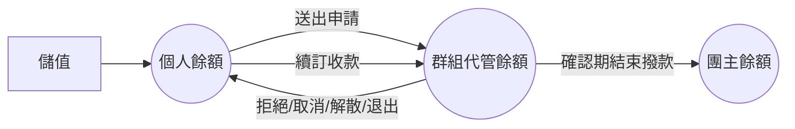

# PM 幣代管與撥款流程

## 使用者目標
使用者以「PM 幣」作為平台內唯一的計價與支付單位：儲值取得 PM 幣、送出申請的當下就把費用交給平台代管、服務確認無誤後才撥款給團主；如果申請被拒絕、中途退出、群組解散，或申訴成立，費用就會退款回來。

## 資金流動（簡圖）

## 流程
1. **儲值**：使用者輸入金額（目前是模擬儲值，尚未串接真正的金流）
2. **代管扣款**：送出加入申請的當下，費用就從個人餘額轉入該群組的代管餘額，不是等團主接受才扣款
3. **拒絕／取消／退款**：申請被拒絕、申請人自行取消、成員退出或被移除、團主解散群組，都會把代管的費用退還給對應成員
4. **撥款**：確認期內全員主動確認完成、或確認期屆滿沒有異議，代管金額就會撥給團主
5. **申訴期間資金凍結**：成員提出正式申訴後，代管金額暫時不會有任何異動，等平台裁定或雙方自行解決後才會繼續往下走
6. **續訂收款**：團主開始新一期時，會向全體成員重新收費並轉入代管，任何一人餘額不足就整批失敗

## 產品決策
- **代管扣款發生在申請當下**：讓使用者一送出申請就知道款項已經被代管扣留，不會等到接受當下才發現餘額不足
- **退款一律用當初實際扣的金額，不是即時重算**：避免團主事後調整價格時，退款金額對不上當初真正扣的錢
- **每一次金流異動都是不可分割的整體**：檢查餘額、扣款/退款、記錄交易，要嘛全部成功、要嘛全部不生效，不會留下半套的中間狀態

## 驗證重點
- 高併發下不會發生重複扣款或重複退款
- 查詢代管交易紀錄只有團主本人可以看
