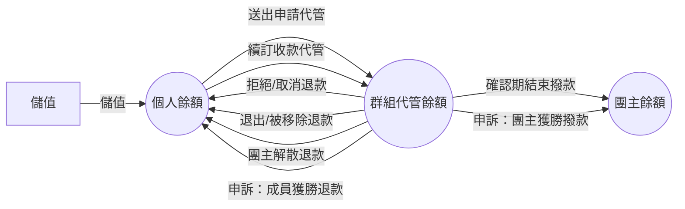
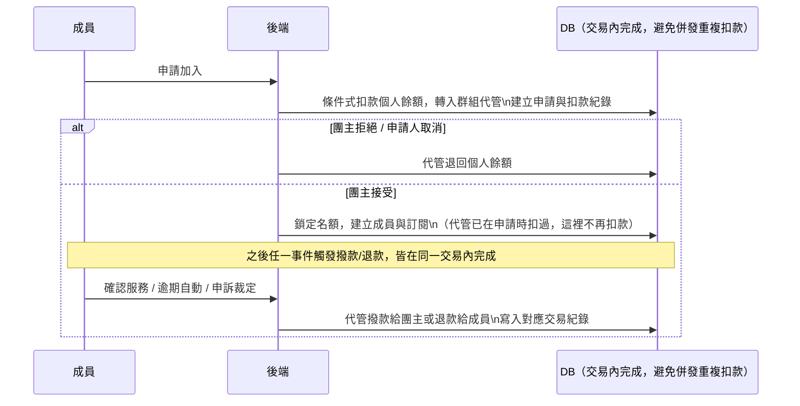

# PM幣代管與撥款流程

## 使用者目標
使用者以「PM幣」作為平台內唯一的計價與支付單位：儲值取得 PM幣、送出申請的當下就把席位費用交給平台代管、服務確認無誤後撥款給團主；如果申請被拒絕、中途退出、群組解散或申訴成立，就退款回來。

## 流程圖

## 入口
- **儲值**：桌機側欄／手機導覽列的「加值」按鈕、儲值視窗內的儲值面板；任何顯示「PM幣不足」提示時的「前往儲值」按鈕
- **代管扣款**：在群組詳情視窗送出申請加入群組（扣款發生在這裡，不是接受時）
- **撥款／退款**：團主在群組管理審核申請、解散群組、移除成員、開始續訂；成員在訂閱頁確認服務、取消申請或申訴；管理員裁定申訴
- **交易紀錄查詢**：儲值視窗的交易紀錄子面板（個人）；團主端收款管理面板（該群組全體成員，只顯示每人最新一筆代管紀錄）；成員端付款管理面板（自己這期最新一筆代管紀錄）

## 相關檔案

**前端**

| 路徑 | 說明 |
|------|------|
| `src/components/ui/TopupModal.jsx` | 儲值 + 交易紀錄雙面板 Modal |
| `src/components/ui/TokenAmount.jsx` | `TokenBadge`／`TokenAmount` 金額顯示元件 |
| `src/features/account/components/tabs/TokenTab.jsx` | 帳號中心 PM幣分頁 |
| `src/common/api/tokensApi.js` | `fetchTokenBalance`、`topupTokens` |
| `src/common/stores/useAuthStore.js` | `topup(amount)`，呼叫 API 後更新餘額 |
| `src/features/group/GroupDetailModal.jsx` | 申請加入時處理餘額不足的錯誤 |
| `src/features/manage-groups/components/hostGroupView/buildBillingPanel.jsx` | 團主收款管理面板，只顯示每位成員最新一筆代管紀錄，並在頂部彙總目前代管中／已撥款總額 |
| `src/common/api/groupsApi.js` | `fetchGroupTransactions` |
| `src/features/subscriptions/components/MemberGroupView.jsx` | 確認服務（撥款）、申訴（凍結代管） |
| `src/features/subscriptions/components/memberGroupView/buildPaymentsPanel.jsx` | 成員端付款管理面板，邏輯跟團主端收款管理對齊，只顯示自己這期最新一筆代管紀錄 |
| `src/features/manage-groups/hooks/useHostActions.js` | 解散群組、移除成員、開始續訂等會牽動代管的操作 |
| `src/features/account/components/tabs/AdminTab.jsx` | 申訴裁定表單 |

**後端**

| 路徑 | 說明 |
|------|------|
| `server/src/routes/tokens.js` | `GET /tokens`（餘額 + 近 50 筆交易）、`POST /tokens/topup`（模擬儲值） |
| `server/src/utils/membership.js` | `admitMemberIntoGroup`（團主手動加人，走完整扣款）、`finalizeApprovedApplication`（申請接受，代管已扣過款）、`refundEscrow`（拒絕/取消/移除成員共用的退款邏輯） |
| `server/src/utils/pricing.js` | `computeSeatCost`：年繳算全年費用，月繳算月費 |
| `server/src/routes/applications.js` | `POST /applications`（送出申請即代管扣款）、`DELETE /applications/:id`（取消退款）、`PATCH /applications/:id`（接受建成員／拒絕退款） |
| `server/src/routes/members.js` | `DELETE /members/:id`（退出／被移除時退款） |
| `server/src/routes/groups/crud.js` | 惰性自動撥款、查詢代管紀錄 |
| `server/src/routes/groups/lifecycle.js` | 確認服務撥款、申訴凍結、解散退款、裁定撥款或退款、續訂收款 |

**資料表 / Model**

| Model | 用途 |
|-------|------|
| `User.tokenBalance` | 個人 PM幣餘額 |
| `Group.escrowTokens` | 該群組目前代管中的總額 |
| `Application.escrowAmount` | 這筆申請當下實際扣了多少錢，退款時讀這個值，不用即時價格重算 |
| `TokenTransaction` | `type` 分 `topup`／`escrow`／`release`／`refund`，正負號代表增減，`relatedGroupId` 可以是 null（例如儲值） |

## 使用技術
- **代管扣款發生在申請當下**：送出申請就會扣款進入代管，接受時不再重複扣款，拒絕或取消則會退款——跟「先預檢、接受才扣款」的舊設計不同，好處是使用者一送出申請就知道錢已經圈住了，不會等到接受當下才發現餘額不夠
- **退款用當初實際扣的金額，不是即時價格**：申請當下真正扣了多少 PM幣會單獨記錄下來，拒絕、取消、成員被移除都讀這個值退款，並跟目前群組代管餘額取較小值夾住；如果用當下即時價格重算，團主事後改價格或計費週期就會讓退款金額跟當初真正扣的錢對不上
- **退款邏輯只寫一次**：拒絕、取消、成員被移除/退出三處共用同一個退款函式，不用各自重寫「加回餘額、扣代管、寫交易紀錄」三個步驟
- **每一次金流異動都包在同一個資料庫交易裡**：送出申請、接受、拒絕、取消、成員退出/移除、解散群組、裁定申訴、續訂收款，都把「檢查餘額 → 扣款/退款 → 寫交易紀錄」包在同一個交易裡，確保不會半途而廢
- **用條件式更新當樂觀鎖**：申請扣款、接受、拒絕退款、名額檢查、續訂扣款都是靠這個手法，避免同時間有好幾個請求打進來時重複扣款或超賣名額
- **惰性求值**：讀取群組詳情時如果發現群組在確認期而且已經逾期，讀取的當下就會順便觸發自動撥款並回寫，不需要另外排程任務去掃描
- 前端提示上的「前往儲值」按鈕會廣播一個事件，跨元件直接開啟儲值視窗

## 流程步驟

**1. 儲值**
- 使用者選預設金額，或自行輸入金額（整數、1～100,000，前後端驗證範圍一致）送出，後端會同時把餘額加上去、寫一筆儲值交易紀錄
- 目前是模擬儲值，點擊就直接入帳，還沒串接真正的金流

**2. 送出申請即代管扣款**
- 送出申請時，後端算出席位費用，友善預檢餘額不夠就先擋下並回錯誤；通過後在交易內用條件式扣款、建立申請、把費用轉入該群組的代管餘額

**3. 接受或拒絕**
- 團主接受：交易內搶佔申請（避免雙擊重複接受）→ 核對名額並鎖定 → 建立成員與訂閱；代管扣款已在申請時完成，這裡不再扣款 → 額滿的話把群組狀態推進為額滿
- 團主拒絕（或申請人自行取消）：交易內把申請狀態改掉 → 把代管的席位費用退還給申請人、群組代管餘額減少 → 寫入退款交易紀錄；申請人自行取消時，前端會額外通知團主，避免團主端本地資料還停在取消前的待審狀態，誤操作一筆已失效的申請

**4. 確認期撥款**
- 成員點「確認服務」後，如果剛好全員都確認完了，後端就一次撥款：把代管金額轉給團主、清空代管餘額、把所有成員的訂閱設成啟用中
- 如果還有人沒確認，就只記錄這位成員已確認，等其他人或等逾期

**5. 逾期自動撥款**
- 任何人只要讀取這個群組的資料，只要偵測到確認期已經過了，就會順便觸發跟上一步一樣的撥款邏輯（交易內會先重新確認一次狀態，避免重複撥款）

**6. 成員退出／被移除退款**
- 退款金額是「席位費用」跟「群組目前代管餘額」兩者取比較小的那個，避免扣成負數
- 交易內同時刪除成員記錄、釋出名額、退款、寫交易紀錄，並把對應申請依身分改成離開或被移除

**7. 申訴凍結**
- 成員在確認期送出申訴後，群組狀態改成申訴中，代管金額暫時不會有任何異動，只是先把申訴原因跟附件記在該成員身上

**8. 申訴裁定**
- 管理員選定群組、裁定結果與說明後送出：成員獲勝就退款給申訴成員並讓他離開群組（其餘成員代管不受影響，群組回到啟用中）；團主獲勝就全額撥款給團主，全員訂閱設成啟用中

**9. 團主解散群組**
- 只有招募中或額滿狀態能解散，解散後群組代管歸零，每位成員各自拿回自己的席位費用

**10. 續訂收款**
- 團主開始新一期收款時，後端會先用條件式扣款嘗試向全體成員收費，只要有一個人餘額不夠就整批失敗，回傳哪些成員餘額不足；成功的話批次寫入交易紀錄、清空所有成員的帳號資訊、群組回到等待填寫帳號的狀態

## 驗證重點
- 申請扣款、接受、拒絕退款都用條件式更新（只有符合當下預期狀態才會轉換），不是先讀後寫，避免同一筆申請被雙擊或併發重複處理、重複扣款/退款
- 拒絕退款跟成員被移除退款是兩條獨立路徑，各自限定觸發時機（拒絕只限待審狀態），不會互相重複退款
- 名額檢查同樣用條件式更新，併發接受時只會有一筆成功，另一筆回錯誤
- 餘額不足時會在交易內直接丟出錯誤，觸發自動回滾，不會出現「已扣款但申請/成員資料沒建立」這種不一致的狀態
- 續訂扣款用條件式更新而不是先查餘額再扣款兩個步驟，避免檢查完、真正寫入前的空檔餘額被別的請求變動而扣成負數；只要成功筆數跟成員數對不上就整批回滾
- 成員退款金額會取「席位費用」跟「代管餘額」兩者較小值，避免代管餘額因為之前已經退過款而不夠扣成負數
- 確認撥款跟逾期自動撥款都會在交易內先重新查一次狀態，確認還是確認期才動作，避免同一個群組被重複撥款兩次
- 查詢代管交易紀錄只有團主本人可以看，其他人一律拒絕
