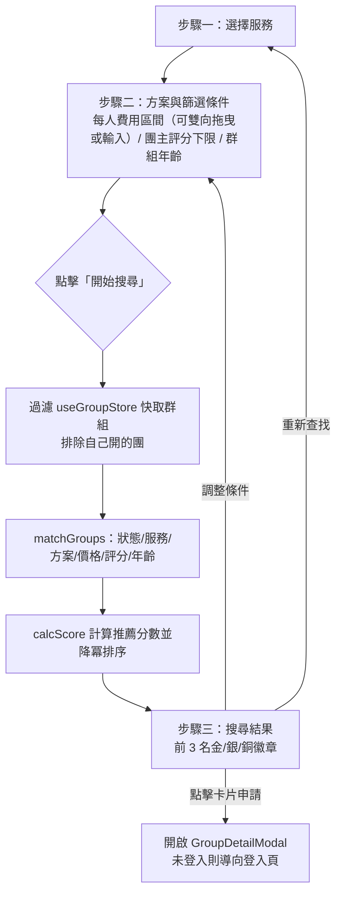

# 快速搜尋（Quick Match）

## 使用者目標
不用先瀏覽整個探索頁，透過「選擇服務 → 設定方案與篩選條件 → 查看搜尋結果」三個步驟，快速找到符合條件、依推薦分數排序的群組，不用登入也能用。

## 流程圖

## 入口
- 首頁／導覽列的「快速搜尋」入口，會導向 `/quick-match`
- `/quick-match` 是獨立於 `AppLayout` 之外的全螢幕步驟流程頁面（沒有 sidebar/dock），不用登入就能使用；只有在搜尋結果點擊「申請加入」時才會被導向登入頁

## 相關檔案

**前端**

| 路徑 | 說明 |
|------|------|
| `src/features/match/QuickMatchPage.jsx` | 步驟容器與狀態機 |
| `src/features/match/utils/matchGroups.js` | 篩選 + 推薦分數排序 |
| `src/features/match/components/steps/Step1Services.jsx` | 步驟一：選擇服務 |
| `src/features/match/components/steps/Step2PlansAndFilters.jsx` | 步驟二外殼，內含方案與篩選兩個錨點區塊 |
| `src/features/match/components/steps/Step2Plans.jsx` | 步驟二：選擇方案 |
| `src/features/match/components/steps/Step3Filters.jsx` | 步驟二：篩選條件（每人費用區間、團主評分下限、群組年齡） |
| `src/features/match/components/steps/Step4Results.jsx` | 步驟三：搜尋結果列表，前 3 名加金/銀/銅名次徽章 |
| `src/features/match/components/MatchConditionBar.jsx`、`MatchSummaryPanel.jsx` | 條件摘要顯示 |
| `src/features/explore/components/ExploreGroupCard.jsx` | 結果列表沿用探索頁的群組卡片 |
| `src/features/group/GroupDetailModal.jsx` | 群組詳情 Modal；`GroupDetailModal` 平常只在 `AppLayout` 裡掛載一次，`/quick-match` 在 `AppLayout` 之外，`QuickMatchPage.jsx` 額外自己掛了一份（`lazy` + `Suspense`），否則卡片點擊時 `pm:open-group` 事件沒有監聽者、Modal 開不起來 |
| `src/features/messages/MessagesModal.jsx` | 私訊 Modal；同樣只在 `AppLayout` 掛載，`QuickMatchPage.jsx` 也額外自己掛了一份，否則群組詳情內團主評價區的「聯絡團主」（dispatch `pm:open-dm`）在 `/quick-match` 會沒有監聽者、私訊開不起來 |

**後端**

沒有獨立的後端端點——配對邏輯完全在前端對已經快取的群組資料進行運算。

**資料表 / Model**

| Model | 用途 |
|-------|------|
| `Group` | 讀取快取，不寫入 |
| `Member` | 用來判斷結果卡片是否已經是該群組的成員 |

## 使用技術
- **雖然分三步，UI 上其實是 2 個可捲動內容頁 + 1 個結果頁**：選擇方案跟篩選條件被合併在同一個可捲動容器裡，用左側 sticky 導覽加錨點捲動模擬子步驟切換
- **篩選條件跟結果都只存在頁面的 React state**：離開頁面就消失，不寫進 store 也不寫進 `sessionStorage`
- 步驟切換時整個內容區塊會重新掛載，套用進場動畫
- **配對分數是前端一次性計算**，不是後端排序，也不是存進資料庫的欄位
- **免登入也能用**：未登入時篩選照樣跑，只是不會排除任何人開的群組（因為沒有「自己」可以排除）

## 流程步驟

**1. 選擇服務**
- 依分類列出所有服務，點擊服務卡片可以複選；取消勾選某服務時，連動清掉該服務已選的方案
- 至少選一個服務才能進到下一步

**2. 設定方案與篩選條件**
- 針對每個已選的服務，讓使用者指定要比對的方案（或不限方案）
- 設定每人費用區間（雙把手滑桿，最低/最高金額都可以拖曳或直接輸入數字，兩者互相夾住不會交叉；也可以勾選「不限」讓價格完全不篩選）、團主信用分數下限、群組成立時間（新成立／已運作一陣子／資深／不限）
- 桌機版右側會常駐顯示目前已選條件的摘要

**3. 開始搜尋**
- 讀取已快取的群組資料，先排除自己開的團，再交給配對邏輯處理
- 配對邏輯依序過濾：狀態要是招募中而且還有名額、服務要符合已選清單（若有指定）、方案要符合已選（若非不限）、每人單價要落在設定的最低～最高區間內、團主評分要達到下限、群組年齡要落在設定區間內
- 通過篩選的群組各自計算推薦分數：團主評分越高分數越高、剩餘名額越多加分、離下次扣款日越久加分、單價明顯低於使用者設定上限也加分；依分數由高到低排序

**4. 查看搜尋結果**
- 顯示唯讀的條件摘要與結果網格，前 3 名加上金/銀/銅名次徽章
- 每張卡片沿用探索頁的卡片樣式，點擊會開啟群組詳情（後續申請流程見 `apply-join-flow.md`），未登入時點申請會先導向登入頁
- 名次徽章是透過 `ExploreGroupCard` 的 `rank` prop 畫在卡片內部（`<article>` 自己的 `relative` 定位範圍內），不是外層包一層 `absolute` 疊上去——這樣卡片 hover 放大（`card-lift`）時徽章才會跟著卡片一起縮放移動，不會維持原地不動看起來像脫落
- 卡片容器的 `overflow-y-auto` 捲動區用 `p-2` 而不是 `p-0.5`，讓最左/最右欄的卡片 hover 放大時有足夠留白，不會被容器邊緣裁掉

**5. 調整或重新查找**
- 「調整條件」回到步驟二；「重新查找」把所有條件跟結果重設，回到步驟一

## 驗證重點
- 前端唯一的硬性檢查是步驟一至少要選一個服務，步驟二沒有必填限制，可以直接用預設的篩選值查找
- 搜尋結果只會回傳狀態是招募中而且還有名額的群組，額滿或非招募中的都不會出現
- 沒有配對到結果時會顯示空狀態並引導去探索頁，不會顯示錯誤訊息
- 整個運算都是基於前端已經快取的群組資料（可能是頁面載入當下的快照），快速搜尋不會重新打 API 拿最新群組列表，搜尋結果可能跟資料庫當下的實際狀態有些微落差
