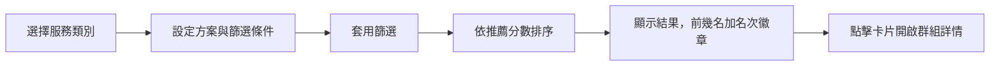

# 快速搜尋（Quick Match）

## 使用者目標
不用先瀏覽整個探索頁，透過「選擇服務 → 設定方案與篩選條件 → 查看搜尋結果」三個步驟，快速找到符合條件、依推薦分數排序的群組，不用登入也能用。

## 流程

1. **選擇服務**：可複選有興趣的服務類別，至少選一個才能繼續
2. **設定方案與篩選條件**：針對每個已選服務指定方案（或不限），設定每人費用區間、團主評分下限、群組成立時間等條件
3. **開始搜尋**：對已快取的群組資料套用篩選，通過篩選的群組再依推薦分數（團主評分、剩餘名額、扣款週期、價格優勢等綜合考量）排序
4. **查看結果**：結果依分數排序，前幾名加上名次徽章；點擊卡片開啟群組詳情，後續申請流程見 [申請加入流程](./apply-join-flow.md)
5. 可以隨時調整條件重新搜尋，或整個重來

## 產品決策
- **免登入也能使用**：讓還沒註冊的使用者也能先體驗配對結果，只有真的要申請加入時才要求登入
- **篩選條件與結果只存在頁面當下**：離開頁面就清空，不會被記錄或帶到別處，避免使用者的搜尋偏好被意外保留
- **推薦分數是前端即時計算**，不是後端排序結果，也不會存進資料庫

## 驗證重點
- 搜尋結果只會回傳招募中且有名額的群組
- 沒有配對到結果時顯示空狀態並引導去探索頁，不當成錯誤處理
- 運算基於頁面載入當下的快照資料，可能跟資料庫當下的實際狀態有些微落差
