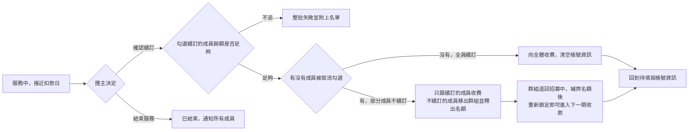

# 續訂流程

## 使用者目標
團主在群組服務期滿後，決定是要開始下一期收款讓群組繼續運作（可以逐一勾選這期哪些成員要續訂），還是結束服務讓群組收尾。

## 流程圖

## 流程
1. 群組進入服務中狀態後，收款管理分頁右下角會出現續訂服務入口，顯示距下次帳單日還有多久，並列出目前成員供團主逐一勾選（預設全部勾選）
2. **確認續訂**：系統會先確認勾選續訂的成員餘額是否足夠，任何一人不足就整批失敗並附上名單；成功後：
   - 全員都續訂：向全體成員收費、清空帳號資訊，群組回到「待填寫帳號資訊」的狀態，重新走一次鎖定後的流程
   - 有成員被取消勾選：只跟續訂的成員收費，不續訂的成員移出群組並釋出名額，群組先退回「招募中」讓團主補齊名額，補滿後再重新鎖定即可進入下一期收款；下次扣款日不會因為補位花了多久而往後跑
3. **結束服務**：群組狀態改為已結束，通知所有成員；已結束的群組不再保留「群組訊息」入口
4. 快到期時，成員會提前收到續訂提醒，確認自己的餘額是否足夠

## 產品決策
- **續訂扣款要嘛全員成功、要嘛整批不生效**：避免出現「有人扣了錢、有人沒扣」的不一致狀態
- **不續訂不等於退款**：這期一開始就沒把不續訂的成員算進收費名單，不是先收費再退費
- **下次扣款日一旦排定就固定下來，不受團主補位/啟用時間點影響**（僅第一次啟用例外）：確保成員能穩定預期扣款節奏，團主如果真的需要調整，走的是另一個限次數的調整功能

## 驗證重點
- 只有團主本人能操作續訂，且群組必須是服務中狀態
- 續訂扣款會先做一次餘額預檢，正式扣款時再次核對，避免扣一半
- 全部取消勾選（一個續訂的都沒有）視為不允許的操作，要結束服務需改用「結束服務」
