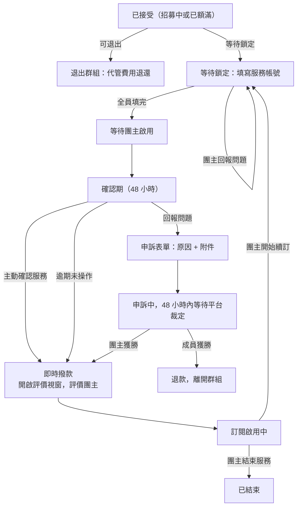

# 我的訂閱（成員視角）

## 使用者目標
成員在申請通過後追蹤自己的訂閱進度：填寫服務帳號、確認服務是否正常啟用、有問題時申訴，或在群組鎖定前退出。

## 流程圖

## 入口
- `/my-subscriptions` 獨立頁面
- 也可以透過通知點擊，或儲值視窗的交易紀錄列點擊，間接開啟特定群組的詳情視窗

## 相關檔案

**前端**

| 路徑 | 說明 |
|------|------|
| `src/features/subscriptions/SubscriptionsPage.jsx` | 頁面總入口，串接分頁與訂閱卡片 grid |
| `src/features/subscriptions/components/SubscriptionCard.jsx` | 單一訂閱卡片 |
| `src/features/subscriptions/components/MemberGroupView.jsx` | 成員視角群組詳情 Modal：確認服務、申訴、退出、查看群組名單、付款管理、查看團主提供的帳號資訊分頁（`shared_credentials` 服務限定） |
| `src/features/subscriptions/components/FillServiceInfoModal.jsx` | 第一次提取／填寫服務帳號的獨立彈窗，開啟時底下的群組詳情視窗完全隱藏，關閉才恢復顯示；`shared_credentials` 服務會先顯示團主提供的帳號資訊並疊上浮水印，再是確認勾選框 |
| `src/features/subscriptions/components/memberGroupView/buildCredentialsPanel.jsx` | 「帳號資訊」分頁內容（`shared_credentials` 服務限定），提取過一次之後改走這裡查看，不用再重新跑一次 sub-modal；密碼欄位預設遮罩，眼睛 icon 切換顯示，跟團主端 `buildMemberInfoPanel.jsx` 一致；底部接一個 `CredentialCommentsSection` 留言區 |
| `src/components/ui/group/CredentialCommentsSection.jsx` | 「帳號資訊」分頁底下的留言區元件，團主端／成員端共用；每 5 秒輪詢 `GET /credential-comments/:groupId`，送出打 `POST /credential-comments` |
| `src/components/ui/primitives/CredentialWatermark.jsx` | 疊在帳密內容上的浮水印（查看者名稱＋時間），無法阻止截圖，但外流時至少能溯源查看者 |
| `src/common/utils/hostCredentialFields.js` | `getHostCredentialFields`、`parseHostCredentials`：`shared_credentials` 服務依服務別定義的結構化帳密欄位與解析 |
| `src/features/subscriptions/components/memberGroupView/buildPaymentsPanel.jsx` | 付款管理面板，顯示自己這期最新一筆代管紀錄（見 PM幣代管流程文件） |
| `src/common/utils/serviceInfoFields.js` | `SHARING_METHOD_CONFIG`（各共享機制的欄位設定與提醒文案）、`hasFilledServiceInfo`、`getServiceInfoSummary` |
| `src/features/subscriptions/components/ReviewHostModal.jsx` | 確認服務完成後的團主評價彈窗 |
| `src/features/subscriptions/utils/memberFilters.js` | 分頁篩選邏輯：`FILTER_TABS`（審核中/招募中/處理中/服務中四個大分類；已移除「全部」，待鎖定/成員填寫中/待啟用/確認期中/申訴中五種細分狀態併入「處理中」，`PROCESSING_STATUSES` 定義在 `src/common/utils/groupStatus.js`，跟 host 端共用） |
| `src/components/ui/group/GroupViewModal.jsx` | 依身分決定渲染團主或成員視角的薄殼 |
| `src/components/ui/group/GroupModalShell.jsx` | 三層滑動 Panel 共用殼；桌機版側邊欄在左側（`md:order-first`），手機版仍堆疊在下方；Header 顯示「服務名稱 \| 方案名稱」 |
| `src/components/ui/group/GroupOverviewContent.jsx` | 群組概覽內容，含服務說明／方案說明 |
| `src/common/utils/groupStatus.js` | `isEffectivelyActive`，成員自行確認服務後個人視角提前視為已啟用 |

**後端**

| 路徑 | 說明 |
|------|------|
| `server/src/routes/members.js` | `GET /members`、`PATCH /members/:id`（填寫帳號資訊）、`DELETE /members/:id`（退出） |
| `server/src/routes/groups/lifecycle.js` | `POST /groups/:id/confirm`（確認服務）、`POST /groups/:id/dispute`（申訴） |
| `server/src/routes/subscriptions.js` | `GET /subscriptions`，附帶即將續訂提醒的副作用 |
| `server/src/utils/pricing.js` | `computeSeatCost` |

**資料表 / Model**

| Model | 用途 |
|-------|------|
| `Member` | `serviceInfo`（JSON，帳號資訊）、`serviceInfoIssueNote`、`disputeEvidenceUrl`、`confirmedAt` |
| `Subscription` | `status`（`pending`/`active`/`ended`）、`nextBillingDate` |
| `Group` | `status`、`serviceInfoDeadline`、`confirmDeadline`、`disputeDeadline`、`escrowTokens` |
| `Review` | 確認服務完成後可對團主留下的評價 |

## 使用技術
- **先更新畫面，失敗會復原**：填寫服務帳號時先更新本地畫面，如果送出失敗就把資料復原成送出前的樣子（不是清空），避免使用者辛苦填好的內容無故消失
- **三層滑動面板**：從總覽切到申訴／群組名單這類子面板，都是同一套滑動元件；「填寫帳號」不在這套機制裡，見下方獨立說明
- **倒數／狀態提醒橫幅不綁定分頁**：切到群組名單等分頁時倒數橫幅仍會顯示，不會只留在群組概覽
- **「付款管理」面板只顯示最新一筆代管紀錄**：邏輯跟團主端「收款管理」對齊，只看自己這期最新一筆代管交易；未撥款時文案「本期費用已交由平台代管，尚未撥款至團主帳戶」，群組進入啟用中或已結束後視為已撥款，文案改「本期費用已撥款給團主」；退款等歷史紀錄不在這裡處理
- **服務說明／方案說明顯示在群組概覽畫面**：跟探索頁群組詳情視窗的呈現方式統一；服務說明拆成「服務說明」「方案說明」兩個並列的大標題區塊，字級一樣大
- **「填寫帳號」是群組概覽底部的動態按鈕**：跟「確認服務」「回報問題」一樣，只有在需要填寫帳號、或帳號被回報有問題時才會出現；`shared_credentials` 服務（團主主動提供帳密，成員只需提取確認）按鈕與相關文案改顯示「提取帳號資訊」，跟其他組需要成員自行輸入帳號的情境區隔
- **不可逆操作要倒數確認**：確認服務、退出群組都要倒數幾秒才能真的送出，避免手滑誤觸
- **側邊欄固定項目**：符合退出條件（招募中或已額滿）時側邊欄底部固定顯示「退出群組」，跟「群組訊息」共用側邊欄右下角同一個位置
- **「帳號資訊」側邊欄項目（`shared_credentials` 服務限定）**：只有在已經提取過一次帳密後（`hasServiceInfo` 為 true）才會出現，跟「群組名單」「付款管理」排在側邊欄同一個區塊；點擊開啟的是內嵌在群組詳情 Modal 裡的「帳號資訊」分頁（`buildCredentialsPanel.jsx`），不是重新彈出提取用的 sub-modal——這組服務的帳密是團主一次性提供、整個訂閱週期都有效，成員可能事後忘記密碼，不能只在第一次提取的當下才給查看入口；分頁裡密碼欄位預設遮罩，眼睛 icon 可切換顯示，跟團主端「帳號資訊」分頁（原「成員資料」）一致
- **帳號資訊分頁底部的留言區**：只有 `shared_credentials` 服務才有，團主與該群組所有成員都能看、都能留言（後端 `CredentialComment` 表，`GET`/`POST /credential-comments`），用來針對帳密內容直接溝通，不透過群組聊天室避免訊息混在一起；每 5 秒輪詢一次，跟 Conversations 同一套做法；團主端「帳號資訊」分頁底下接的是同一個元件、同一份留言串，雙方看到的內容一致
- **訂閱卡片（`SubscriptionCard.jsx`）依狀態切換統計格內容**：比團主端的 `HostedGroupCard.jsx`（見群組管理流程文件）簡單很多，中間格固定顯示「群組人數」，左格一律固定顯示「團主」（頂部 badge 已經顯示目前狀態，左格不重複顯示狀態文字），只有右格會依是否已啟用切換：

  | `sub.groupStatus`（判定用） | 卡片頂部 Badge | 左格 | 中格 | 右格 |
  |---|---|---|---|---|
  | 審核中（申請已送出、尚未被團主接受，用的是另一個卡片元件 `ApplicationCard`，見下方說明） | 團主審核中 | 團主：{團主名稱} | 群組狀態：審核中 | 申請日期 |
  | `recruiting` 招募中 | 申請通過 | 團主：{團主名稱} | 群組人數 | 加入日期 |
  | `full` 額滿 | 等待鎖定 | 團主：{團主名稱} | 群組人數 | 加入日期 |
  | `pending_confirmation` 待成員填寫（自己已填完、等其他人） | 已填寫完成（`shared_credentials` 服務顯示「已提取完成」） | 團主：{團主名稱} | 群組人數 | 預估下次扣款 |
  | `pending_confirmation` 待成員填寫（自己尚未填） | 成員填寫中（`shared_credentials` 服務顯示「帳號提取中」） | 團主：{團主名稱} | 群組人數 | 預估下次扣款 |
  | `pending_activation` 待啟用 | 待啟用 | 團主：{團主名稱} | 群組人數 | 預估下次扣款 |
  | `confirming` 確認期中（自己尚未確認） | 確認期中 | 團主：{團主名稱} | 群組人數 | 下次扣款 |
  | `confirming` 確認期中（自己已確認） | 服務中（視同已啟用） | 團主：{團主名稱} | 群組人數 | 下期收費 |
  | `disputed` 申訴中 | 問題處理中 | 團主：{團主名稱} | 群組人數 | 下次扣款 |
  | `active` 服務中 | 服務中（7 天內即將續訂時改顯示「即將續訂」） | 團主：{團主名稱} | 群組人數 | 下期收費 |
  | `cancelled` 已解散 | 已解散 | 團主：{團主名稱} | 群組人數 | 加入日期 |
  | `ended` 已結束 | 已結束 | 團主：{團主名稱} | 群組人數 | 加入日期 |

  「已啟用」的判定不是單純看 `groupStatus === 'active'`：自己在確認期已經按下確認（`confirmedAt` 有值）的話，即使群組整體還沒等到其他成員確認、狀態上仍是 `confirming`，右格也會視同已啟用顯示「下期收費」（因為對這位成員來說，該做的事已經做完了，比起「加入日期」更想知道下次扣款時間）；待成員填寫／待啟用這兩個階段顯示的是「預估下次扣款」，因為鎖定時算出來的日期要等團主真正啟用服務才定案（見續訂流程文件的下次扣款日說明）
- 表格第一列「審核中」用的其實是另一個卡片元件（`ApplicationCard`，`SubscriptionsPage.jsx` 內），不是 `SubscriptionCard`：申請送出後、被團主接受前還不是群組成員，沒有群組人數/加入日期這些資料可用，所以獨立一個元件，但套用一樣的 hover 放大效果與共用徽章元件，視覺風格跟其他訂閱卡片一致
- 申訴附件會先上傳到圖床拿到 URL，再隨申訴表單一起送出
- 從群組概覽或群組名單可以直接觸發開啟群組聊天室或私訊團主

## 流程步驟

**1. 查看訂閱列表**
- 依分頁（審核中／招募中／處理中／服務中）過濾出屬於自己的訂閱資料；待鎖定／成員填寫中／待啟用／確認期中／申訴中都併在「處理中」，細分階段交給卡片本身的狀態標籤顯示；已結束／已取消的訂閱不在這幾個分頁裡，要點最上方的「群組紀錄」按鈕查看

**2. 填寫服務帳號（等待鎖定）**
- 還沒填寫帳號資訊時，群組概覽底部會顯示「填寫帳號」動態按鈕（跟「確認服務」「回報問題」同一個位置，不是側邊欄項目），點擊後開啟填寫帳號的獨立彈窗，開啟時底下的群組詳情視窗會完全隱藏（不是半透明疊加），關閉後才會重新顯示群組詳情；表單依該服務的共享機制動態顯示對應欄位（一般是 email；KKBOX 多一個地址欄位；friDay影音是邀請碼；沒有官方邀請機制的服務則是先顯示團主鎖定群組時填寫的結構化帳密資訊，成員只需確認勾選），送出後存入成員的帳號資訊（詳見 [各服務填寫帳號資訊需求調查](../product/service-info-requirements.md)）；顯示帳密內容的畫面會疊一層浮水印（查看者名稱＋時間），無法阻止截圖，但外流時至少能溯源是誰看過
- 頁面頂部會顯示倒數橫幅「請填寫服務帳號，剩餘 HH:MM:SS」（`shared_credentials` 服務顯示「請提取帳號資訊，剩餘 HH:MM:SS」），鎖定時間起算 24 小時，每秒更新；逾期只顯示「已逾期」，不會有任何自動處理
- 後端會檢查群組內是否全員都已經填寫，如果是，就自動把群組狀態推進到「等待團主啟用」

**3. 帳號問題修正**
- 如果團主回報帳號有問題，畫面會顯示警示訊息，並允許重新填寫

**4. 確認服務（確認期）**
- 服務啟用後的確認期內，會顯示「確認服務」跟「回報問題」兩個按鈕，頂部橫幅顯示「服務已啟用，請確認是否正常，剩餘 HH:MM:SS」倒數
- 點「確認服務」需要倒數確認；送出後如果全員都已確認，後端會立即撥款給團主，前端提示「款項已撥付」；如果還有人沒確認，就只標記自己已確認，並提示還在等其他人

**5. 確認後邀請評價**
- 確認服務送出後一定會跳出團主評價視窗；如果剛好撥款完成，評價視窗關閉時會一併關閉整個群組 Modal

**6. 申訴（確認期期間）**
- 點「回報問題」進入申訴表單，可以複選申訴原因、填說明、上傳附件
- 送出後群組進入等待平台裁定的狀態，關閉 Modal 並提示「已送出回報，將於 48 小時內處理」

**7. 退出群組（招募中／已額滿）**
- 入口固定在側邊欄右下角（跟「群組訊息」共用同一個位置）
- 符合條件時可以退出，需要倒數確認
- 退出時會發送系統訊息並退出聊天室、移除自己的成員與訂閱資料、把對應申請標為已離開、釋出名額，並通知團主
- 退出邏輯統一寫在共用工具函式裡，探索頁跟我的訂閱頁兩個入口都呼叫同一份，避免各自維護一份重複邏輯、行為不一致

**8. 群組名單／聯絡團主**
- 可以查看團主與其他成員名單（分頁命名為「群組名單」，因為裡面包含團主，不只是成員），團主標示為一個只有文字「團主」的圓角標籤（不再有盾牌圖示）；點擊個別成員的訊息圖示能直接開啟私訊

**9. 付款管理**
- 側邊欄「付款管理」分頁顯示自己這期最新一筆代管紀錄與目前狀態（尚未撥款／已撥款給團主），資料來源跟團主端收款管理一樣，前端篩選出屬於這個群組的交易

## 驗證重點
- 填寫帳號資訊只有本人或該群組團主可以操作，其他人一律回錯誤
- 退出群組只允許在招募中或已額滿狀態操作，一旦鎖定（進入等待填寫帳號資訊之後）成員名單就不能再變動，會回錯誤
- 確認服務／申訴都會檢查請求人確實是該群組成員，非成員回錯誤；群組狀態不是確認期一律回錯誤
- 確認服務時，後端會在同一個交易內同時更新群組狀態、撥款、清空代管金額、寫入交易紀錄、把全員訂閱設成啟用中，避免只寫一半造成資料不一致
- 填寫帳號失敗時前端會把資料復原成送出前的樣子，不是清空，避免使用者原本填好的資料無故消失
- 只要自己已經確認服務，即使其他成員還沒確認，個人視角也會提前顯示為已啟用
