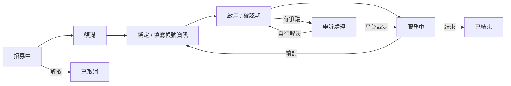

# 使用者流程總覽

平台的核心體驗，是讓使用者能安心地跟陌生人合購訂閱服務。整體流程設計圍繞著「錢什麼時候該被保護」這個問題展開。

## 整體流程

1. **找群組**：透過探索頁篩選，或用免登入的快速配對找到合適的合購群組
2. **送出申請**：對招募中的群組提出加入申請，費用立即交由平台代管，不會直接撥入團主帳戶
3. **團主審核**：接受就成為正式成員；拒絕則全額退還代管費用，可重新申請
4. **鎖定群組**：名額額滿後團主鎖定群組、開通聊天室，成員開始提供訂閱帳號資訊
5. **啟用服務**：帳號資訊到位後團主啟用服務，進入一段確認期；成員可以主動確認，或在有問題時正式回報
6. **撥款**：全員確認（或確認期屆滿）後，代管金額才撥給團主
7. **續訂或結束**：服務週期結束後，團主決定開啟下一期收款或結束群組

貫穿整個流程的還有兩塊共用機制：站內訊息（群組聊天室、私訊、系統通知）與站內通知（提醒使用者相關動態並導向對應畫面）。

## 群組生命週期（簡圖）

一個群組從建立到結束會依序走過這些階段，不會跳步驟。各階段的細節、以及成員端／團主端各自能做的事，分別記錄在下方對應的個別流程文件中。

## 相關文件

- 探索與配對：[探索群組](explore-flow.md)、[快速搜尋](quick-match-flow.md)
- 成員端：[申請加入](apply-join-flow.md)、[我的訂閱](subscriptions-flow.md)、[申訴](dispute-flow.md)
- 團主端：[建立群組](create-group-flow.md)、[審核申請](approval-flow.md)、[群組管理](manage-groups-flow.md)、[續訂](renewal-flow.md)
- 共用機制：[PM 幣代管與付款](payment-token-flow.md)、[訊息](messages-flow.md)、[通知](notification-flow.md)
- 群組狀態機完整定義：[群組生命週期狀態機](group-state-machine.md)
