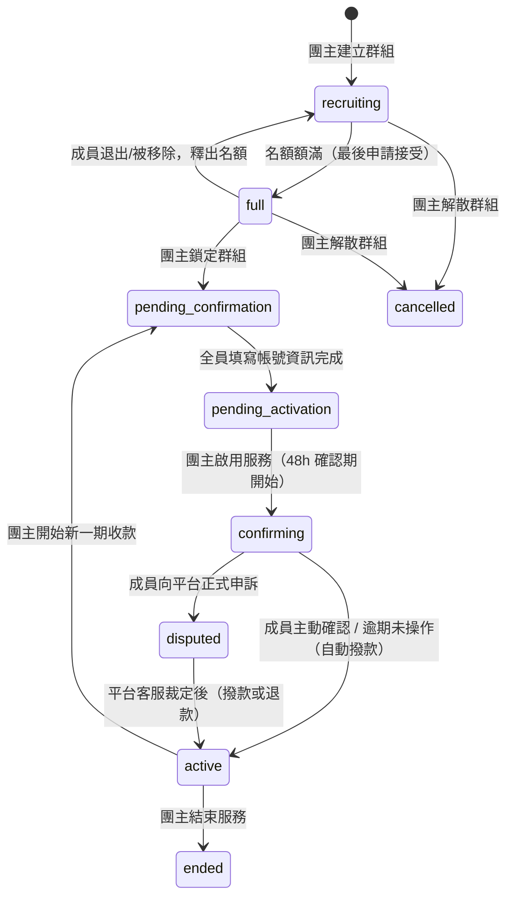

# 使用者流程總覽

這篇是整個平台操作流程的入口，先看這篇抓整體輪廓，想知道某一步的細節再點連結到對應的個別流程文件（裡面有更詳細的 Mermaid 圖、相關檔案、驗證重點）。

## 整體流程

1. **找群組**：透過探索頁篩選，或用免登入的快速搜尋配對 → 詳見 [探索群組流程](./explore-flow.md)、[快速搜尋流程](./quick-match-flow.md)
2. **送出申請**：對招募中的群組送出加入申請，系統立即從申請人餘額扣款、轉入該群組的代管餘額 → 詳見 [申請加入流程](./apply-join-flow.md)
3. **團主審核**：接受就建立成員資格；拒絕則把代管的席位費用退還給申請人，申請人可重新提出 → 詳見 [團主審核流程](./approval-flow.md)
4. **鎖定群組**：名額額滿後，團主鎖定群組、建立聊天室，成員開始填寫訂閱帳號資訊 → 詳見 [群組管理（團主視角）流程](./manage-groups-flow.md)
5. **啟用服務**：帳號資訊齊全後團主啟用服務，進入 48 小時確認期；成員可主動確認、透過聊天室反應問題，或正式申訴 → 詳見 [我的訂閱（成員視角）流程](./subscriptions-flow.md)、[申訴流程](./dispute-flow.md)
6. **撥款**：全員確認（或確認期逾期）後，代管金額撥款給團主，訂閱進入啟用中 → 詳見 [PM幣代管與付款流程](./payment-token-flow.md)
7. **續訂或結束**：服務期滿後，團主決定開始下一期收款或結束群組 → 詳見 [續訂流程](./renewal-flow.md)

貫穿整個流程的還有兩塊共用機制：[訊息流程](./messages-flow.md)（群組聊天室、私訊、系統通知）與 [通知流程](./notification-flow.md)（站內通知與點擊導向）。

## 群組狀態機（簡圖）

一個群組從建立到結束，狀態只會照下面的圖走，不會跳步驟：

每個狀態實際的推進條件、觸發端點、前置檢查，見 [群組狀態機](./group-state-machine.md) 的完整版。

## 依角色查看細節流程

### 成員端

| 流程 | 說明 |
|------|------|
| [探索群組流程](./explore-flow.md) | 分類、服務、價格、關鍵字篩選找群組 |
| [快速搜尋流程](./quick-match-flow.md) | 免登入的三步驟配對，依推薦分數排序 |
| [申請加入流程](./apply-join-flow.md) | 送出申請、等待審核、審核前可取消 |
| [我的訂閱（成員視角）流程](./subscriptions-flow.md) | 填寫帳號、確認服務、退出群組 |
| [申訴流程](./dispute-flow.md) | 服務有問題時向平台正式申訴 |

### 團主端

| 流程 | 說明 |
|------|------|
| [建立群組流程](./create-group-flow.md) | 4 步驟表單建立招募中的群組 |
| [團主審核流程](./approval-flow.md) | 接受或拒絕申請，接受會自動扣款、建成員 |
| [群組管理（團主視角）流程](./manage-groups-flow.md) | 鎖定群組、啟用服務、收款管理、解散群組 |
| [續訂流程](./renewal-flow.md) | 服務期滿後開始下一期收款或結束服務 |

### 共用機制

| 流程 | 說明 |
|------|------|
| [PM幣代管與付款流程](./payment-token-flow.md) | 儲值、代管、撥款、退款怎麼串起來 |
| [訊息流程](./messages-flow.md) | 群組聊天室、私訊、系統通知聊天室 |
| [通知流程](./notification-flow.md) | 站內通知怎麼發送、點擊後怎麼導向 |
