# 操作流程

## 群組狀態機

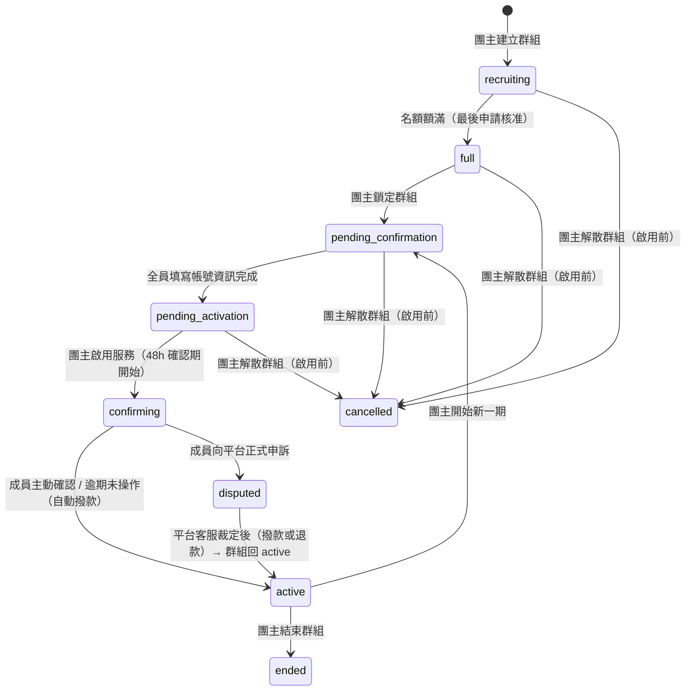

| 狀態 | 說明 | 推進條件 |
|------|------|----------|
| `recruiting` | 公開招募中，接受申請 | 最後一個申請被核准且名額額滿 → 系統自動推進至 `full` |
| `full` | 名額額滿，等待團主鎖定群組；成員仍可退出或被移除（釋出名額，退回 `recruiting`） | 團主點「鎖定群組」 |
| `pending_confirmation` | 成員填寫訂閱帳號資訊；**付款已在核准時代管完成，本階段無付款操作**；成員名單不可再變動 | 全員填寫完成後自動推進 |
| `pending_activation` | 帳號資訊齊全，等待團主啟用服務；成員名單不可再變動 | 團主點「啟用服務」 |
| `confirming` | 服務啟用後最長 48 小時確認期；成員可主動確認、向團主反應或向平台申訴；逾期未操作則自動撥款 | 成員主動確認（即時結束）或逾期未操作（惰性求值）|
| `disputed` | 成員向平台正式申訴；代管金額凍結，客服 3 天內裁定；裁定只影響申訴的那位成員 | 平台客服手動推進 |
| `active` | 服務運作中；成員名單不可再變動 | 團主開始新一期或結束群組 |
| `cancelled` | 團主在服務啟用前解散群組；所有代管金額退還成員代幣餘額 | — |
| `ended` | 服務到期後團主正常結束群組 | — |

---

## 成員端

### 1-A 探索與申請加入

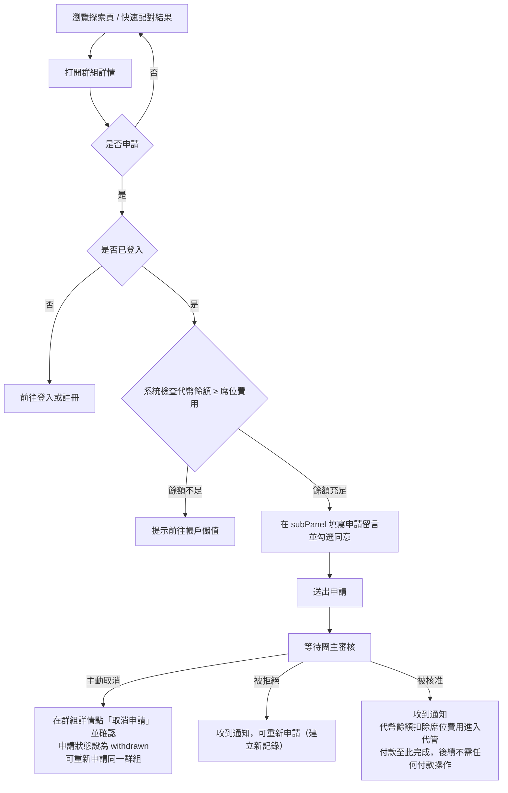

### 1-B 等待啟用期間（`recruiting` → `full` → `pending_confirmation`）

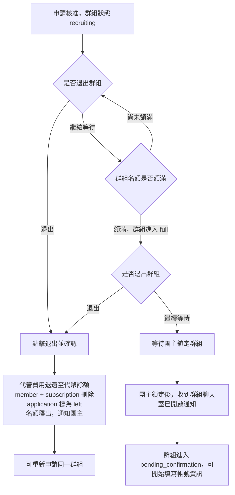

### 1-C 填寫訂閱帳號資訊（`pending_confirmation`）

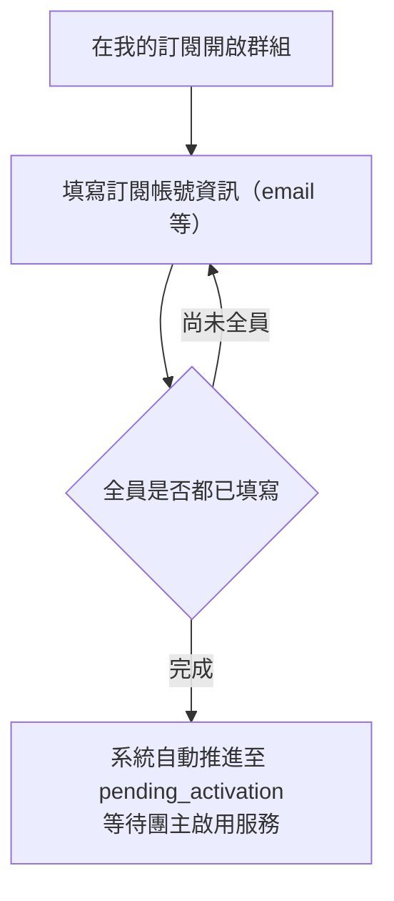

### 1-D 確認期（`confirming`）

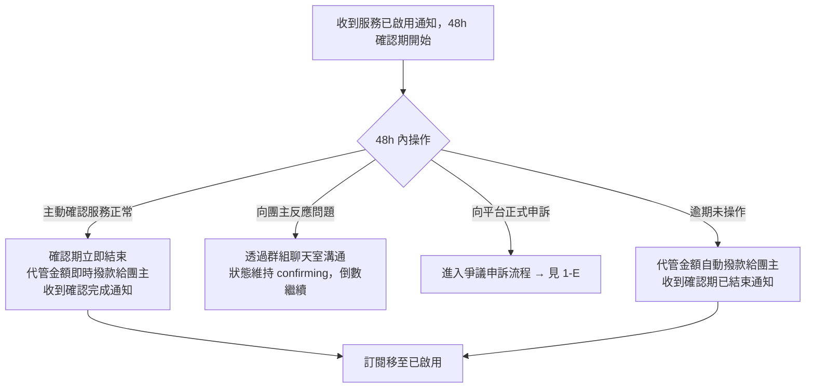

### 1-E 爭議申訴（`disputed`）

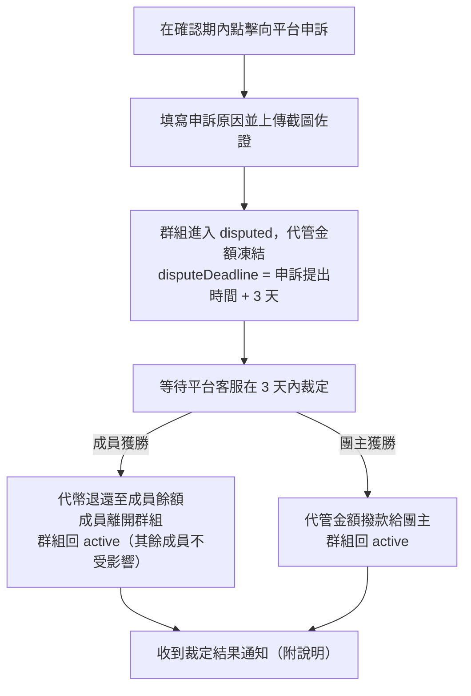

---

## 團主端

### 2-A 建立群組

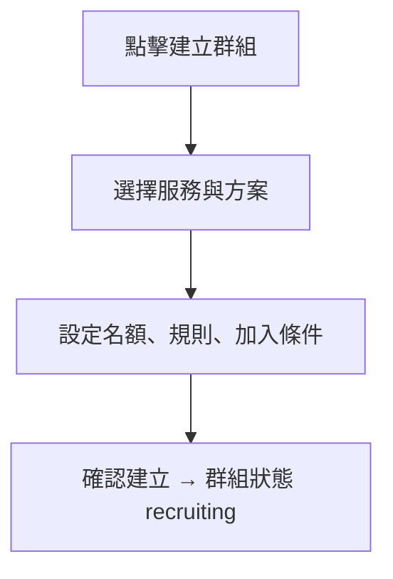

### 2-B 審核申請（`recruiting`）

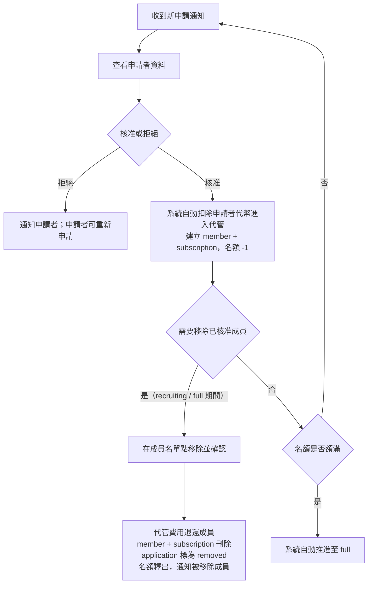

### 2-C 鎖定群組（`full` → `pending_confirmation`）

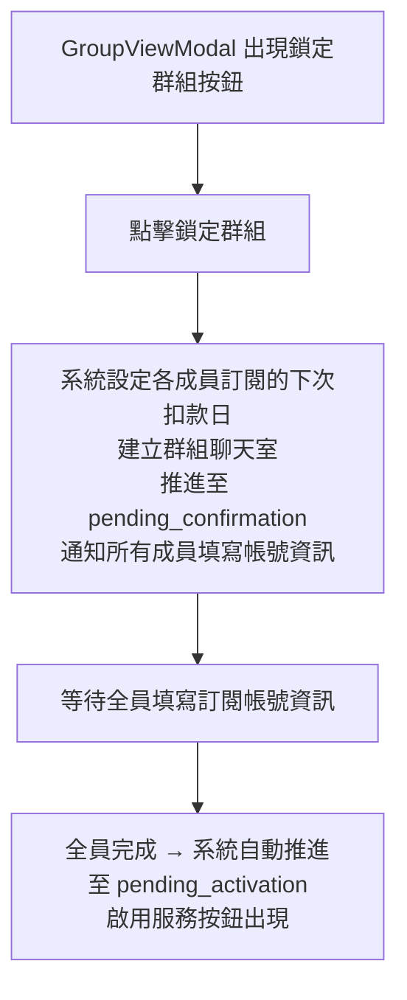

### 2-D 啟用服務（`pending_activation` → `confirming`）

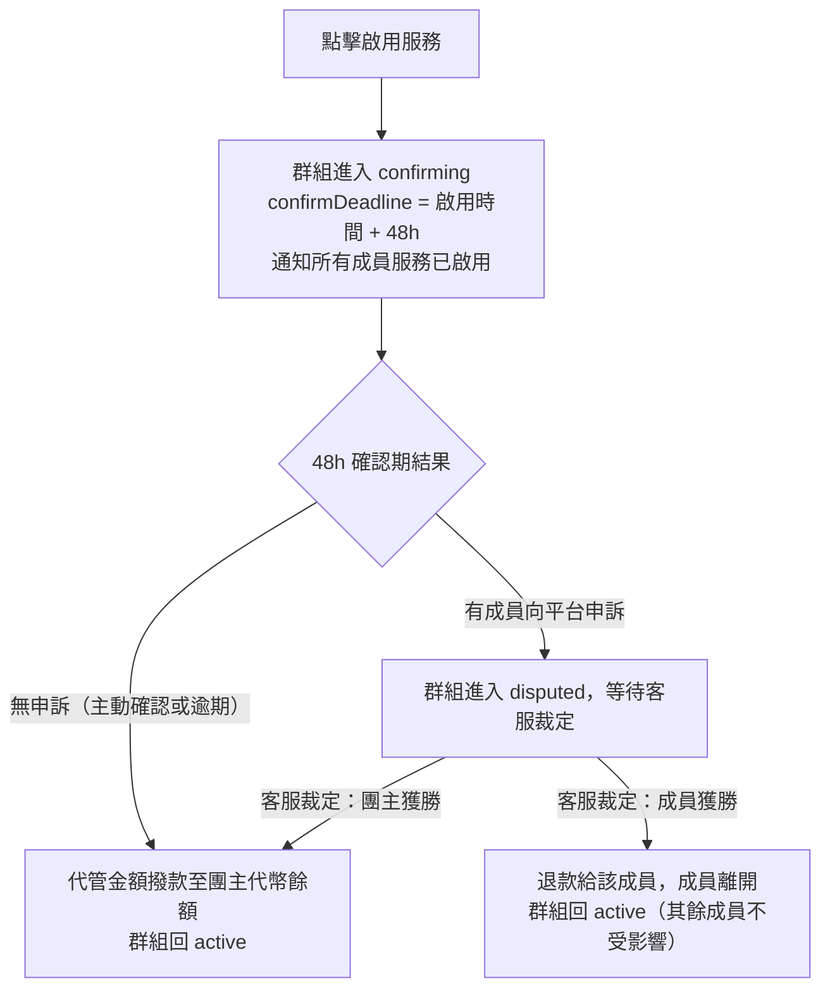

### 2-E 解散群組（啟用前）

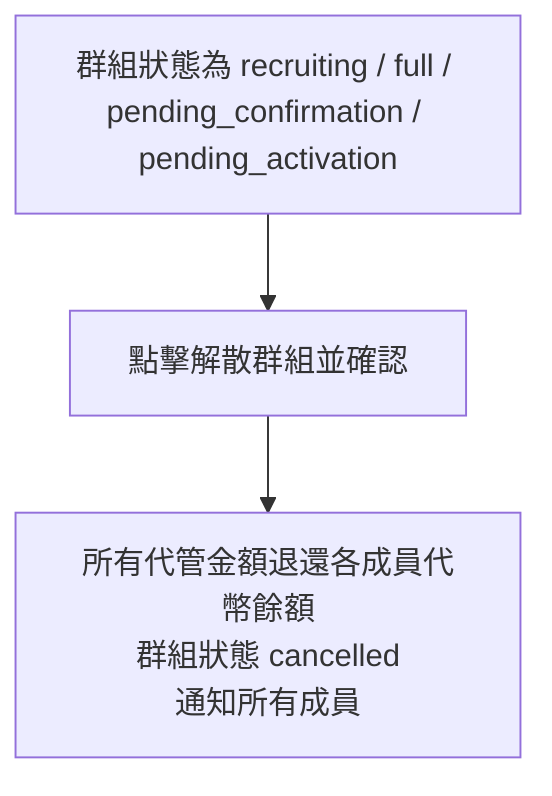

### 2-F 到期後（`active`）

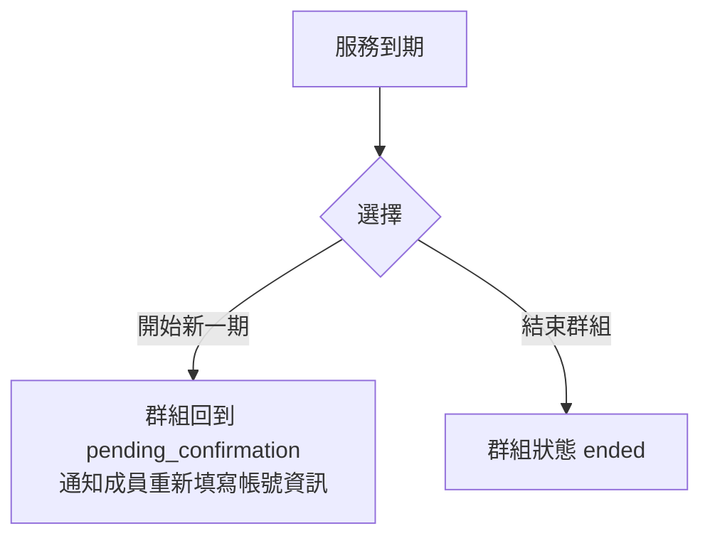

---

## 平台端：爭議裁定

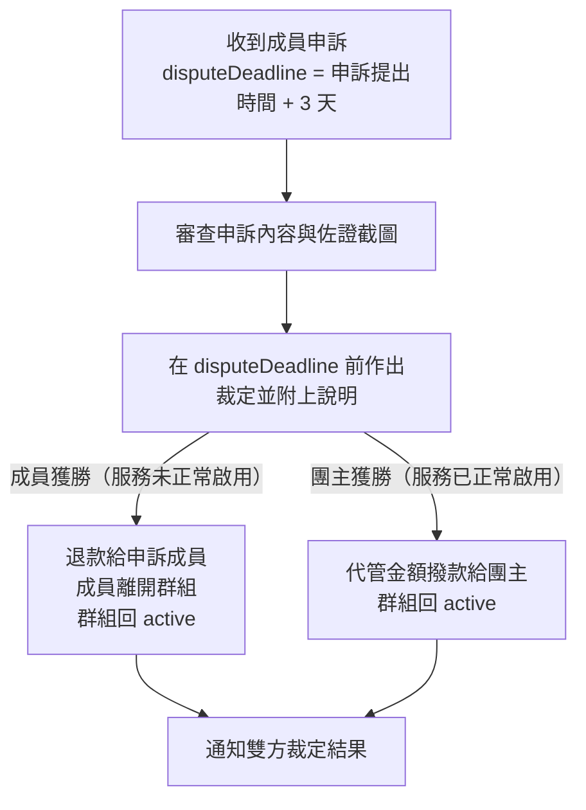

---

## 代幣與帳戶管理

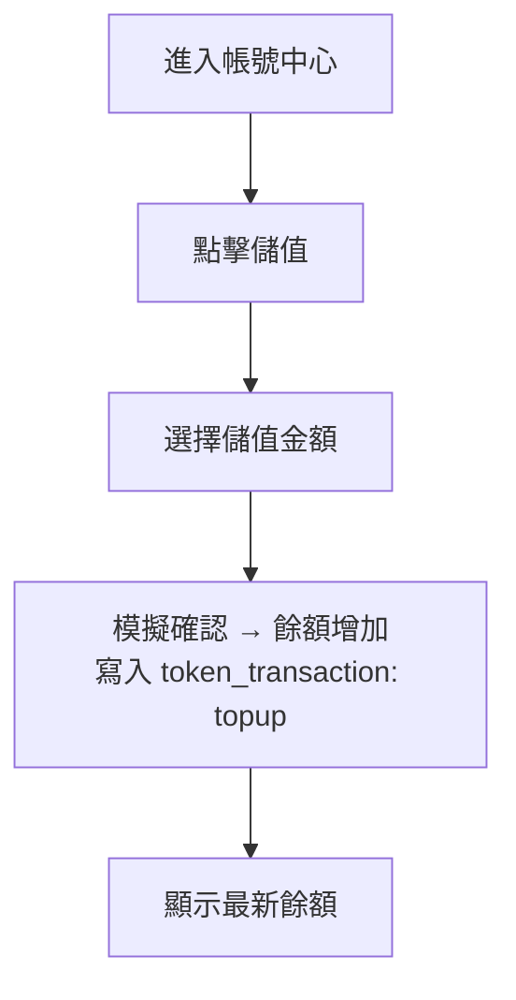

| 時機 | 代幣異動 | 類型 |
|------|----------|------|
| 儲值 | `user.tokenBalance` += 金額 | `topup` |
| 申請核准 | `user.tokenBalance` -= 席位費用；`group.escrowTokens` += 費用 | `escrow` |
| 確認期結束（無爭議） | `group.escrowTokens` → `host.tokenBalance` | `release` |
| 成員退出 / 被移除 | `group.escrowTokens` → `user.tokenBalance`（退還） | `refund` |
| 團主解散群組（`cancelled`） | 所有成員 `group.escrowTokens` → 各 `user.tokenBalance`（退還） | `refund` |
| 爭議申訴：成員獲勝 | `group.escrowTokens` → `user.tokenBalance`（退還） | `refund` |
| 爭議申訴：團主獲勝 | `group.escrowTokens` → `host.tokenBalance` | `release` |

- 申請時只做餘額**檢查**，不預扣；核准後才扣除並進入代管。
- 所有代幣異動均記錄至 `token_transactions`，提供完整審計軌跡。
- 現階段儲值為模擬模式（點擊即儲值），正式金流為未來擴充項目。

---

## 訊息與通知

1. 訪客可打開通知中心，但只看到系統公告；個人通知需登入。
2. 通知依類型分為代幣帳務、申請、系統三頁，可標記已讀。
3. 群組聊天室在團主點「鎖定群組」後建立；成員收到通知。
4. 訊息透過 REST API polling（每 5 秒）同步；成員加入或退出時寫入系統訊息。
