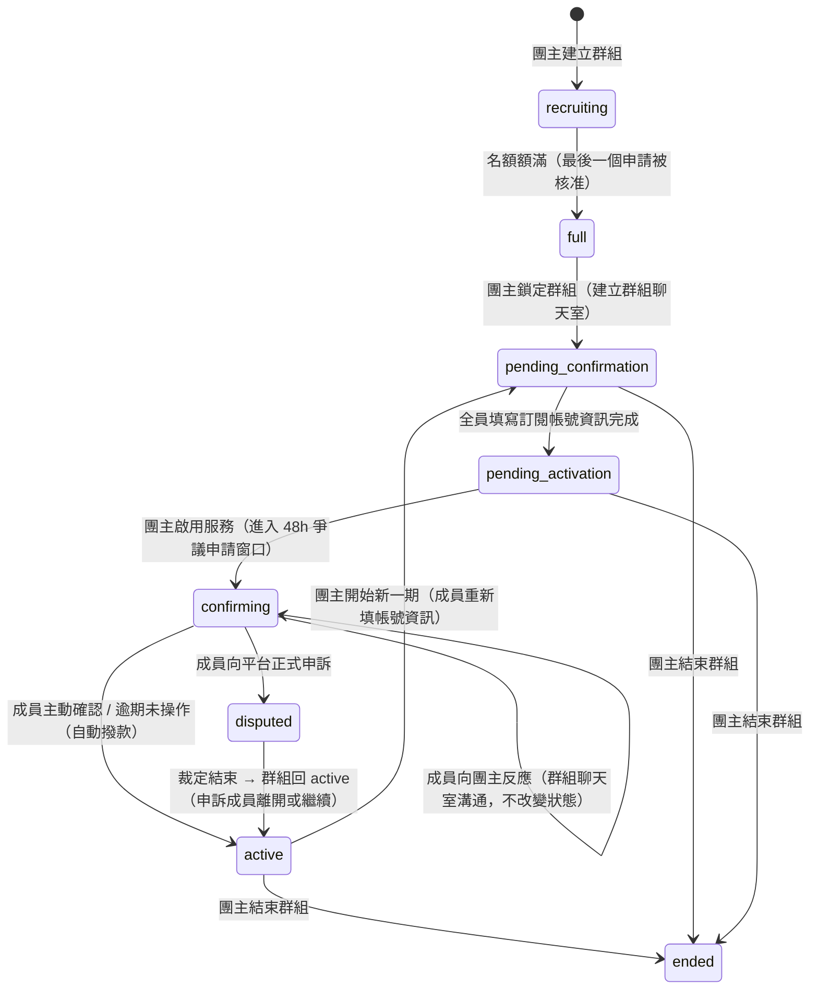
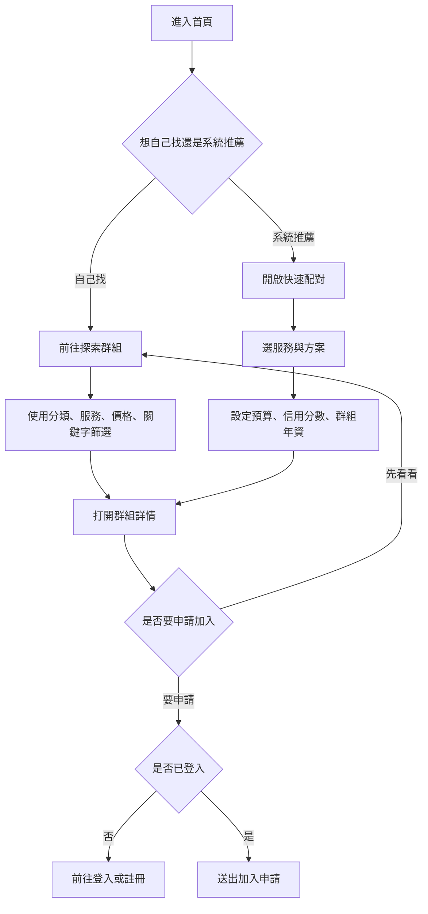
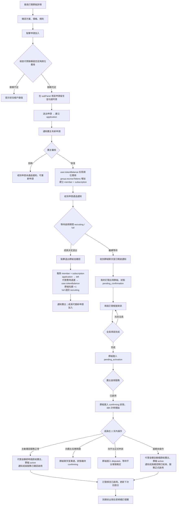
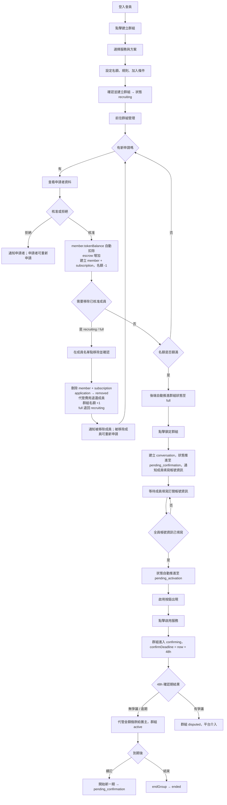
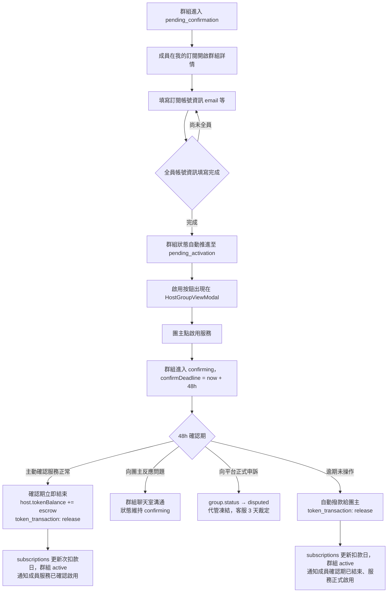
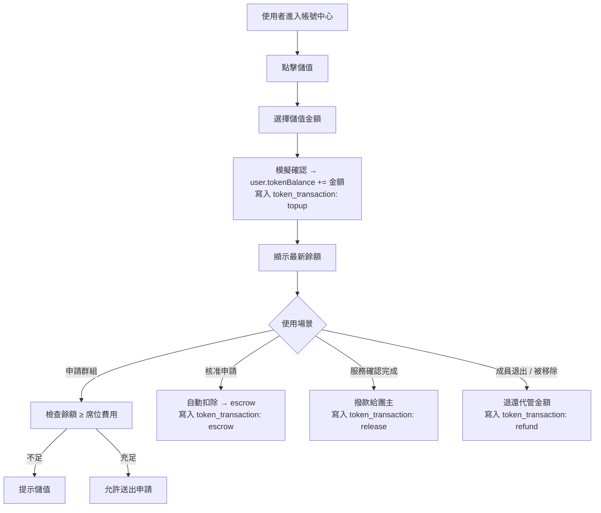
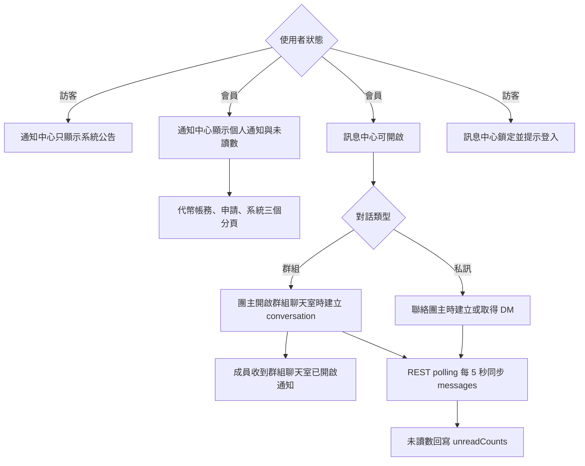

# 操作流程

## 群組狀態機

群組從建立到結束共經歷多個狀態（另有 `paused` / `cancelled` 同視為結束狀態），每個狀態有對應的操作角色與觸發條件。

| 狀態 | 說明 | 下一步操作者 |
|------|------|------------|
| `recruiting` | 公開招募中，接受申請；成員可自行退出、團主可移除成員 | 團主審核申請；最後一個申請被核准且名額額滿時，後端自動推進至 `full` |
| `full` | 名額額滿，等待團主鎖定群組；成員仍可自行退出或被團主移除（會釋出名額，狀態退回 `recruiting`）| 團主點「鎖定群組」 |
| `pending_confirmation` | 帳號資訊填寫階段：成員填寫各自的訂閱帳號資訊（email 等）；付款已在核准時透過代管機制完成，**本階段不需付款操作**；**成員名單不可再變動** | 全員填寫完成後自動推進 |
| `pending_activation` | 帳號資訊齊全，等待團主啟用服務；**成員名單不可再變動** | 團主點「啟用服務」 |
| `confirming` | 服務啟用後最長 2 天（48 小時）的確認期倒數；成員有三種選擇：（1）**主動確認**服務正常 → 確認期立即結束，代管即時撥款給團主；（2）**向團主反應**問題 → 透過群組聊天室溝通，倒數繼續，不改變狀態；（3）**向平台申訴** → 觸發 `disputed`，代管凍結；倒數結束仍未操作則視為同意，自動撥款 | 成員主動確認（即時結束）/ 向平台申訴 / 後端惰性自動撥款 |
| `disputed` | 成員在窗口內向平台提出正式申訴；代管金額凍結，由平台客服在 **3 天內**裁定責任歸屬並附上說明；**此階段才需要提供截圖等佐證**，正常流程無需任何付款憑證；裁定只影響**申訴的那位成員**，不影響其他成員；**成員獲勝** → 退款給該成員並離開群組、群組回 `active`（其餘成員不受影響）；**團主獲勝** → 代管撥款給團主、群組回 `active` | 平台客服裁定後手動推進 |
| `active` | 服務運作中；**成員名單不可再變動** | 團主開始新一期或結束群組 |
| `ended` | 群組已結束（唯讀） | — |
| `paused` / `cancelled` | 異常暫停或取消，前端與 `ended` 同視為「已結束」顯示 | — |

---

## 1. 訪客探索與快速配對

操作說明：

1. 從首頁或側欄進入「探索群組」，或用「快速配對」輸入需求讓系統推薦。
2. 點群組卡片開啟詳情，查看方案、價格、規則與名額。
3. 送出申請需要登入；未登入的受保護入口會顯示鎖頭並提示「請先登入會員」。

---

## 2. 會員申請加入群組

操作說明：

1. 在群組詳情點「申請加入」，系統檢查代幣餘額是否足夠支付席位費用；餘額不足時提示前往帳戶儲值。
2. 申請表單以 `GroupModalShell` 的 `subPanel` 翻書動畫呈現；填寫留言、勾選同意條款後送出。
3. 團主核准後，席位費用從成員帳戶扣除並代管於平台（`escrowTokens`），同時建立成員與訂閱資料。**付款至此完成，後續不需任何付款操作。**
4. **等待啟用期間（`recruiting` / `full`）**，成員可點擊「退出群組」離開：代管費用退還，後端刪除 member 並將 application 標為 `left`；申請狀態 `left` 允許再次申請同一群組。被拒絕的申請保留歷史紀錄，可重新申請（建立新記錄）。
5. 名額額滿後，團主點「鎖定群組」，系統建立群組聊天室並推進至 `pending_confirmation`；成員收到通知。進入此階段後成員名單不可再變動。
6. 成員在「我的訂閱」填寫訂閱帳號資訊（用於共享訂閱的帳號 email 等）。全員填寫完成後自動推進至 `pending_activation`。
7. 團主啟用服務後，群組進入 `confirming` 狀態，`confirmDeadline` 設為啟用時間 + 2 天（48 小時）。
8. 服務啟用後進入最長 2 天（48 小時）的確認期倒數，成員可選擇：**主動確認**服務正常（確認期立即結束，代管即時撥款給團主）；**向團主反應**問題（群組聊天室溝通，倒數繼續）；**向平台正式申訴**（觸發 `disputed`，代管凍結）；或**放置不管**（倒數結束後後端惰性求值自動撥款）。
9. 群組回到 `active` 後，訂閱移到「已啟用」分類，接近到期日時出現在「即將續訂」提醒。

---

## 3. 團主建立與管理群組

操作說明：

1. 從側欄點「建立群組」開始 4 步驟表單；建立成功狀態為 `recruiting`。
2. 在「群組管理」點卡片「查看群組」開啟 HostGroupViewModal，從底部列進入「申請管理」子 Modal。
3. 團主核准申請後，席位費用**由系統自動代管**，無需向成員收款或確認付款。
4. **`recruiting` / `full` 期間**，團主可在成員名單移除已核准的成員：代管費用退還，後端刪除 member 並將 application 標為 `removed`；被移除成員收到通知，可重新申請。
5. 所有名額核准完畢後，GroupViewModal 出現「鎖定群組」按鈕；點擊後系統建立群組聊天室並推進至 `pending_confirmation`，通知所有成員填寫訂閱帳號資訊。進入此階段後成員名單不可再變動。
6. 全員填寫帳號資訊後自動推進至 `pending_activation`；啟用按鈕出現（含 ping 動畫）。
7. 啟用後群組進入 `confirming` 狀態（48h 計時）。無爭議或逾期後代管金額撥款給團主，群組進入 `active`；到期後可選擇「開始新一期」或「結束群組」。

---

## 4. 帳號資訊填寫與啟用服務

操作說明：

1. 成員在「我的訂閱」開啟群組，填寫用於共享訂閱的帳號資訊（email 等）。**無需任何付款操作**，費用已在申請核准時代管。
2. 全員填寫完成後群組自動推進至 `pending_activation`；啟用按鈕出現。
3. 啟用後群組進入 `confirming` 狀態，`confirmDeadline` 設為啟用時間 + 2 天（48 小時）。
4. 成員在確認期倒數（最長 48 小時）內有三種操作：
   - **主動確認**服務正常 → 確認期立即結束，代管金額即時撥款給團主，群組回 `active`
   - **向團主反應**問題 → 透過群組聊天室溝通，倒數繼續，狀態維持 `confirming`
   - **向平台正式申訴** → 群組進入 `disputed`，代管金額凍結；平台客服在 3 天內裁定並附說明；裁定只影響申訴的那位成員：**成員獲勝**則退款給該成員並離開群組、群組回 `active`；**團主獲勝**則撥款給團主、群組回 `active`
5. 成員未在 48 小時倒數結束前操作，代管金額自動撥款給團主，群組回 `active`，訂閱更新下次扣款日；系統發送通知告知成員「確認期已結束，費用已撥款給團主，服務正式啟用」。

---

## 5. 代幣與帳戶管理

操作說明：

1. 現階段儲值為模擬模式：點擊後直接增加餘額，不串接外部金流。
2. 所有代幣異動（儲值、代管、撥款、退款）均記錄至 `token_transactions`，提供完整審計軌跡。
3. 申請時僅做餘額檢查，不預扣；核准後才扣除並進入代管。

---

## 6. 訊息與通知

操作說明：

1. 訪客可打開通知中心，但只看到系統公告；個人通知需登入。
2. 通知依類型分為代幣帳務、申請、系統三頁，可標記已讀。
3. 群組聊天室在團主點「鎖定群組」並確認後建立；成員收到通知。
4. 訊息透過 REST API polling（每 5 秒）同步；成員加入或退出時寫入系統訊息。
