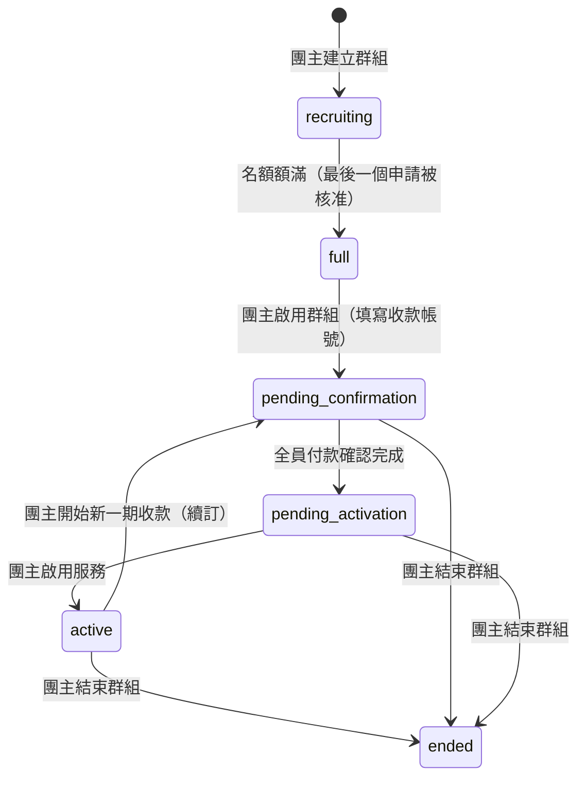
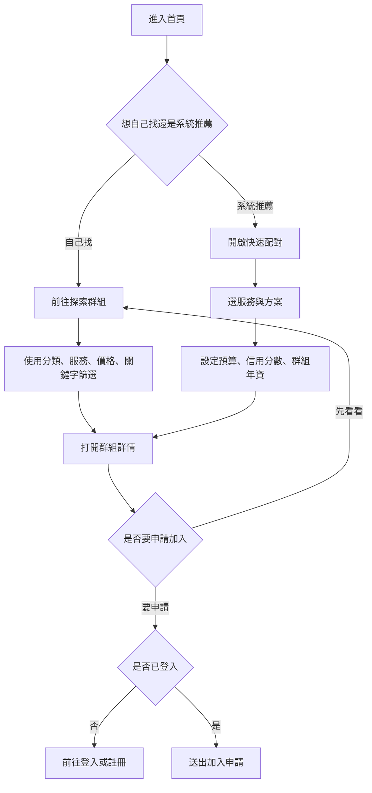
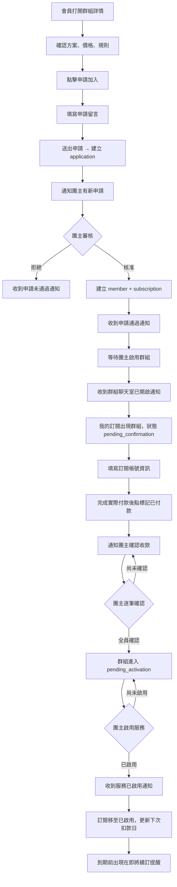
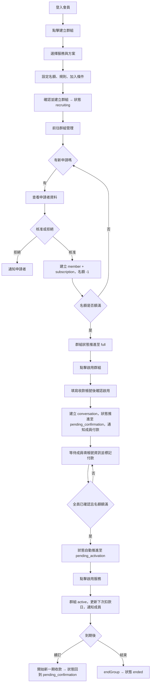
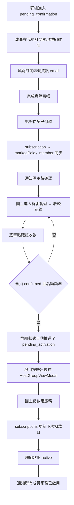
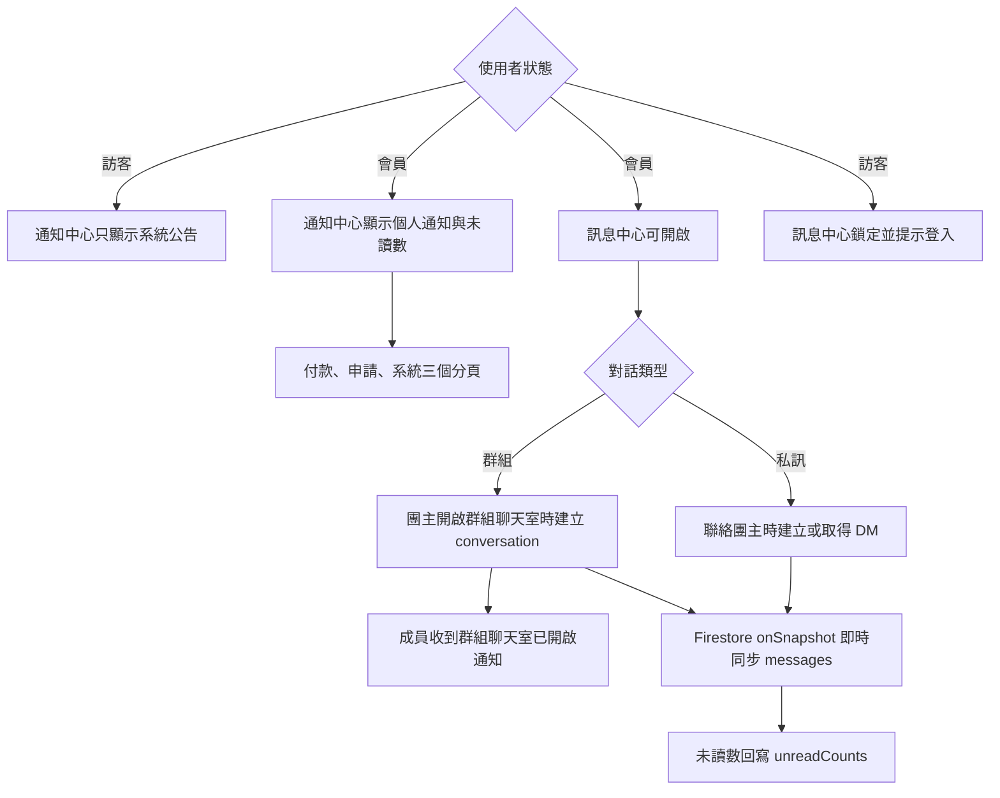

# 操作流程

## 群組狀態機

群組從建立到結束共經歷七個狀態，每個狀態有對應的操作角色與觸發條件。

| 狀態 | 說明 | 下一步操作者 |
|------|------|------------|
| `recruiting` | 公開招募中，接受申請；成員可退出群組 | 團主審核申請 |
| `full` | 名額額滿，等待團主啟用群組；成員仍可退出（會釋出名額，狀態退回 `recruiting`） | 團主點「啟用群組」並填寫收款帳號 |
| `pending_confirmation` | 收款階段：成員填寫帳號資訊、標記付款；團主逐筆確認 | 全員確認後自動推進 |
| `pending_activation` | 收款完成，等待團主啟用服務 | 團主點「啟用服務」 |
| `active` | 服務運作中；到期時團主可開始新一期收款 | 團主續訂或結束 |
| `ended` | 群組已結束（唯讀） | — |

---

## 1. 訪客探索與快速配對

操作說明：

1. 從首頁或側欄進入「探索群組」，或用「快速配對」輸入需求讓系統推薦。
2. 點群組卡片開啟詳情，查看方案、價格、規則與名額。
3. 送出申請需要登入；未登入的受保護入口會顯示鎖頭並提示「請先登入會員」。

---

## 2. 會員申請加入群組

操作說明：

1. 在群組詳情送出申請，系統建立申請資料並通知團主。
2. 團主核准後建立成員與訂閱資料，傳送申請通過通知。
3. 名額額滿後，團主點「啟用群組」並填寫收款帳號，確認後系統建立群組聊天室並推進至 `pending_confirmation`；成員收到通知。
4. 成員需先**填寫訂閱帳號資訊**，才能看到「標記已付款」按鈕。
5. 標記後通知團主確認；全員確認後群組自動推進至 `pending_activation`。
6. 團主啟用後，訂閱移到「已啟用」分類，接近到期日時出現在「即將續訂」提醒。

---

## 3. 團主建立與管理群組

操作說明：

1. 從側欄點「建立群組」開始 4 步驟表單；建立成功狀態為 `recruiting`。
2. 在「群組管理」點卡片「查看群組」開啟 HostGroupViewModal，從底部列進入「申請管理」或「收款紀錄」子 Modal。
3. 所有名額核准完畢後，GroupViewModal 出現「啟用群組」按鈕（含 ping 動畫）；點擊後填寫收款帳號並確認，系統建立群組聊天室並推進至 `pending_confirmation`，通知所有成員付款。
4. 全員確認後自動推進至 `pending_activation`；啟用按鈕出現（含 ping 動畫）。
5. 啟用後進入 `active`；到期後可選擇「開始新一期收款」或「結束群組」。

---

## 4. 付款確認與啟用服務

操作說明：

1. 成員需先填寫**訂閱帳號資訊**，才會看到「標記已付款」按鈕。
2. 標記後系統通知團主；團主在「收款紀錄」子 Modal 逐筆確認。
3. 全員確認且名額額滿 → 自動推進 `pending_activation`；啟用按鈕出現。
4. 啟用後訂閱更新下次扣款日，成員收通知。

---

## 5. 訊息與通知

操作說明：

1. 訪客可打開通知中心，但只看到系統公告；個人通知需登入。
2. 通知依類型分為付款、申請、系統三頁，可標記已讀。
3. 群組聊天室在團主點「啟用群組」並確認後建立；成員收到通知。
4. 訊息透過 Firestore `onSnapshot` 即時同步；成員加入或退出時寫入系統訊息。
